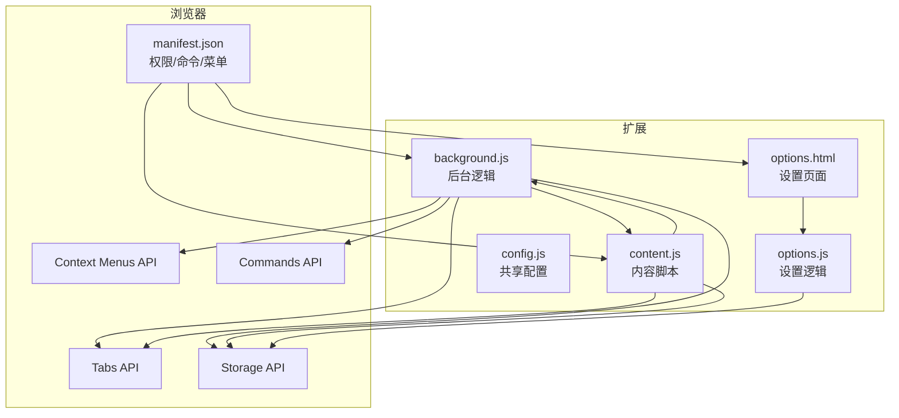
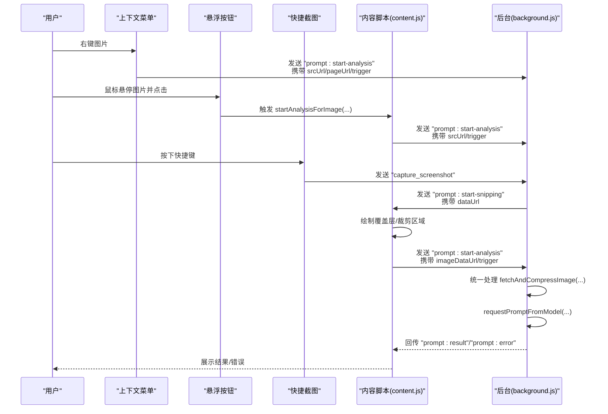
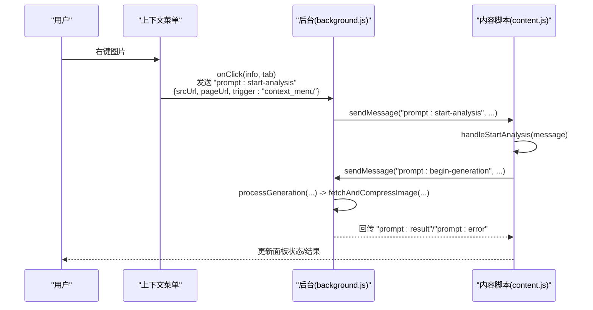
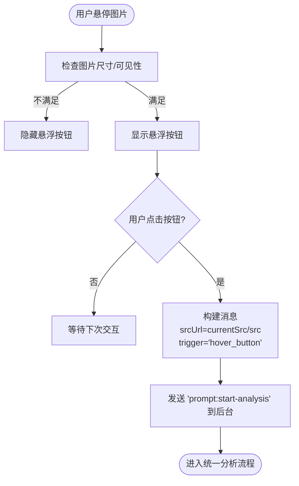
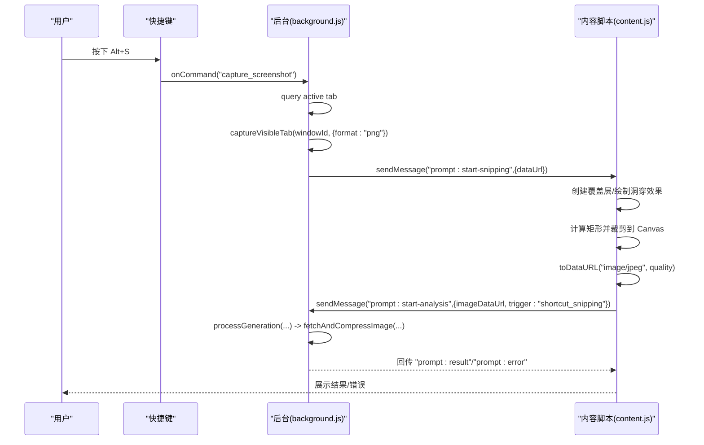
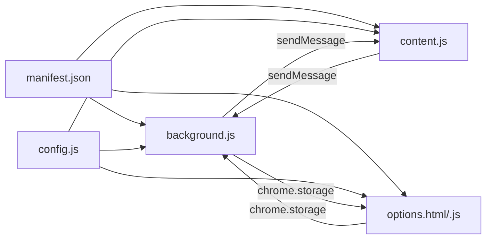

# 图片捕获方式

<cite>
**本文引用的文件**
- [manifest.json](file://manifest.json)
- [background.js](file://background.js)
- [content.js](file://content.js)
- [config.js](file://config.js)
- [options.html](file://options.html)
- [options.js](file://options.js)
</cite>

## 目录
1. [简介](#简介)
2. [项目结构](#项目结构)
3. [核心组件](#核心组件)
4. [架构总览](#架构总览)
5. [详细组件分析](#详细组件分析)
6. [依赖关系分析](#依赖关系分析)
7. [性能考量](#性能考量)
8. [故障排查指南](#故障排查指南)
9. [结论](#结论)
10. [附录](#附录)

## 简介
本文件面向 Img2Prompt 扩展的“图片捕获方式”技术文档，聚焦三种图片获取机制：
- 右键菜单触发（context menu）
- 悬浮按钮触发（hover button）
- 快捷截图触发（screen snipping）

文档将从用户交互到图片数据获取的完整链路出发，解释每种方式的数据传递过程、图片来源处理逻辑（网络图片 URL、本地文件读取、截图数据转换），并给出错误处理与最佳实践建议。

## 项目结构
扩展采用 Manifest V3 架构，包含后台脚本、内容脚本、共享配置与设置页面：
- manifest.json 定义权限、命令、上下文菜单、侧边栏等
- background.js 处理后台消息、上下文菜单点击、快捷键截图、与模型交互
- content.js 处理 UI 面板、悬浮按钮、截图选取、与后台的消息收发
- config.js 提供默认设置、UI 文案、错误码与分析配置
- options.html/options.js 提供设置界面与历史记录管理

图表来源
- [manifest.json:1-45](file://manifest.json#L1-L45)
- [background.js:1-184](file://background.js#L1-L184)
- [content.js:1-247](file://content.js#L1-L247)
- [config.js:1-253](file://config.js#L1-L253)
- [options.html:1-687](file://options.html#L1-L687)
- [options.js:1-551](file://options.js#L1-L551)

章节来源
- [manifest.json:1-45](file://manifest.json#L1-L45)
- [background.js:1-184](file://background.js#L1-L184)
- [content.js:1-247](file://content.js#L1-L247)
- [config.js:1-253](file://config.js#L1-L253)
- [options.html:1-687](file://options.html#L1-L687)
- [options.js:1-551](file://options.js#L1-L551)

## 核心组件
- 上下文菜单（Context Menu）
  - 在图片元素上右键触发，向后台发送“开始分析”消息，携带图片 URL 与页面 URL
- 悬浮按钮（Hover Button）
  - 鼠标悬停到图片上显示入口，点击后以“hover_button”触发类型启动分析
- 快捷截图（Screen Snipping）
  - 通过快捷键触发后台截图，再由内容脚本绘制覆盖层进行区域选择，裁剪后以 base64 数据触发分析

章节来源
- [background.js:19-72](file://background.js#L19-L72)
- [content.js:77-97](file://content.js#L77-L97)
- [content.js:1158-1190](file://content.js#L1158-L1190)
- [content.js:489-594](file://content.js#L489-L594)
- [background.js:74-92](file://background.js#L74-L92)

## 架构总览
三类触发方式最终都会通过内容脚本向后台发送“开始生成”的消息，后台统一执行图片获取与压缩、模型请求、结果归一化与回传。

图表来源
- [background.js:59-72](file://background.js#L59-L72)
- [content.js:328-345](file://content.js#L328-L345)
- [content.js:489-594](file://content.js#L489-L594)
- [background.js:74-92](file://background.js#L74-L92)
- [background.js:212-320](file://background.js#L212-L320)

## 详细组件分析

### 右键菜单触发（context menu）
- 注册菜单项：在安装时创建“ImgPrompt”菜单，作用域为图片元素
- 点击回调：根据当前标签页 ID，向该标签页发送“开始分析”消息，携带：
  - srcUrl：图片资源 URL
  - pageUrl：页面 URL
  - trigger：固定为“context_menu”
- 后台处理：收到消息后，交由统一生成流程处理，包括图片获取与压缩、模型请求、结果归一化

图表来源
- [background.js:19-25](file://background.js#L19-L25)
- [background.js:59-72](file://background.js#L59-L72)
- [content.js:249-326](file://content.js#L249-L326)
- [background.js:212-320](file://background.js#L212-L320)

章节来源
- [background.js:19-25](file://background.js#L19-L25)
- [background.js:59-72](file://background.js#L59-L72)
- [content.js:249-326](file://content.js#L249-L326)

### 悬浮按钮触发（hover button）
- 事件监听：捕获 document 的 contextmenu 事件，记录最近一次右键命中的图片元素
- 悬浮入口：当鼠标移动到图片上时，若满足尺寸与可见性条件，显示悬浮按钮
- 点击行为：点击按钮后，读取上次记录的图片元素的 src/currentSrc，构造“开始分析”消息，trigger 为“hover_button”
- 内容脚本处理：与右键一致，进入统一分析流程

图表来源
- [content.js:1158-1190](file://content.js#L1158-L1190)
- [content.js:328-345](file://content.js#L328-L345)
- [content.js:249-326](file://content.js#L249-L326)

章节来源
- [content.js:77-97](file://content.js#L77-L97)
- [content.js:1158-1190](file://content.js#L1158-L1190)
- [content.js:328-345](file://content.js#L328-L345)
- [content.js:249-326](file://content.js#L249-L326)

### 快捷截图触发（screen snipping）
- 快捷键注册：manifest 中声明 capture_screenshot 命令，默认 Alt+S
- 快捷键回调：后台查询当前活动标签页，调用 Tabs.captureVisibleTab 获取 PNG 数据，封装为 dataUrl，向内容脚本发送“开始截图”消息
- 内容脚本绘制覆盖层：创建全屏覆盖层，使用洞穿效果（box-shadow）实现“打孔”视觉，允许用户框选区域
- 区域裁剪：根据起点与终点计算矩形，将截图 dataUrl 绘制到 Canvas 并按 JPEG 质量导出为 base64
- 触发分析：将裁剪后的 imageDataUrl 与 trigger=“shortcut_snipping”发送给后台，进入统一分析流程

图表来源
- [manifest.json:13-20](file://manifest.json#L13-L20)
- [background.js:74-92](file://background.js#L74-L92)
- [content.js:489-594](file://content.js#L489-L594)

章节来源
- [manifest.json:13-20](file://manifest.json#L13-L20)
- [background.js:74-92](file://background.js#L74-L92)
- [content.js:489-594](file://content.js#L489-L594)

## 依赖关系分析
- 权限与 API
  - permissions: contextMenus, storage, sidePanel, activeTab
  - host_permissions: <all_urls>
  - commands: capture_screenshot
- 消息协议
  - content -> background: prompt:start-analysis, prompt:start-snipping, prompt:begin-generation, prompt:cancel-generation, prompt:load-history-item, settings:updated, analytics:track
  - background -> content: prompt:progress, prompt:result, prompt:error, prompt:canceled, settings:updated
- 配置与国际化
  - config.js 提供默认设置、UI 文案、错误码、分析上报配置
  - options 页面读取/写入存储，同步至内容脚本

图表来源
- [manifest.json:1-45](file://manifest.json#L1-L45)
- [background.js:1-184](file://background.js#L1-184)
- [content.js:1-247](file://content.js#L1-L247)
- [config.js:1-253](file://config.js#L1-L253)
- [options.html:1-687](file://options.html#L1-L687)
- [options.js:1-551](file://options.js#L1-L551)

章节来源
- [manifest.json:1-45](file://manifest.json#L1-L45)
- [background.js:1-184](file://background.js#L1-L184)
- [content.js:1-247](file://content.js#L1-L247)
- [config.js:1-253](file://config.js#L1-L253)
- [options.html:1-687](file://options.html#L1-L687)
- [options.js:1-551](file://options.js#L1-L551)

## 性能考量
- 图片压缩
  - 统一使用 fetchAndCompressImage 对 data URL 或远程图片进行压缩，避免过大请求导致超时或被拒
- 进度与 UI
  - 内容脚本维护进度条与状态文本，避免阻塞主线程
- 截图区域
  - 快捷截图仅在矩形面积超过阈值时处理，减少无效操作
- 设置联动
  - 最大边长设置影响压缩质量与体积，建议根据目标模型接口限制合理调整

章节来源
- [background.js:238-243](file://background.js#L238-L243)
- [content.js:1396-1429](file://content.js#L1396-L1429)
- [content.js:554-555](file://content.js#L554-L555)
- [options.js:423-422](file://options.js#L423-L422)

## 故障排查指南
- 常见错误分类与用户提示
  - 网络错误、图片获取失败、图片处理失败、认证失败、速率限制、超时、无效响应、JSON 解析失败、字段缺失、取消、未知错误
- 错误映射与回传
  - 后台根据异常类型映射为错误码，并通过 content -> background -> content 的消息链路回传用户友好提示
- 取消与中断
  - 支持在 UI 中点击停止按钮，或通过“prompt:cancel-generation”消息取消当前请求
- 存储与历史
  - 历史记录保存在本地存储，支持清空与逐条删除；设置变更会广播通知内容脚本更新 UI

章节来源
- [config.js:206-247](file://config.js#L206-L247)
- [background.js:280-317](file://background.js#L280-L317)
- [content.js:433-487](file://content.js#L433-L487)
- [background.js:122-132](file://background.js#L122-L132)
- [options.js:362-367](file://options.js#L362-L367)

## 结论
三种图片捕获方式在扩展内部通过统一的消息协议与处理流程协作，确保从用户交互到模型生成的一致体验。右键菜单适合直接分析图片资源，悬浮按钮提升易用性，快捷截图则覆盖更广泛的页面区域分析需求。结合合理的设置与错误处理策略，可获得稳定高效的图片提示词生成能力。

## 附录
- 设置页面功能
  - 连接设置：API 端点、模型、密钥
  - 提示词设置：内置预设与自定义模板
  - 使用体验：悬浮按钮开关、快捷截图开关、默认快捷键提示
  - 兼容性设置：最大图片分辨率
  - 历史记录：查看、复制、删除、清空
- 最佳实践
  - 优先使用右键菜单或悬浮按钮直接分析图片资源
  - 快捷截图适用于需要从页面中框选特定区域的场景
  - 合理设置最大分辨率，避免超时与体积过大
  - 出现错误时优先检查网络、认证与模型配置

章节来源
- [options.html:484-687](file://options.html#L484-L687)
- [options.js:182-216](file://options.js#L182-L216)
- [options.js:336-367](file://options.js#L336-L367)