# 数据流转机制

<cite>
**本文档引用的文件**
- [manifest.json](file://manifest.json)
- [background.js](file://background.js)
- [content.js](file://content.js)
- [config.js](file://config.js)
- [options.js](file://options.js)
- [options.html](file://options.html)
- [messages.json (en)](file://_locales/en/messages.json)
- [messages.json (zh_CN)](file://_locales/zh_CN/messages.json)
</cite>

## 目录
1. [简介](#简介)
2. [项目结构](#项目结构)
3. [核心组件](#核心组件)
4. [架构概览](#架构概览)
5. [详细组件分析](#详细组件分析)
6. [依赖关系分析](#依赖关系分析)
7. [性能考虑](#性能考虑)
8. [故障排除指南](#故障排除指南)
9. [结论](#结论)

## 简介

Img2Prompt 是一个 Chrome 扩展程序，能够将图片转换为 AI 提示词。该扩展通过浏览器扩展的消息传递机制实现了完整的数据流转，从用户触发到最终结果展示的全过程都经过精心设计的异步处理流程。

该系统的核心特点是：
- **双线程架构**：content script 负责用户界面交互，background script 处理后台计算
- **消息驱动**：所有组件间通信基于标准化的消息协议
- **状态管理**：完整的进度跟踪和错误处理机制
- **异步处理**：支持取消操作和超时控制

## 项目结构

Img2Prompt 采用标准的 Chrome 扩展目录结构，包含以下关键文件：

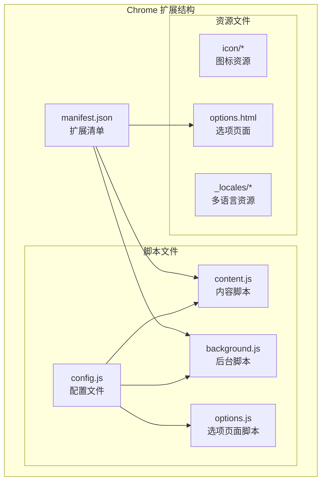

**图表来源**
- [manifest.json:1-45](file://manifest.json#L1-L45)
- [config.js:1-253](file://config.js#L1-L253)

**章节来源**
- [manifest.json:1-45](file://manifest.json#L1-L45)
- [config.js:1-253](file://config.js#L1-L253)

## 核心组件

### 消息类型定义

扩展定义了完整的消息类型系统，用于在不同组件间传递数据：

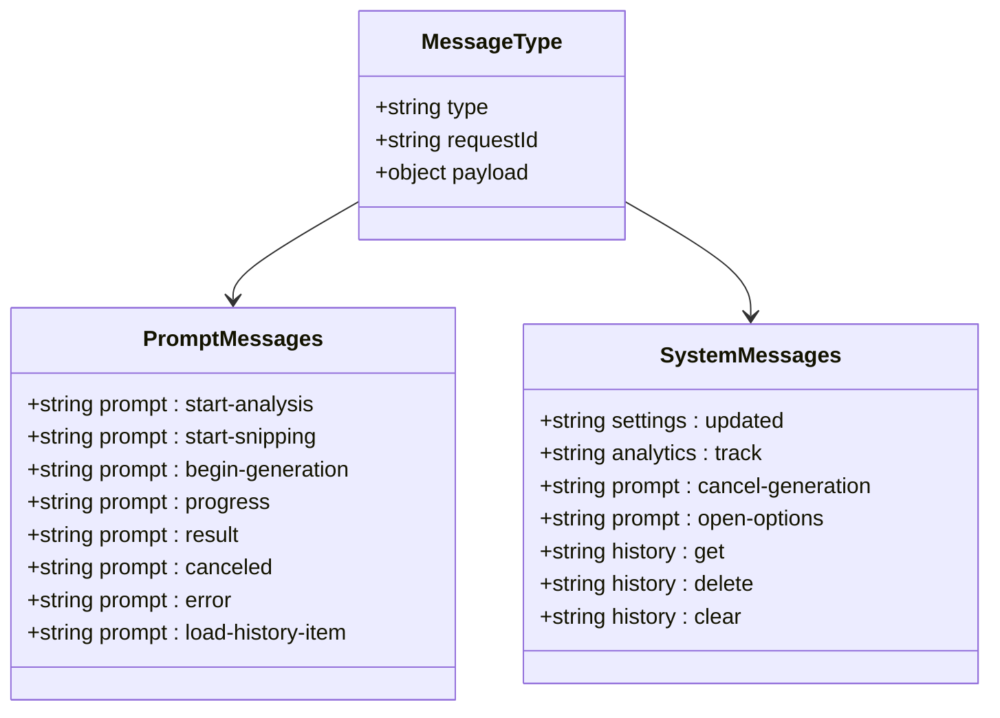

**图表来源**
- [background.js:94-184](file://background.js#L94-L184)
- [content.js:209-247](file://content.js#L209-L247)

### 数据包结构

每个消息都遵循统一的数据包结构：

| 字段名 | 类型 | 必需 | 描述 |
|--------|------|------|------|
| type | string | 是 | 消息类型标识符 |
| requestId | string | 是 | 唯一请求标识符 |
| payload | object | 否 | 实际数据负载 |
| errorCode | string | 否 | 错误码（错误消息） |
| message | string | 否 | 用户可读错误信息 |

**章节来源**
- [background.js:170-184](file://background.js#L170-L184)
- [content.js:249-326](file://content.js#L249-L326)

## 架构概览

Img2Prompt 采用了典型的 Chrome 扩展架构模式，通过消息传递实现组件解耦：

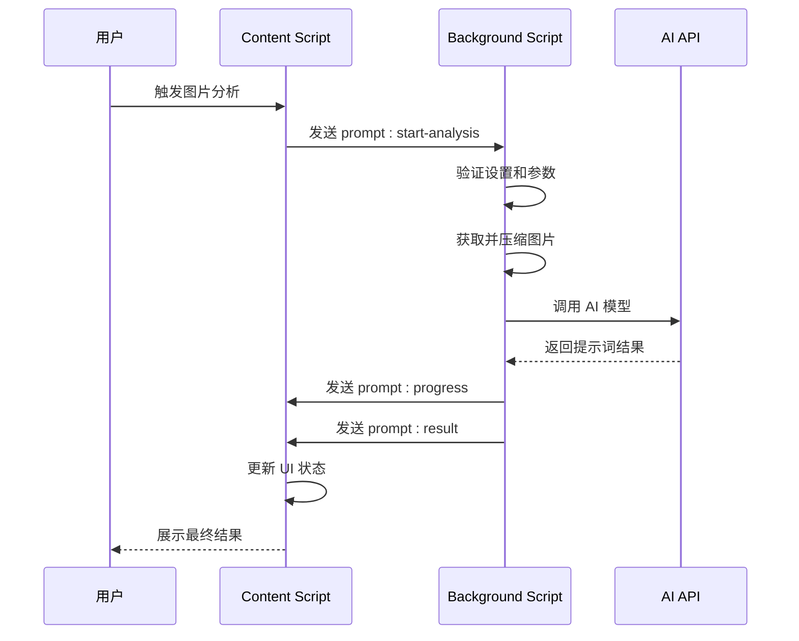

**图表来源**
- [background.js:212-320](file://background.js#L212-L320)
- [content.js:249-326](file://content.js#L249-L326)

## 详细组件分析

### Content Script 组件

Content Script 负责用户界面交互和实时状态更新：

#### 进度状态管理系统

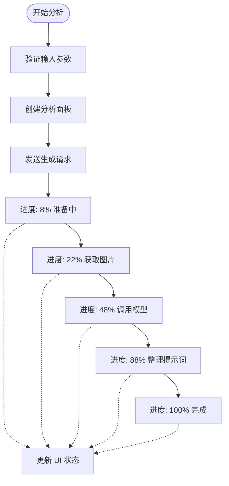

**图表来源**
- [background.js:226-264](file://background.js#L226-L264)
- [content.js:1373-1380](file://content.js#L1373-L1380)

#### 取消机制实现

Content Script 支持实时取消正在进行的生成操作：

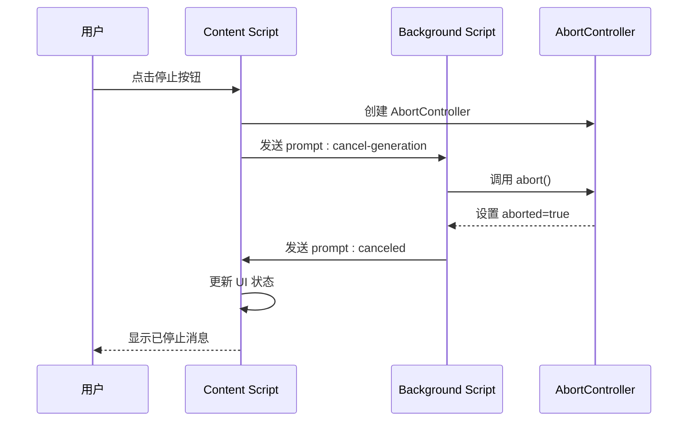

**图表来源**
- [content.js:1348-1362](file://content.js#L1348-L1362)
- [background.js:122-132](file://background.js#L122-L132)

**章节来源**
- [content.js:1348-1362](file://content.js#L1348-L1362)
- [background.js:122-132](file://background.js#L122-L132)

### Background Script 组件

Background Script 处理实际的 AI 生成逻辑和错误处理：

#### 异步处理流程

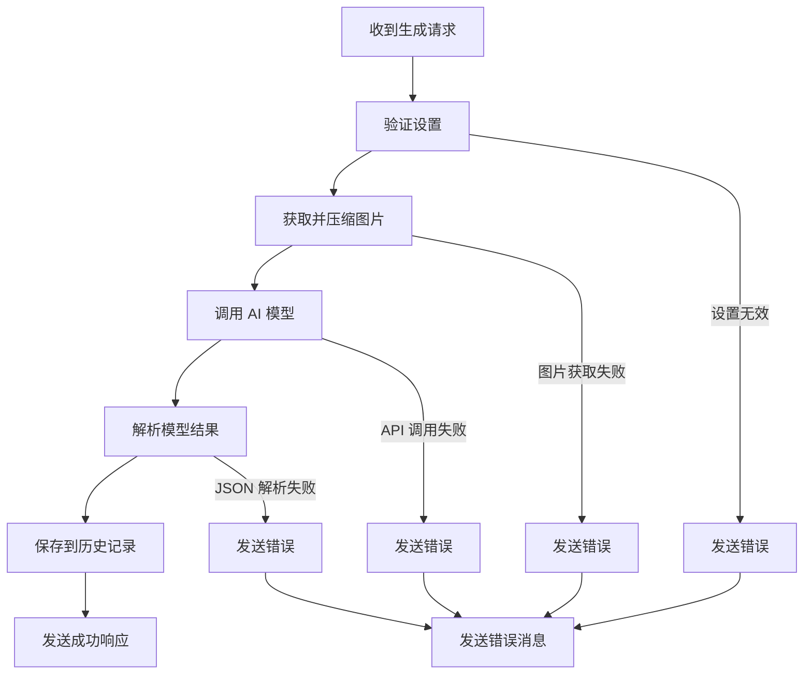

**图表来源**
- [background.js:212-320](file://background.js#L212-L320)
- [background.js:478-666](file://background.js#L478-L666)

#### 错误分类和处理

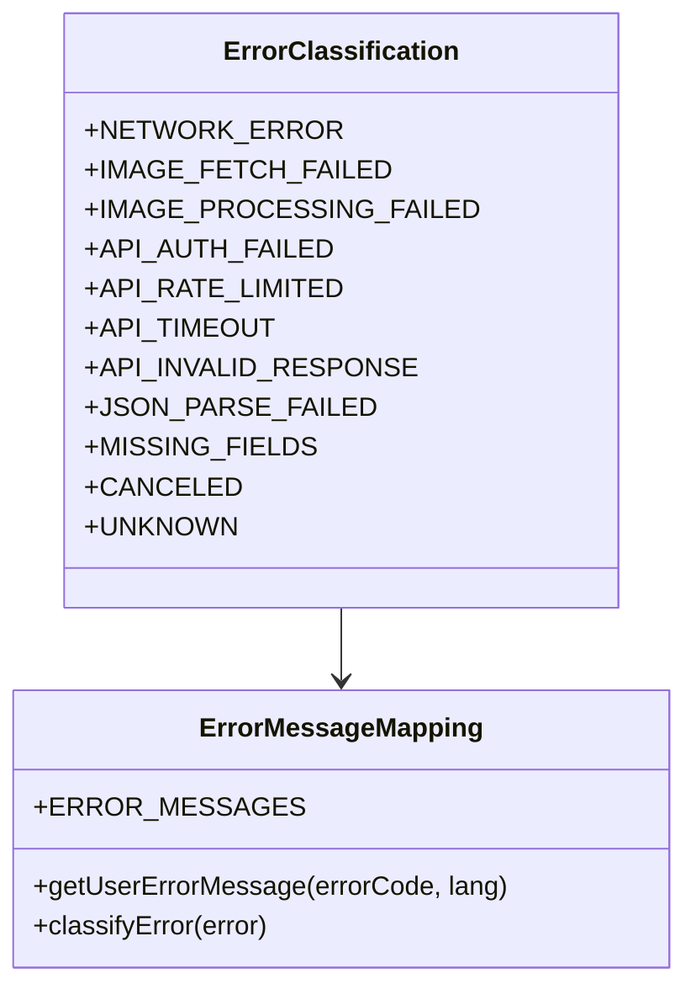

**图表来源**
- [config.js:206-247](file://config.js#L206-L247)
- [background.js:280-317](file://background.js#L280-L317)

**章节来源**
- [config.js:206-247](file://config.js#L206-L247)
- [background.js:280-317](file://background.js#L280-L317)

### 配置管理系统

Config.js 提供了统一的配置管理，包括默认设置、UI 字符串和错误码定义：

#### 配置层次结构

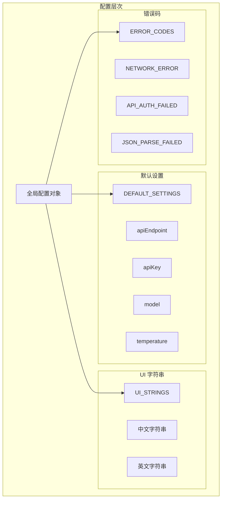

**图表来源**
- [config.js:4-253](file://config.js#L4-L253)

**章节来源**
- [config.js:4-253](file://config.js#L4-L253)

## 依赖关系分析

### 组件耦合度分析

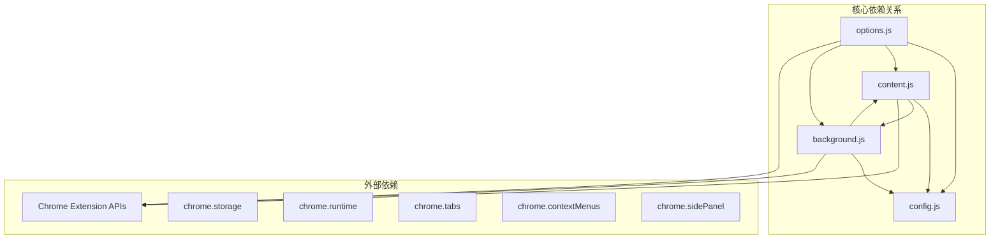

**图表来源**
- [manifest.json:10-42](file://manifest.json#L10-L42)
- [content.js:1-50](file://content.js#L1-L50)
- [background.js:1-12](file://background.js#L1-L12)

### 数据流依赖

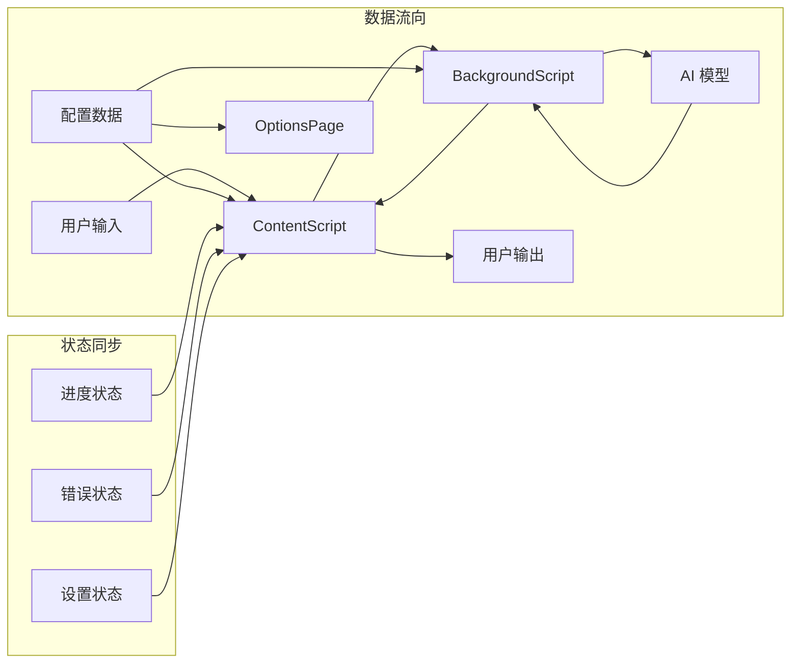

**图表来源**
- [content.js:209-247](file://content.js#L209-L247)
- [background.js:94-184](file://background.js#L94-L184)

**章节来源**
- [manifest.json:10-42](file://manifest.json#L10-L42)
- [content.js:209-247](file://content.js#L209-L247)
- [background.js:94-184](file://background.js#L94-L184)

## 性能考虑

### 异步处理优化

1. **并发控制**：使用 AbortController 管理并发请求
2. **内存管理**：及时清理事件监听器和定时器
3. **网络优化**：智能缓存和重试机制
4. **UI 响应性**：非阻塞的进度更新

### 内存泄漏防护

```javascript
// 定时器清理示例
function stopProgressTimer() {
    window.clearInterval(progressTimerId);
    progressTimerId = 0;
}

// 事件监听器清理
function cleanupListeners() {
    window.removeEventListener("pointermove", onDragMove);
    window.removeEventListener("pointerup", stopDragging);
    window.removeEventListener("pointercancel", stopDragging);
}
```

### 性能监控建议

1. **时间戳记录**：记录关键操作的执行时间
2. **内存使用监控**：定期检查内存占用
3. **网络请求统计**：跟踪 API 调用成功率
4. **错误率监控**：统计各类错误的发生频率

## 故障排除指南

### 常见问题诊断

#### 网络连接问题

**症状**：图片获取失败或 API 调用超时
**解决方案**：
1. 检查网络连接状态
2. 验证 API 端点可达性
3. 调整超时设置
4. 检查防火墙设置

#### 认证失败

**症状**：API 返回 401 错误
**解决方案**：
1. 验证 API Key 有效性
2. 检查 API 密钥权限
3. 确认 API 端点配置正确
4. 重新生成 API 密钥

#### 图片处理错误

**症状**：图片压缩或转换失败
**解决方案**：
1. 检查图片格式支持
2. 调整最大图片尺寸
3. 验证图片 URL 可访问性
4. 尝试不同的图片源

### 调试技巧

#### 开发者工具使用

1. **Chrome 扩展调试**：
   - 访问 `chrome://extensions/`
   - 启用"开发者模式"
   - 点击"检查视图"查看后台脚本

2. **网络请求监控**：
   - 使用开发者工具的 Network 面板
   - 监控 API 调用和响应时间
   - 检查请求头和响应体

3. **消息传递调试**：
   ```javascript
   // 在 content.js 中添加调试日志
   console.log('发送消息:', message);
   
   // 在 background.js 中添加调试日志
   chrome.runtime.onMessage.addListener((message, sender, sendResponse) => {
       console.log('接收消息:', message);
       // 处理逻辑...
   });
   ```

#### 日志记录策略

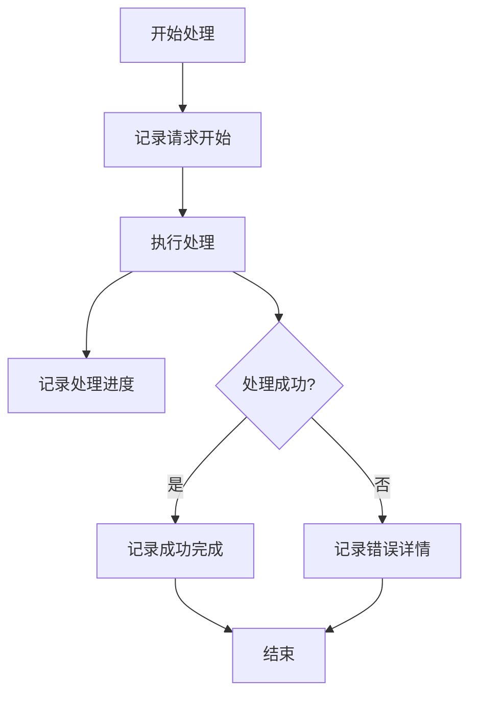

**章节来源**
- [background.js:280-317](file://background.js#L280-L317)
- [content.js:464-487](file://content.js#L464-L487)

## 结论

Img2Prompt 的数据流转机制展现了现代浏览器扩展的最佳实践：

### 技术优势

1. **清晰的架构分离**：content script 和 background script 各司其职
2. **标准化的消息协议**：统一的通信格式便于维护和扩展
3. **完善的错误处理**：多层次的错误分类和用户友好的提示
4. **实时状态反馈**：流畅的用户体验和进度可视化

### 最佳实践总结

1. **消息驱动架构**：避免直接函数调用，使用标准化消息传递
2. **异步优先**：所有耗时操作都应异步处理
3. **状态管理**：明确的状态机设计和生命周期管理
4. **错误隔离**：错误处理与业务逻辑分离
5. **性能优化**：合理的资源管理和内存控制

### 扩展性建议

1. **模块化设计**：将功能拆分为独立模块
2. **配置驱动**：通过配置文件管理可变参数
3. **插件化架构**：支持第三方 AI 模型接入
4. **国际化支持**：完善多语言支持机制
5. **监控告警**：建立完整的性能和错误监控体系

该系统为浏览器扩展开发提供了优秀的参考模板，特别是在消息传递、状态管理和错误处理方面的实现值得其他项目借鉴。