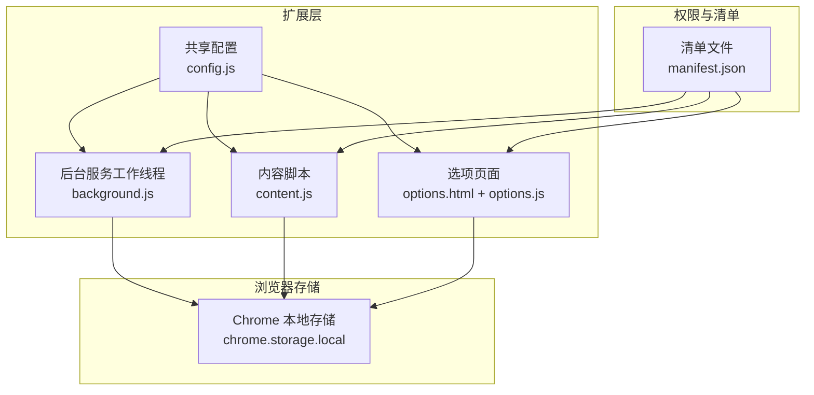
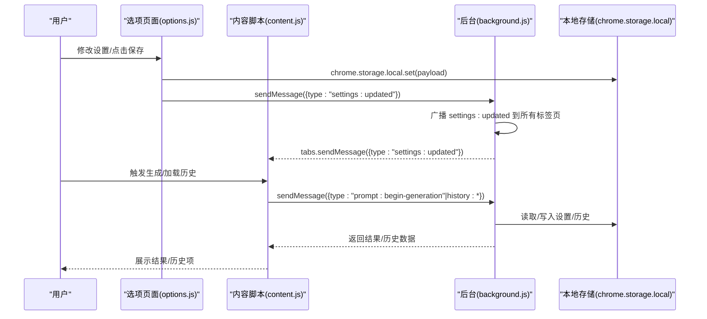
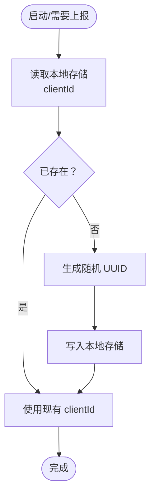
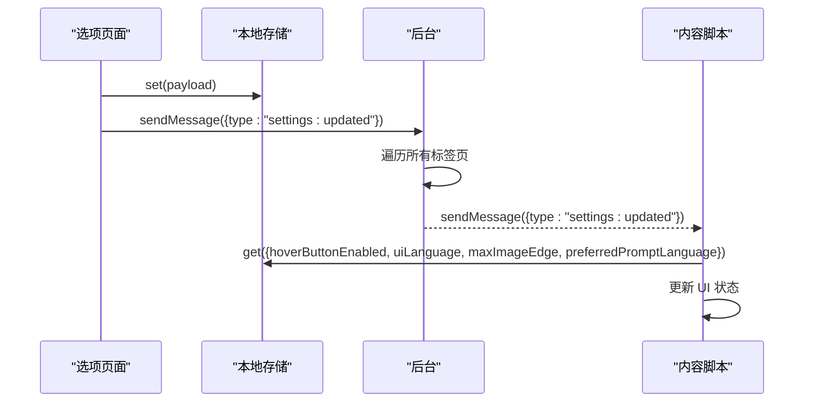
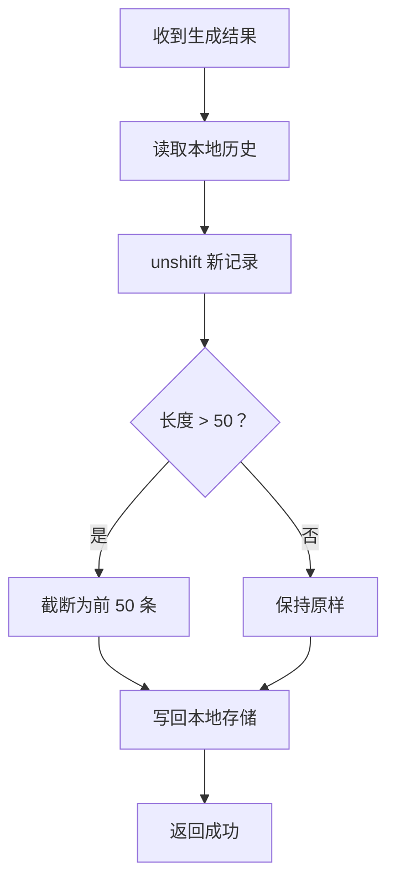
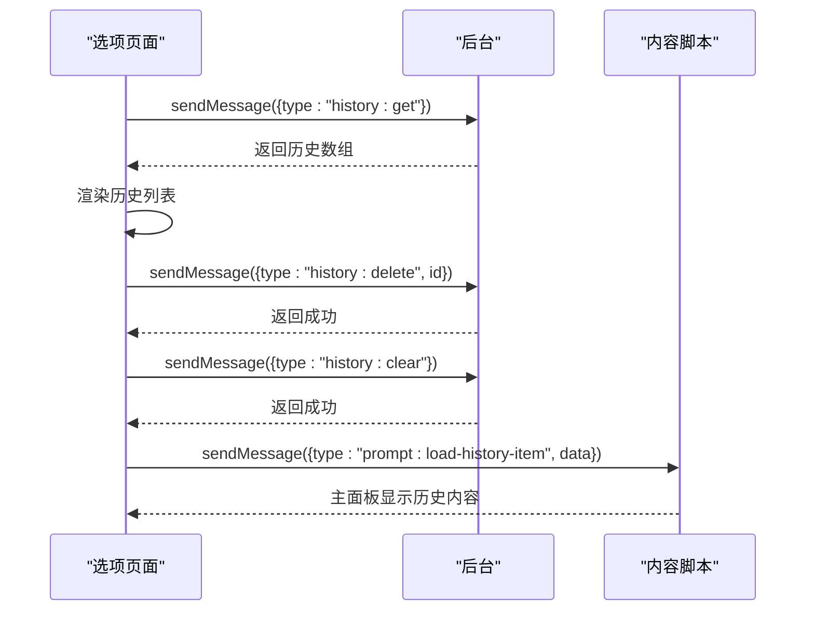
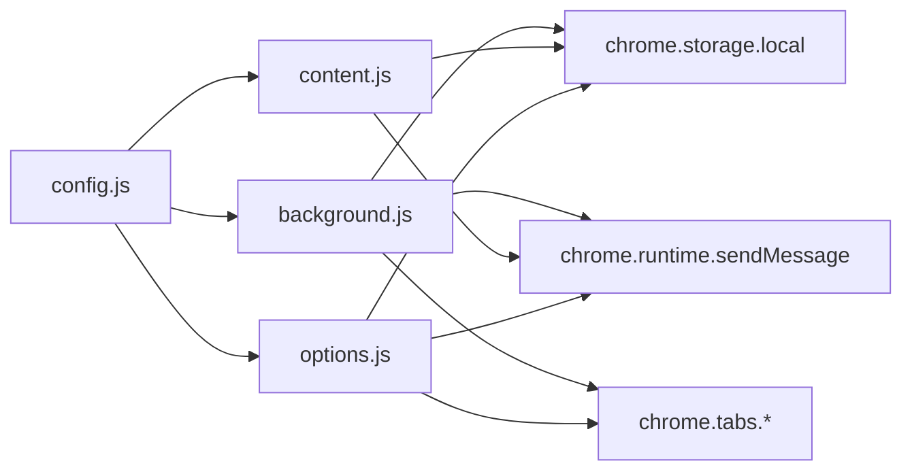

# 数据管理

<cite>
**本文档引用的文件**
- [background.js](file://background.js)
- [content.js](file://content.js)
- [options.js](file://options.js)
- [config.js](file://config.js)
- [manifest.json](file://manifest.json)
- [options.html](file://options.html)
</cite>

## 目录
1. [简介](#简介)
2. [项目结构](#项目结构)
3. [核心组件](#核心组件)
4. [架构总览](#架构总览)
5. [详细组件分析](#详细组件分析)
6. [依赖关系分析](#依赖关系分析)
7. [性能考量](#性能考量)
8. [故障排查指南](#故障排查指南)
9. [结论](#结论)
10. [附录](#附录)

## 简介
本文件聚焦 Img2Prompt 的数据管理功能，系统性阐述本地存储策略与实现细节，包括：
- 设置配置的持久化与默认值注入
- 客户端 ID 的生成与存储
- 历史记录的增删查改、容量限制与清理策略
- 配置持久化与跨标签页状态同步
- 数据备份与恢复建议

## 项目结构
该项目采用 Manifest V3 架构，包含后台服务工作线程、内容脚本与选项页面三部分，数据主要通过 Chrome Extension Storage API 在本地持久化。

图表来源
- [manifest.json:10-26](file://manifest.json#L10-L26)
- [background.js:1-20](file://background.js#L1-L20)
- [content.js:1-10](file://content.js#L1-L10)
- [options.js:1-10](file://options.js#L1-L10)
- [config.js:1-10](file://config.js#L1-L10)

章节来源
- [manifest.json:10-26](file://manifest.json#L10-L26)
- [background.js:1-20](file://background.js#L1-L20)
- [content.js:1-10](file://content.js#L1-L10)
- [options.js:1-10](file://options.js#L1-L10)
- [config.js:1-10](file://config.js#L1-L10)

## 核心组件
- 后台服务工作线程：负责安装初始化、消息路由、历史记录管理、客户端 ID 管理、设置默认值注入与分析事件上报。
- 内容脚本：负责悬浮按钮、主面板渲染、进度与结果展示、设置变更监听与即时更新。
- 选项页面：负责设置表单、预设模板管理、历史记录列表展示与操作、自动保存与跨标签页通知。
- 共享配置：提供默认设置、UI 文案、错误码与分析配置常量。

章节来源
- [background.js:13-57](file://background.js#L13-L57)
- [content.js:101-141](file://content.js#L101-L141)
- [options.js:182-216](file://options.js#L182-L216)
- [config.js:4-252](file://config.js#L4-L252)

## 架构总览
数据流以“消息驱动 + 本地存储”为核心：
- 用户在选项页面或内容脚本中触发设置变更或生成流程
- 通过 runtime.sendMessage 将消息发送至后台
- 后台根据消息类型执行相应逻辑（保存设置、写入历史、删除历史、清空历史、生成取消）
- 所有持久化均通过 chrome.storage.local 进行
- 设置变更通过广播通知所有活跃标签页，确保 UI 即时同步

图表来源
- [options.js:387-405](file://options.js#L387-L405)
- [background.js:134-147](file://background.js#L134-L147)
- [content.js:209-247](file://content.js#L209-L247)
- [background.js:149-168](file://background.js#L149-L168)

## 详细组件分析

### 本地存储策略与键空间
- 存储区域：chrome.storage.local（扩展级持久化）
- 关键键名：
  - 客户端 ID：clientId
  - 历史记录：promptHistory
  - 设置键：来自 DEFAULT_SETTINGS 的所有键
  - 自定义模板：customTemplates
  - 分析开关：analyticsConfig
- 默认值注入：首次安装时，若某默认设置不存在则写入默认值，保证新用户零配置可用

章节来源
- [background.js:14-16](file://background.js#L14-L16)
- [background.js:322-328](file://background.js#L322-L328)
- [background.js:330-341](file://background.js#L330-L341)
- [options.js:188-194](file://options.js#L188-L194)

### 客户端 ID 生成与存储
- 生成时机：扩展安装时与需要分析事件上报时
- 生成方式：使用 crypto.randomUUID() 生成唯一标识
- 存储位置：chrome.storage.local 中的 clientId 键
- 使用场景：分析事件上报时作为 distinct_id

图表来源
- [background.js:330-341](file://background.js#L330-L341)

章节来源
- [background.js:330-341](file://background.js#L330-L341)

### 设置配置持久化与默认值注入
- 默认设置来源：DEFAULT_SETTINGS
- 注入逻辑：安装时扫描 DEFAULT_SETTINGS，若本地缺失对应键则写入默认值
- 实时保存：选项页面通过防抖在用户输入/变更后约 220ms 写入本地存储
- 语言切换：uiLanguage 变更时移除 preferredPromptLanguage，并更新面板语言
- 通知同步：每次保存后向所有标签页广播 settings:updated，确保 UI 即时更新

图表来源
- [options.js:387-405](file://options.js#L387-L405)
- [background.js:134-147](file://background.js#L134-L147)
- [content.js:101-141](file://content.js#L101-L141)

章节来源
- [background.js:322-328](file://background.js#L322-L328)
- [options.js:387-405](file://options.js#L387-L405)
- [content.js:101-141](file://content.js#L101-L141)

### 历史记录管理
- 数据结构：数组，每个条目包含 id、timestamp、prompts、srcUrl、imageDataUrl、pageUrl、model、trigger 等字段
- 存储键：promptHistory
- 容量限制：最多 50 条，超出时保留最新 50 条
- 操作接口：
  - 查询：history:get -> getHistory()
  - 新增：生成成功后 saveToHistory()
  - 删除：history:delete -> deleteHistoryItem()
  - 清空：history:clear -> clearHistory()

图表来源
- [background.js:412-430](file://background.js#L412-L430)
- [background.js:432-440](file://background.js#L432-L440)
- [background.js:442-453](file://background.js#L442-L453)
- [background.js:455-463](file://background.js#L455-L463)

章节来源
- [background.js:14-16](file://background.js#L14-L16)
- [background.js:412-463](file://background.js#L412-L463)
- [options.js:218-248](file://options.js#L218-L248)

### 选项页面的历史记录展示与操作
- 展示：通过 runtime.sendMessage 发送 history:get 获取历史并渲染
- 复制：点击复制按钮将对应语言文本复制到剪贴板
- 删除：发送 history:delete 删除指定条目
- 清空：发送 history:clear 清空全部历史
- 加载：点击历史项通过 tabs.sendMessage 将历史数据注入主面板

图表来源
- [options.js:218-248](file://options.js#L218-L248)
- [options.js:321-325](file://options.js#L321-L325)
- [options.js:362-367](file://options.js#L362-L367)
- [options.js:336-360](file://options.js#L336-L360)

章节来源
- [options.js:218-367](file://options.js#L218-L367)

### 内容脚本中的设置监听与即时更新
- 监听：chrome.storage.onChanged 监听 hoverButtonEnabled、uiLanguage、maxImageEdge 等键变化
- 行为：根据变化更新内部状态、隐藏/显示悬浮按钮、更新面板语言文案
- 语言偏好：preferredPromptLanguage 与 uiLanguage 解耦，切换语言时移除偏好并重新渲染

章节来源
- [content.js:113-141](file://content.js#L113-L141)
- [content.js:1299-1300](file://content.js#L1299-L1300)

### 配置持久化与跨标签页状态管理
- 配置持久化：所有设置通过 chrome.storage.local.set 保存，包含默认值注入与自动保存
- 跨标签页同步：后台收到 settings:updated 后遍历所有标签页发送消息，确保各页面 UI 即时一致
- 选项页面监听：options.js 监听 storage.onChanged，当 promptHistory 变化时刷新历史列表

章节来源
- [options.js:387-405](file://options.js#L387-L405)
- [background.js:134-147](file://background.js#L134-L147)
- [options.js:211-215](file://options.js#L211-L215)

### 数据迁移机制
- 安装时默认值注入：首次安装时自动补齐缺失的默认设置键，避免因版本升级导致的缺省问题
- 历史记录容量限制：通过截断策略保证历史记录数量稳定，无需手动迁移
- 客户端 ID：首次生成后长期复用，不涉及迁移

章节来源
- [background.js:322-328](file://background.js#L322-L328)
- [background.js:421-423](file://background.js#L421-L423)

## 依赖关系分析
- 组件耦合：
  - background.js 依赖 config.js 提供的常量与默认设置
  - content.js 与 options.js 通过 runtime.sendMessage 与后台通信
  - options.js 依赖 content.js 的面板事件（通过 tabs.sendMessage）
- 外部依赖：
  - Chrome Extension Storage API（chrome.storage.local）
  - Chrome Runtime Messaging（chrome.runtime.sendMessage）
  - Chrome Tabs API（chrome.tabs.query/sendMessage）

图表来源
- [config.js:4-252](file://config.js#L4-L252)
- [background.js:1-12](file://background.js#L1-L12)
- [content.js:1-10](file://content.js#L1-L10)
- [options.js:1-10](file://options.js#L1-L10)

章节来源
- [config.js:4-252](file://config.js#L4-L252)
- [background.js:1-12](file://background.js#L1-L12)
- [content.js:1-10](file://content.js#L1-L10)
- [options.js:1-10](file://options.js#L1-L10)

## 性能考量
- 存储写入频率控制：选项页面采用约 220ms 防抖，减少频繁写入
- 历史记录截断：固定容量上限，避免无限增长导致的读写开销
- 本地存储批量读取：安装时一次性读取 DEFAULT_SETTINGS 键集合，减少多次查询
- 消息广播：settings:updated 广播到所有标签页，避免重复监听带来的内存占用

[本节为通用性能讨论，不直接分析具体文件]

## 故障排查指南
- 历史记录读取失败
  - 现象：历史列表为空或报错
  - 排查：检查 getHistory() 是否抛出异常；确认 promptHistory 键是否存在
  - 参考路径：[background.js:432-440](file://background.js#L432-L440)
- 历史记录写入失败
  - 现象：生成完成后历史未增加
  - 排查：检查 saveToHistory() 异常日志；确认本地存储写入权限
  - 参考路径：[background.js:412-430](file://background.js#L412-L430)
- 设置未生效或不同步
  - 现象：更改设置后其他标签页未更新
  - 排查：确认 settings:updated 广播是否成功；检查 tabs.sendMessage 是否抛错
  - 参考路径：[background.js:134-147](file://background.js#L134-L147)
- 客户端 ID 未生成
  - 现象：分析事件上报失败
  - 排查：确认 ensureClientId() 是否返回值；检查本地存储读写
  - 参考路径：[background.js:330-341](file://background.js#L330-L341)

章节来源
- [background.js:412-440](file://background.js#L412-L440)
- [background.js:134-147](file://background.js#L134-L147)
- [background.js:330-341](file://background.js#L330-L341)

## 结论
Img2Prompt 的数据管理以 Chrome Extension Storage API 为核心，结合后台消息路由与跨标签页广播，实现了：
- 安装即用的默认值注入
- 唯一客户端 ID 的自动生成与持久化
- 固定容量的历史记录管理与清理策略
- 实时的设置持久化与跨标签页同步
整体方案简洁可靠，满足扩展级本地数据管理需求。

[本节为总结性内容，不直接分析具体文件]

## 附录

### 数据备份与恢复最佳实践
- 备份范围
  - 本地存储键：clientId、promptHistory、DEFAULT_SETTINGS 键集合、customTemplates、analyticsConfig
- 备份方法
  - 使用浏览器扩展自带的“导出/导入”功能（若浏览器提供）或通过开发者工具在 Application 面板查看 Local Storage
  - 记录上述键的值，形成 JSON 备份
- 恢复步骤
  - 在目标设备上将备份的键值写回 chrome.storage.local
  - 重启扩展或刷新页面，验证设置与历史记录恢复
- 注意事项
  - 不同浏览器的存储命名空间可能不同，建议在同一浏览器内迁移
  - 若涉及隐私或敏感信息，备份前应做好脱敏处理

[本节为通用实践建议，不直接分析具体文件]