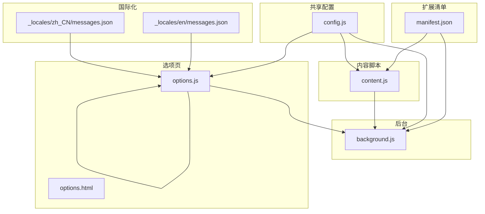
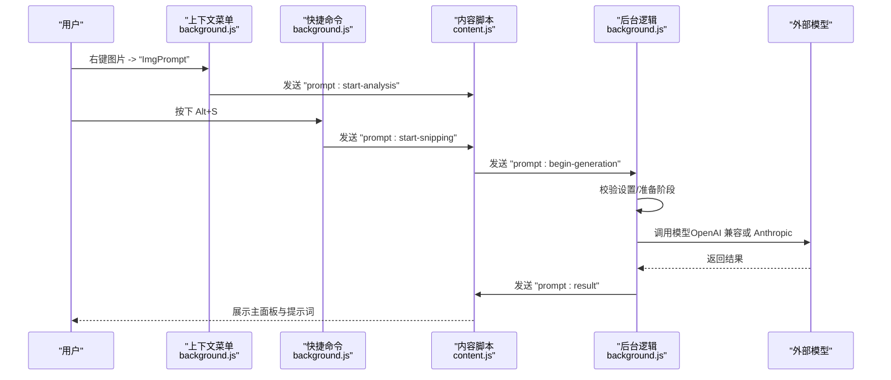
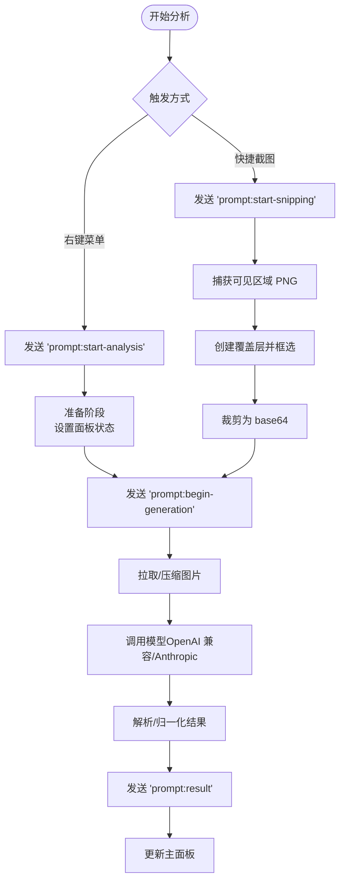
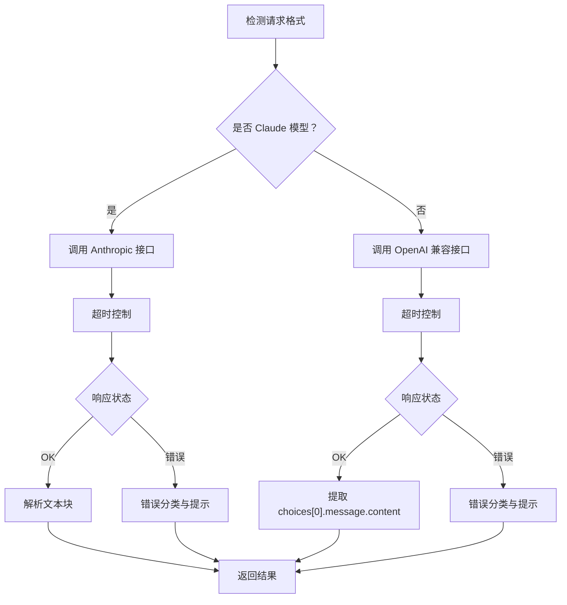
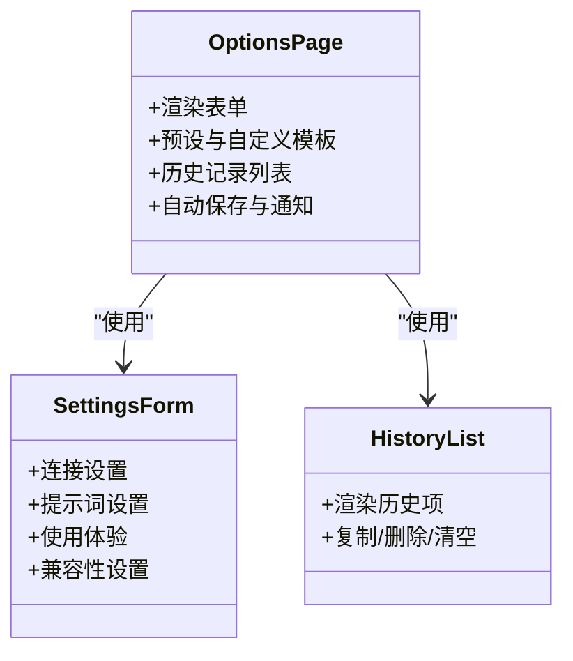
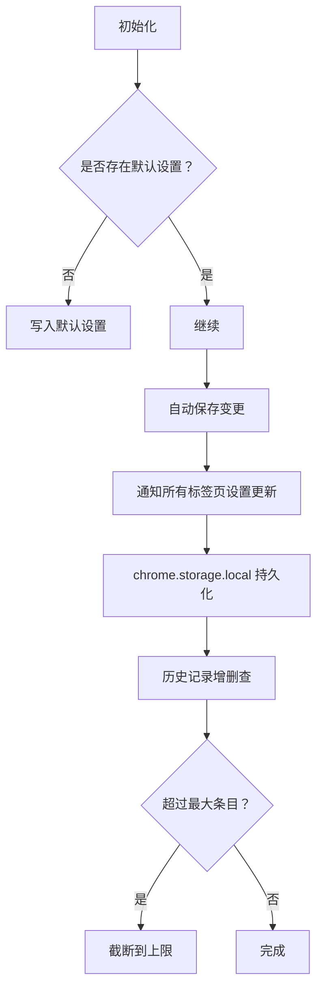
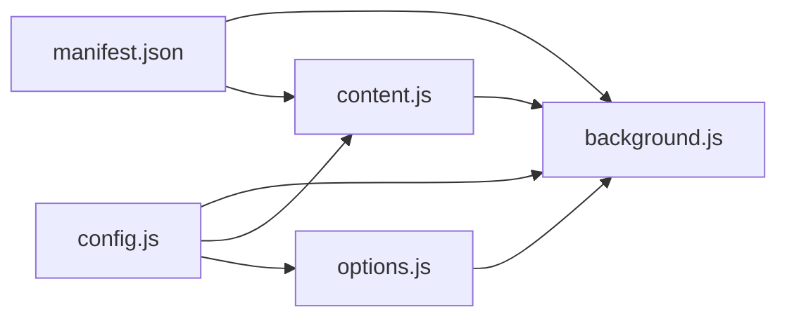

# 核心功能

<cite>
**本文引用的文件**
- [manifest.json](file://manifest.json)
- [config.js](file://config.js)
- [background.js](file://background.js)
- [content.js](file://content.js)
- [options.js](file://options.js)
- [options.html](file://options.html)
- [_locales/en/messages.json](file://_locales/en/messages.json)
- [_locales/zh_CN/messages.json](file://_locales/zh_CN/messages.json)
</cite>

## 目录
1. [简介](#简介)
2. [项目结构](#项目结构)
3. [核心组件](#核心组件)
4. [架构总览](#架构总览)
5. [详细组件分析](#详细组件分析)
6. [依赖关系分析](#依赖关系分析)
7. [性能考量](#性能考量)
8. [故障排查指南](#故障排查指南)
9. [结论](#结论)
10. [附录](#附录)

## 简介
本文件面向 Img2Prompt 的核心功能，系统性阐述以下能力：
- 图片分析流程：右键菜单触发、悬浮按钮交互、快捷截图（Alt+S）与区域截图。
- AI 模型集成：OpenAI 兼容接口与 Anthropic Claude 的适配与自动识别。
- 用户界面：主面板显示、设置页面、历史记录管理。
- 数据管理：本地存储策略、配置持久化、历史记录增删查。
- 使用示例与最佳实践：如何正确配置与高效使用。

## 项目结构
该扩展采用 Manifest V3 架构，包含后台脚本、内容脚本、选项页与共享配置。核心文件职责如下：
- manifest.json：声明权限、快捷键、侧边栏、内容脚本注入等。
- config.js：共享配置（默认设置、提示词预设、UI 文案、错误码、遥测配置）。
- background.js：后台逻辑（上下文菜单、命令监听、消息路由、生成流程、历史记录、遥测）。
- content.js：页面内逻辑（悬浮按钮、主面板、进度与结果展示、截图工具）。
- options.js / options.html：设置页面与历史记录 UI。
- 国际化资源：多语言文案映射。

图表来源
- [manifest.json:1-45](file://manifest.json#L1-L45)
- [config.js:1-254](file://config.js#L1-L254)
- [background.js:1-969](file://background.js#L1-L969)
- [content.js:1-1578](file://content.js#L1-L1578)
- [options.js:1-491](file://options.js#L1-L491)
- [options.html:1-585](file://options.html#L1-L585)
- [_locales/en/messages.json:1-11](file://_locales/en/messages.json#L1-L11)
- [_locales/zh_CN/messages.json:1-11](file://_locales/zh_CN/messages.json#L1-L11)

章节来源
- [manifest.json:1-45](file://manifest.json#L1-L45)
- [config.js:1-254](file://config.js#L1-L254)

## 核心组件
- 配置中心（config.js）
  - 默认设置：API 地址、模型、密钥、请求格式、超时、分辨率限制、系统/用户提示词、温度等。
  - 提示词预设：通用、摄影、CG、平面设计、UI、3D 资产、电商产品等场景模板。
  - UI 文案与错误码：中英文状态文本、错误分类与用户友好提示。
  - 遥测配置：PostHog 项目键与主机地址、配置键名。
- 后台（background.js）
  - 上下文菜单：右键图片触发分析。
  - 快捷命令：Alt+S 截取可见区域并分析。
  - 生成流程：参数校验、图片拉取与压缩、调用模型、结果归一化、进度与错误上报、历史记录持久化。
  - 历史记录：增删清空、最大条目限制、本地存储。
  - 遥测：事件采集与发送，支持开关。
- 内容脚本（content.js）
  - 悬浮按钮：悬停图片显示“ImgPrompt”入口，点击触发分析。
  - 主面板：拖拽、复制、语言切换、进度与结果展示、停止生成。
  - 截图工具：全屏截图后框选区域，裁剪为 base64，触发分析。
- 设置页（options.js / options.html）
  - 连接设置：API Endpoint、Model、API Key。
  - 提示词设置：内置预设与自定义模板，支持保存/编辑/删除。
  - 使用体验：面板语言、悬浮按钮、截屏快捷键开关。
  - 兼容性设置：API 超时、最大图片分辨率。
  - 历史记录：列表展示、复制、删除、清空。

章节来源
- [config.js:1-254](file://config.js#L1-L254)
- [background.js:1-969](file://background.js#L1-L969)
- [content.js:1-1578](file://content.js#L1-L1578)
- [options.js:1-491](file://options.js#L1-L491)
- [options.html:1-585](file://options.html#L1-L585)

## 架构总览
整体工作流从用户操作出发，经由内容脚本与后台脚本协作，最终调用外部模型并回传结果。

图表来源
- [background.js:59-92](file://background.js#L59-L92)
- [content.js:209-247](file://content.js#L209-L247)
- [background.js:212-320](file://background.js#L212-L320)

## 详细组件分析

### 图片分析功能
- 右键菜单触发
  - 注册上下文菜单项，点击后向当前标签页发送“开始分析”消息，并携带图片源地址与页面信息。
- 悬浮按钮交互
  - 监听指针移动与滚动，按节流策略更新悬浮按钮位置；支持关闭按钮与点击进入分析。
- 快捷截图（Alt+S）
  - 监听全局命令，捕获可见区域 PNG，向内容脚本发送“开始截图分析”，随后在页面上绘制覆盖层进行框选，裁剪后以 base64 触发分析。
- 主面板显示
  - 动态构建 Shadow DOM 面板，支持拖拽、复制、语言切换、进度与状态展示、停止生成、预览图渲染。

图表来源
- [background.js:59-92](file://background.js#L59-L92)
- [content.js:209-247](file://content.js#L209-L247)
- [content.js:489-594](file://content.js#L489-L594)
- [background.js:212-320](file://background.js#L212-L320)

章节来源
- [background.js:59-92](file://background.js#L59-L92)
- [content.js:77-111](file://content.js#L77-L111)
- [content.js:489-594](file://content.js#L489-L594)
- [content.js:596-725](file://content.js#L596-L725)

### AI 模型集成功能
- 自动识别请求格式
  - 若模型名以“claude”开头则走 Anthropic；否则走 OpenAI 兼容接口；也可手动指定格式。
- OpenAI 兼容接口
  - 组装消息体（system + user + image_url），支持超时控制与多种状态码的用户友好提示。
- Anthropic Claude
  - 将 base64 图像转换为 Claude 所需的 source 结构，设置 anthropic-version，默认超时控制。
- 错误分类与提示
  - 网络、鉴权、限流、超时、无效响应、JSON 解析失败、字段缺失、取消、未知等分类，并映射为 UI 友好文案。

图表来源
- [background.js:505-515](file://background.js#L505-L515)
- [background.js:497-503](file://background.js#L497-L503)
- [background.js:517-604](file://background.js#L517-L604)
- [background.js:606-690](file://background.js#L606-L690)

章节来源
- [background.js:505-515](file://background.js#L505-L515)
- [background.js:497-503](file://background.js#L497-L503)
- [background.js:517-604](file://background.js#L517-L604)
- [background.js:606-690](file://background.js#L606-L690)

### 用户界面设计
- 主面板
  - 支持拖动、复制提示词、语言切换（中/英）、停止生成、预览图展示、状态与进度反馈。
- 设置页面
  - 连接设置：Endpoint、Model、Key。
  - 提示词设置：内置预设与自定义模板，支持保存/编辑/删除。
  - 使用体验：面板语言、悬浮按钮、截屏快捷键。
  - 兼容性设置：API 超时、最大图片分辨率。
  - 历史记录：列表、复制、删除、清空。
- 历史记录管理
  - 本地存储，最多保留固定条目，支持删除单条与一键清空。

图表来源
- [options.js:182-213](file://options.js#L182-L213)
- [options.js:222-245](file://options.js#L222-L245)
- [options.js:247-325](file://options.js#L247-L325)
- [options.html:379-585](file://options.html#L379-L585)

章节来源
- [options.js:182-213](file://options.js#L182-L213)
- [options.js:222-245](file://options.js#L222-L245)
- [options.js:247-325](file://options.js#L247-L325)
- [options.html:379-585](file://options.html#L379-L585)

### 数据管理机制
- 本地存储策略
  - 使用 chrome.storage.local 存储：客户端 ID、设置、历史记录、自定义模板。
  - 客户端 ID 自动生成并持久化，用于遥测。
  - 历史记录最多保留固定数量，超出则截断。
- 配置持久化
  - 初始化时若缺失默认设置则写入；后续通过自动保存与恢复默认值保持一致性。
- 遥测
  - 可开关；发送至 PostHog；包含扩展版本、页面主机与协议等上下文。

图表来源
- [background.js:19-57](file://background.js#L19-L57)
- [background.js:322-328](file://background.js#L322-L328)
- [background.js:412-463](file://background.js#L412-L463)
- [background.js:359-410](file://background.js#L359-L410)

章节来源
- [background.js:19-57](file://background.js#L19-L57)
- [background.js:322-328](file://background.js#L322-L328)
- [background.js:412-463](file://background.js#L412-L463)
- [background.js:359-410](file://background.js#L359-L410)

## 依赖关系分析
- manifest.json
  - 声明 action、background、commands、content_scripts、permissions、side_panel、host_permissions 等。
- config.js
  - 被 background.js、content.js、options.js 引用，提供统一配置与文案。
- background.js
  - 依赖 config.js 的默认设置、UI 文案、错误码、遥测配置。
  - 与 content.js 通过消息通信协作。
- content.js
  - 依赖 config.js 的 UI 文案与默认提示词。
  - 与 background.js 通过消息通信协作。
- options.js / options.html
  - 依赖 config.js 的 SETTINGS_I18N 与 UI_STRINGS。
  - 与 background.js 交互以加载/更新历史记录。

图表来源
- [manifest.json:1-45](file://manifest.json#L1-L45)
- [config.js:1-254](file://config.js#L1-L254)
- [background.js:1-12](file://background.js#L1-L12)
- [content.js:1-5](file://content.js#L1-L5)
- [options.js:1-5](file://options.js#L1-L5)

章节来源
- [manifest.json:1-45](file://manifest.json#L1-L45)
- [config.js:1-254](file://config.js#L1-L254)
- [background.js:1-12](file://background.js#L1-L12)
- [content.js:1-5](file://content.js#L1-L5)
- [options.js:1-5](file://options.js#L1-L5)

## 性能考量
- 图片处理
  - 默认最大边长 1024px，可在设置中调整；过大的图片会增加请求体积与超时风险。
  - 截图工具使用设备像素比与 Canvas 裁剪，避免不必要的放大。
- 超时控制
  - 默认 60 秒，可通过设置调整；模型响应慢或网络波动时可适当提高。
- UI 更新节流
  - 指针移动与滚动事件采用节流，减少频繁重绘与布局抖动。
- 本地存储
  - 历史记录上限控制，避免无限增长导致存储压力。

## 故障排查指南
- 常见错误与定位
  - 网络错误：检查网络连通性与代理设置。
  - 鉴权失败：核对 API Key 是否正确、是否过期。
  - 限流：降低请求频率或提升配额。
  - 超时：提高 API 超时设置或降低图片分辨率。
  - 无效响应/JSON 解析失败：确保模型返回纯 JSON，System Prompt 正确。
  - 字段缺失：确保返回包含 zh/en 字段。
  - 取消：点击“停止生成”或取消请求。
- 建议步骤
  - 在设置页确认 Endpoint、Model、Key 填写正确。
  - 切换语言查看错误提示是否更清晰。
  - 降低分辨率或缩短提示词长度以减少体积。
  - 查看历史记录，确认是否已保存成功。
  - 如仍失败，清理历史记录并重试。

章节来源
- [background.js:465-476](file://background.js#L465-L476)
- [background.js:296-317](file://background.js#L296-L317)
- [config.js:207-248](file://config.js#L207-L248)

## 结论
Img2Prompt 通过简洁的触发方式与完善的 UI 设计，将图片分析与提示词生成整合为一次流畅的用户体验。其模块化架构使配置、模型集成与数据管理清晰可控，适合在多场景下快速提取高质量提示词。

## 附录

### 使用示例与最佳实践
- 快速开始
  - 在设置页填写 API Endpoint、Model、API Key。
  - 选择合适的提示词预设或自定义模板。
  - 右键图片选择“ImgPrompt”或按下 Alt+S 进行截图分析。
- 最佳实践
  - 对于大图优先降低分辨率，避免超时与高成本。
  - 使用 Claude 模型时确保图片可读为 base64。
  - 定期清理历史记录，保持本地存储整洁。
  - 在复杂场景下优化 System Prompt，确保输出结构化 JSON。
  - 遇到 400 类错误时尝试调整请求格式或兼容性设置。