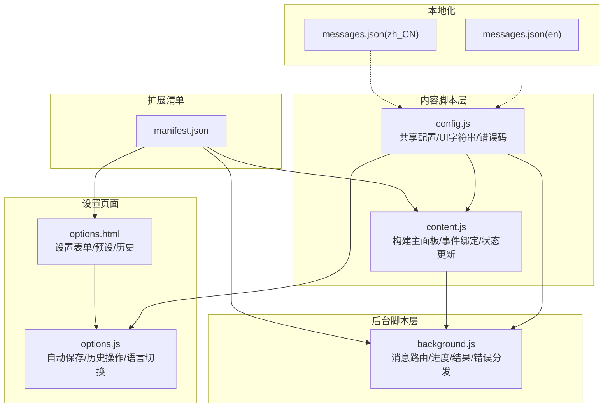
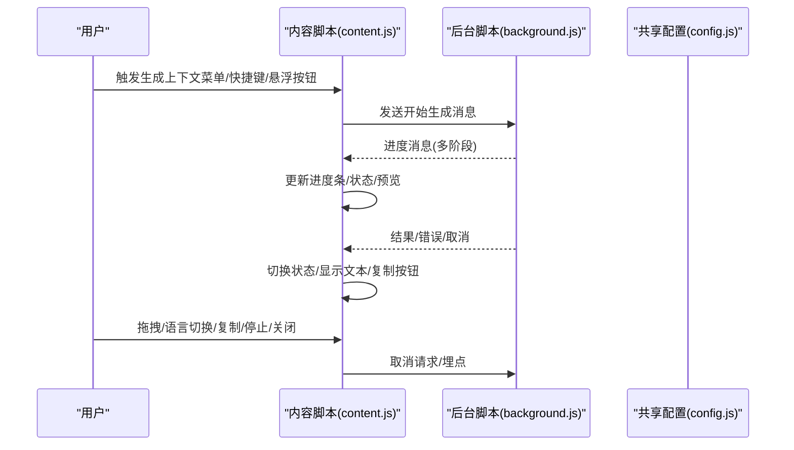
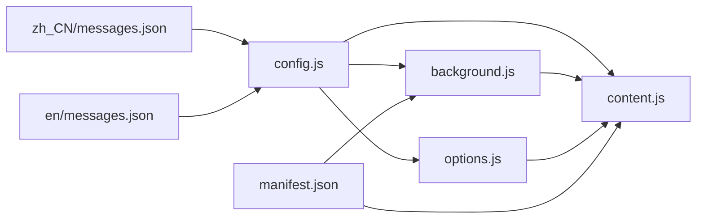
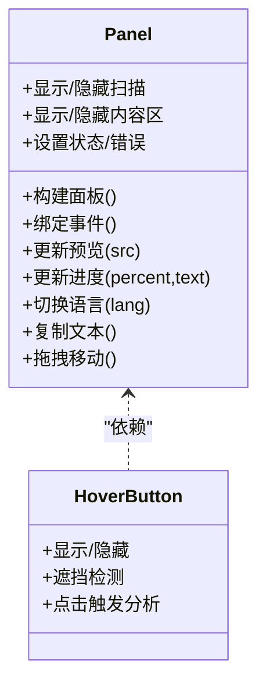
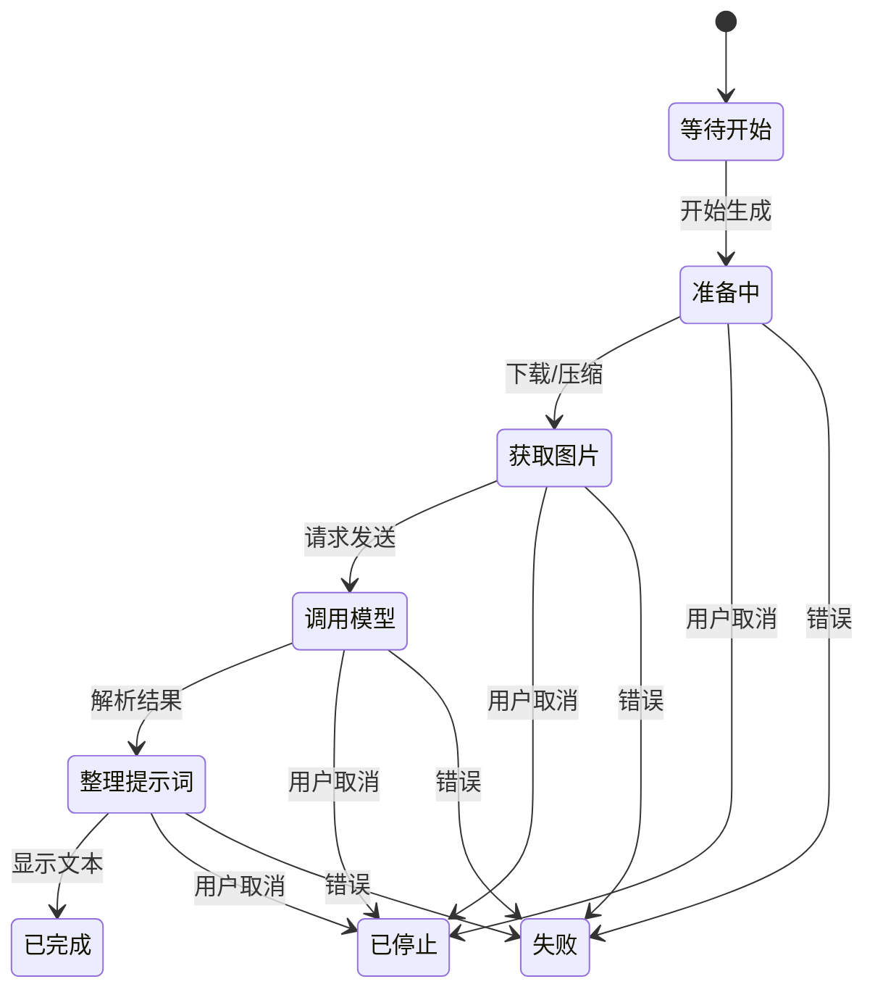

# 主面板显示

<cite>
**本文引用的文件**
- [manifest.json](file://manifest.json)
- [config.js](file://config.js)
- [content.js](file://content.js)
- [background.js](file://background.js)
- [options.html](file://options.html)
- [options.js](file://options.js)
- [_locales/zh_CN/messages.json](file://_locales/zh_CN/messages.json)
- [_locales/en/messages.json](file://_locales/en/messages.json)
</cite>

## 目录
1. [简介](#简介)
2. [项目结构](#项目结构)
3. [核心组件](#核心组件)
4. [架构总览](#架构总览)
5. [详细组件分析](#详细组件分析)
6. [依赖关系分析](#依赖关系分析)
7. [性能考量](#性能考量)
8. [故障排查指南](#故障排查指南)
9. [结论](#结论)
10. [附录](#附录)

## 简介
本文件面向 Img2Prompt 扩展的“主面板显示”能力，聚焦于主面板的 UI 架构与交互流程，包括：
- Shadow DOM 结构与样式系统
- 响应式布局与视觉层次
- 面板各组件：预览区域、提示词文本框、语言切换按钮、复制按钮、进度指示器、状态显示
- 交互逻辑：拖拽移动、关闭按钮、悬浮按钮显示/隐藏机制
- 面板状态管理：加载、生成、错误、完成等状态的视觉反馈
- 定制化与样式修改建议

## 项目结构
该扩展采用 Manifest V3 架构，核心脚本在内容脚本中构建主面板，后台脚本负责与模型服务通信并回传进度与结果。设置页面独立于主面板，提供用户偏好配置与历史记录管理。

图表来源
- [manifest.json:1-45](file://manifest.json#L1-L45)
- [content.js:596-620](file://content.js#L596-L620)
- [background.js:94-184](file://background.js#L94-L184)
- [config.js:4-253](file://config.js#L4-L253)
- [options.html:1-687](file://options.html#L1-L687)
- [options.js:1-551](file://options.js#L1-L551)
- [_locales/zh_CN/messages.json:1-11](file://_locales/zh_CN/messages.json#L1-L11)
- [_locales/en/messages.json:1-11](file://_locales/en/messages.json#L1-L11)

章节来源
- [manifest.json:1-45](file://manifest.json#L1-L45)
- [content.js:596-620](file://content.js#L596-L620)
- [background.js:94-184](file://background.js#L94-L184)
- [config.js:4-253](file://config.js#L4-L253)
- [options.html:1-687](file://options.html#L1-L687)
- [options.js:1-551](file://options.js#L1-L551)
- [_locales/zh_CN/messages.json:1-11](file://_locales/zh_CN/messages.json#L1-L11)
- [_locales/en/messages.json:1-11](file://_locales/en/messages.json#L1-L11)

## 核心组件
- 面板容器与 Shadow DOM
  - 面板根节点 ID 固定，首次渲染时创建并挂载 Shadow DOM，内部包含完整结构与样式。
  - 面板尺寸固定宽度，配合最大宽度与视口约束实现响应式。
- 预览区域
  - 支持 data URL 与远程 URL 预览；加载成功后显示遮罩渐变增强对比度。
- 进度与扫描动画
  - 进度条带色带动画；生成阶段显示扫描条纹动画。
- 文本区
  - 只读状态由生成状态控制；支持垂直滚动与自适应高度。
- 语言切换
  - 中文/英文双按钮，点击切换当前语言与首选语言偏好。
- 复制按钮
  - 成功复制后短暂置为“完成态”，随后恢复。
- 关闭与停止
  - 关闭按钮隐藏面板；停止按钮向后台发送取消请求。
- 悬浮按钮
  - 鼠标悬停图片时出现，支持关闭与点击触发分析。

章节来源
- [content.js:727-1156](file://content.js#L727-L1156)
- [content.js:1273-1346](file://content.js#L1273-L1346)
- [content.js:1439-1499](file://content.js#L1439-L1499)
- [content.js:1501-1567](file://content.js#L1501-L1567)

## 架构总览
主面板的生命周期由内容脚本驱动：当收到后台进度/结果/错误消息时，内容脚本更新面板状态与 UI；同时，用户交互（拖拽、语言切换、复制、停止、关闭）通过事件回调同步到状态与存储。

图表来源
- [content.js:209-247](file://content.js#L209-L247)
- [content.js:249-326](file://content.js#L249-L326)
- [content.js:347-376](file://content.js#L347-L376)
- [content.js:433-450](file://content.js#L433-L450)
- [content.js:464-487](file://content.js#L464-L487)
- [background.js:212-320](file://background.js#L212-L320)
- [config.js:4-253](file://config.js#L4-L253)

## 详细组件分析

### Shadow DOM 结构与样式系统
- 容器与阴影
  - 面板根节点固定 ID，首次渲染时 attachShadow 并注入内联样式与结构。
  - 样式采用 :host 初始化，确保与宿主隔离。
- 视觉层次
  - 预览图覆盖在阶段区域之上，加载成功后显示遮罩增强对比。
  - 卡片背景使用多层渐变与描边，营造沉浸感。
  - 进度条带色带动画，强调动态过程。
- 响应式
  - 面板宽度固定，配合最大宽度与视口边界约束，避免溢出。
  - 文本区最小高度与滚动条样式适配暗色主题。

章节来源
- [content.js:727-1156](file://content.js#L727-L1156)
- [content.js:729-1113](file://content.js#L729-L1113)

### 预览区域
- 加载与错误处理
  - 预览图加载成功后设置 data-loaded 属性，显示遮罩；加载失败则移除属性与 src。
- 显示策略
  - 仅在存在源时设置 src；完成态时根据来源更新预览。

章节来源
- [content.js:1273-1281](file://content.js#L1273-L1281)
- [content.js:1439-1452](file://content.js#L1439-L1452)

### 提示词文本框
- 只读控制
  - 生成过程中禁用编辑；完成后允许编辑。
- 内容管理
  - 当前语言文本实时写入内存；语言切换时同步到文本框。

章节来源
- [content.js:1382-1390](file://content.js#L1382-L1390)
- [content.js:1435-1437](file://content.js#L1435-L1437)
- [content.js:1295-1316](file://content.js#L1295-L1316)

### 语言切换按钮
- 交互
  - 点击切换 activeLanguage，并持久化到存储；同步按钮激活态与文本框内容。
- 顺序与优先级
  - 根据首选语言决定中英文按钮的排列顺序。

章节来源
- [content.js:1295-1311](file://content.js#L1295-L1311)
- [content.js:1364-1371](file://content.js#L1364-L1371)
- [content.js:263-273](file://content.js#L263-L273)

### 复制按钮
- 行为
  - 点击复制当前语言文本；成功后进入完成态并定时恢复。
- 错误处理
  - 失败时提示用户检查剪贴板权限。

章节来源
- [content.js:1318-1338](file://content.js#L1318-L1338)
- [content.js:1454-1471](file://content.js#L1454-L1471)

### 进度指示器与扫描动画
- 进度条
  - 百分比宽度随后台进度更新；状态文本包含耗时。
- 扫描动画
  - 生成阶段启用 data-scanning 属性，显示横向扫描条纹动画。

章节来源
- [content.js:1373-1380](file://content.js#L1373-L1380)
- [content.js:1396-1411](file://content.js#L1396-L1411)
- [content.js:1494-1499](file://content.js#L1494-L1499)

### 状态显示
- 状态文本
  - 生成阶段显示“准备中/获取图片/调用模型/整理提示词”等阶段性文案。
- 错误与完成
  - 错误时显示错误信息；完成时显示“已完成”。

章节来源
- [content.js:1388-1390](file://content.js#L1388-L1390)
- [content.js:452-462](file://content.js#L452-L462)
- [content.js:347-376](file://content.js#L347-L376)

### 关闭与停止按钮
- 关闭
  - 隐藏面板；若正在生成，先尝试取消。
- 停止
  - 向后台发送取消请求；若失败则回退到本地状态。

章节来源
- [content.js:1283-1289](file://content.js#L1283-L1289)
- [content.js:1340-1345](file://content.js#L1340-L1345)
- [content.js:1348-1362](file://content.js#L1348-L1362)

### 拖拽移动
- 触发条件
  - 在卡片区域按下指针且非交互元素时启动拖拽。
- 边界约束
  - 限制在视窗内，保留最小边距。
- 释放
  - 释放指针时停止监听。

章节来源
- [content.js:1501-1533](file://content.js#L1501-L1533)
- [content.js:1535-1556](file://content.js#L1535-L1556)
- [content.js:1558-1567](file://content.js#L1558-L1567)

### 悬浮按钮显示/隐藏机制
- 显示
  - 鼠标移动到图片上，满足尺寸与可见性条件时显示悬浮按钮。
- 遮挡检测
  - 检测按钮位置是否被其他元素遮挡，避免遮挡导致的显示异常。
- 隐藏
  - 图片不可见、离开图片或用户手动关闭时隐藏。

章节来源
- [content.js:1158-1190](file://content.js#L1158-L1190)
- [content.js:1192-1243](file://content.js#L1192-L1243)
- [content.js:1245-1263](file://content.js#L1245-L1263)
- [content.js:1265-1271](file://content.js#L1265-L1271)

### 面板状态管理与视觉反馈
- 加载状态
  - 启动生成时设置加载态、显示扫描动画、隐藏内容区。
- 生成状态
  - 进度推进、状态文本更新、预览加载。
- 完成状态
  - 停止扫描、显示内容区、预览就绪、复制按钮复位。
- 错误状态
  - 停止扫描、显示错误信息、禁用复制。
- 取消状态
  - 停止扫描、显示“已停止”状态、禁用复制。

章节来源
- [content.js:249-326](file://content.js#L249-L326)
- [content.js:347-376](file://content.js#L347-L376)
- [content.js:433-450](file://content.js#L433-L450)
- [content.js:464-487](file://content.js#L464-L487)

### 语言与本地化
- 面板文案
  - UI 字符串来自共享配置，支持中英双语。
- 设置页面
  - 设置页面同样使用 UI 字符串与本地化资源，支持切换 UI 语言。

章节来源
- [config.js:32-113](file://config.js#L32-L113)
- [options.js:424-454](file://options.js#L424-L454)
- [_locales/zh_CN/messages.json:1-11](file://_locales/zh_CN/messages.json#L1-L11)
- [_locales/en/messages.json:1-11](file://_locales/en/messages.json#L1-L11)

## 依赖关系分析
- 内容脚本依赖
  - 依赖共享配置提供 UI 字符串与默认设置。
  - 依赖后台脚本提供进度、结果与错误消息。
- 后台脚本依赖
  - 依赖共享配置提供默认设置、UI 字符串与错误映射。
  - 依赖存储提供用户设置与历史记录。
- 设置页面依赖
  - 依赖共享配置与本地化资源，提供自动保存与历史管理。

图表来源
- [config.js:4-253](file://config.js#L4-L253)
- [content.js:1-50](file://content.js#L1-L50)
- [background.js:1-12](file://background.js#L1-L12)
- [options.js:1-8](file://options.js#L1-L8)
- [manifest.json:1-45](file://manifest.json#L1-L45)
- [_locales/zh_CN/messages.json:1-11](file://_locales/zh_CN/messages.json#L1-L11)
- [_locales/en/messages.json:1-11](file://_locales/en/messages.json#L1-L11)

章节来源
- [config.js:4-253](file://config.js#L4-L253)
- [content.js:1-50](file://content.js#L1-L50)
- [background.js:1-12](file://background.js#L1-L12)
- [options.js:1-8](file://options.js#L1-L8)
- [manifest.json:1-45](file://manifest.json#L1-L45)
- [_locales/zh_CN/messages.json:1-11](file://_locales/zh_CN/messages.json#L1-L11)
- [_locales/en/messages.json:1-11](file://_locales/en/messages.json#L1-L11)

## 性能考量
- 图像压缩与尺寸限制
  - 默认最大边长限制与压缩质量参数，减少传输体积与内存占用。
- 进度节流
  - 使用节流函数控制指针移动事件频率，降低重绘压力。
- 动画与过渡
  - 进度条与扫描动画采用 CSS 动画，避免 JS 循环带来的卡顿。
- 存储与本地化
  - UI 字符串与错误映射集中管理，减少重复计算与网络请求。

章节来源
- [content.js:5-28](file://content.js#L5-L28)
- [content.js:33-34](file://content.js#L33-L34)
- [background.js:774-800](file://background.js#L774-L800)

## 故障排查指南
- 无法复制提示词
  - 检查剪贴板权限；若失败，查看错误区域提示。
- 生成失败
  - 查看错误区域具体错误码与用户友好提示；检查 API 地址、密钥与模型配置。
- 面板不显示
  - 确认扩展已启用；检查悬浮按钮开关与图片可见性；必要时手动触发生成。
- 预览不显示
  - 确认源 URL 可访问；检查图像类型与跨域策略；查看加载失败回调。

章节来源
- [content.js:1318-1338](file://content.js#L1318-L1338)
- [content.js:464-487](file://content.js#L464-L487)
- [content.js:1273-1281](file://content.js#L1273-L1281)
- [background.js:280-317](file://background.js#L280-L317)

## 结论
主面板通过 Shadow DOM 实现强隔离的 UI 结构，结合后台脚本的进度/结果/错误分发，形成清晰的状态机与一致的视觉反馈。其交互设计兼顾易用性与性能，支持拖拽移动、语言切换、复制与停止等常用操作。通过共享配置与本地化资源，实现中英双语支持与一致的文案体验。

## 附录

### 面板组件与类关系（代码级）

图表来源
- [content.js:596-620](file://content.js#L596-L620)
- [content.js:1158-1271](file://content.js#L1158-L1271)
- [content.js:1273-1346](file://content.js#L1273-L1346)
- [content.js:1501-1567](file://content.js#L1501-L1567)

### 面板状态机（概念）

[此图为概念示意，不对应具体代码文件]