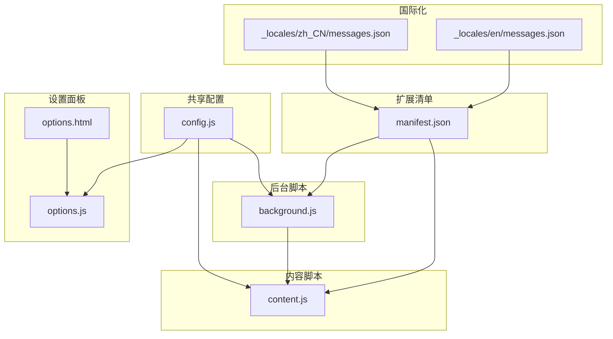
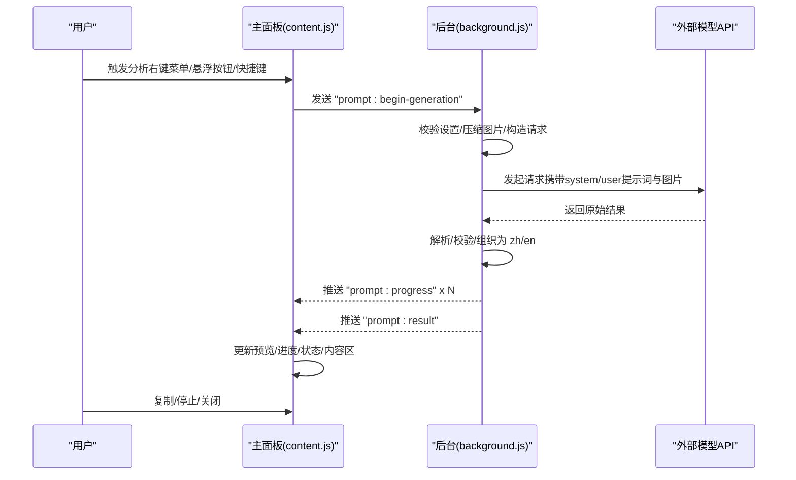
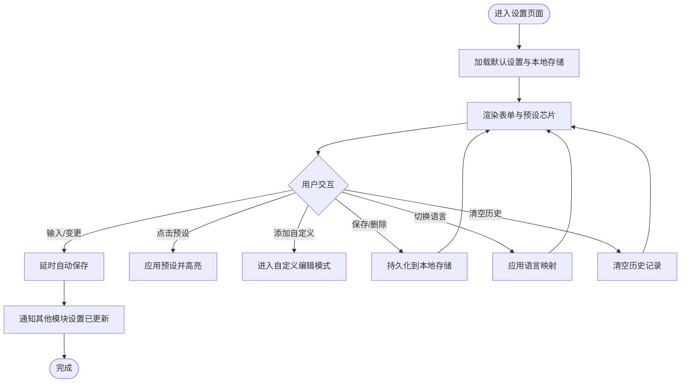
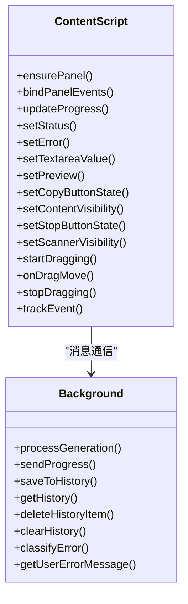
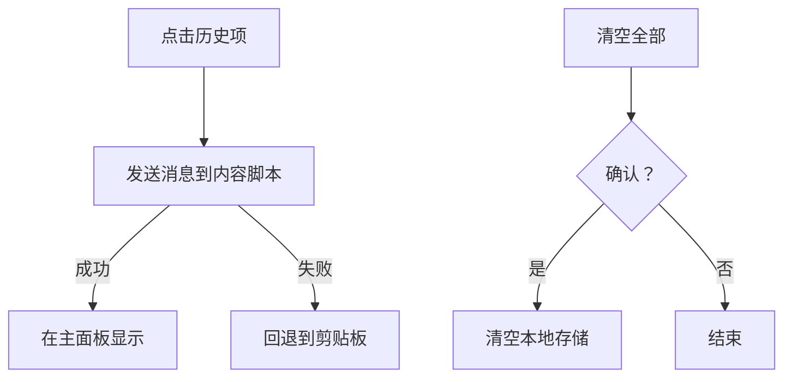
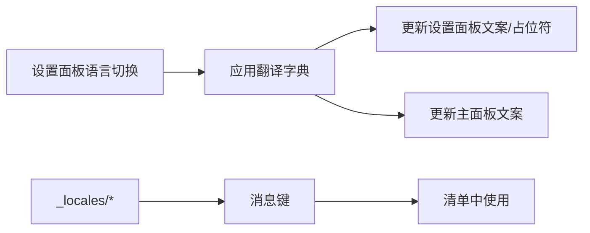
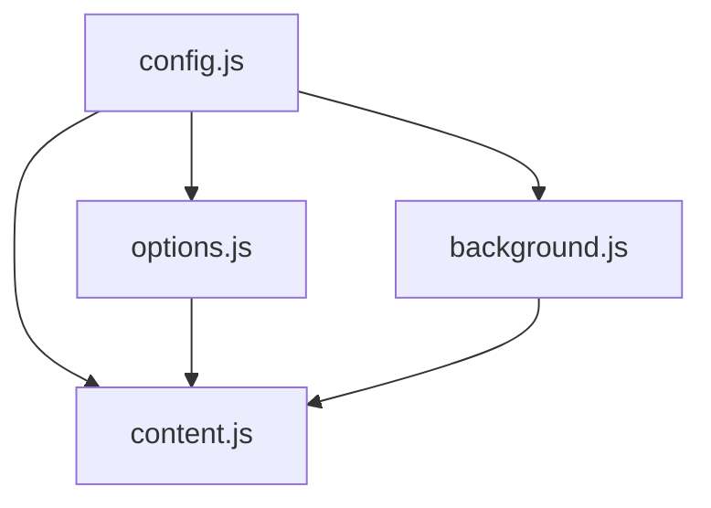

# 用户界面

<cite>
**本文引用的文件**
- [manifest.json](file://manifest.json)
- [config.js](file://config.js)
- [options.html](file://options.html)
- [options.js](file://options.js)
- [content.js](file://content.js)
- [background.js](file://background.js)
- [_locales/en/messages.json](file://_locales/en/messages.json)
- [_locales/zh_CN/messages.json](file://_locales/zh_CN/messages.json)
</cite>

## 更新摘要
**变更内容**
- 新增暗色主题支持和渐变色彩设计
- 实现响应式布局和移动端适配
- 添加丰富的CSS动画和过渡效果
- 引入自定义文本区域调整功能
- 完善悬浮入口和拖拽移动交互
- 增强历史记录管理和导出功能

## 目录
1. [简介](#简介)
2. [项目结构](#项目结构)
3. [核心组件](#核心组件)
4. [架构总览](#架构总览)
5. [详细组件分析](#详细组件分析)
6. [UI改进特性](#ui改进特性)
7. [依赖关系分析](#依赖关系分析)
8. [性能考量](#性能考量)
9. [故障排查指南](#故障排查指南)
10. [结论](#结论)
11. [附录](#附录)

## 简介
本文件面向 Img2Prompt 扩展的用户与维护者，系统化梳理其"用户界面"相关实现，覆盖：
- 主面板（内容脚本注入的浮动面板）的设计与交互，包括提示词显示、复制功能、进度指示器与状态文案。
- 设置页面（侧边栏）的功能与布局，包括 API 配置、模型选择、温度参数、历史记录管理、多语言切换与兼容性设置。
- 多语言支持机制与界面本地化实现。
- 用户交互流程：从触发分析到结果显示的完整体验。
- 界面定制选项与使用技巧。

## 项目结构
该扩展采用 Manifest V3 架构，关键文件职责如下：
- manifest.json：声明 action 图标、背景服务、内容脚本注入、侧边栏默认路径、权限与快捷键等。
- config.js：共享配置（默认设置、提示词预设、UI 文案、错误码与消息、分析上报配置），供多个模块复用。
- options.html/options.js：设置面板页面与逻辑，负责 API 配置、提示词预设、语言切换、历史记录展示与操作、兼容性设置等。
- content.js：内容脚本，负责在页面内渲染主面板、悬浮入口、进度与状态更新、复制与停止等交互。
- background.js：后台脚本，负责上下文菜单、快捷键、历史记录持久化、与模型的请求与进度推送、错误分类与用户友好提示。
- _locales/*：国际化资源，提供扩展名与描述的本地化。

**图表来源**
- [manifest.json:1-45](file://manifest.json#L1-L45)
- [config.js:1-270](file://config.js#L1-L270)
- [options.html:1-769](file://options.html#L1-L769)
- [options.js:1-676](file://options.js#L1-L676)
- [content.js:1-1663](file://content.js#L1-L1663)
- [background.js:1-1107](file://background.js#L1-L1107)

**章节来源**
- [manifest.json:1-45](file://manifest.json#L1-L45)
- [config.js:1-270](file://config.js#L1-L270)

## 核心组件
- 设置面板（侧边栏）
  - 连接设置：API Endpoint、模型、API Key 输入与占位提示。
  - 提示词设置：内置预设（通用、摄影、CG、平面设计、UI、游戏资产、电商产品）与自定义模板管理。
  - 使用体验：悬浮入口开关、截屏提取提示词快捷键开关、快捷键提示。
  - 兼容性设置：最大图片边长下拉选择（512/768/1024/1280）。
  - 历史记录：列表展示、复制、删除、清空。
  - 多语言：设置面板语言切换（中文/英文）。
- 主面板（内容脚本）
  - 预览区：显示分析图片，带扫描动画与遮罩。
  - 进度条：渐变色进度条与状态文本，包含耗时显示。
  - 内容区：提示词文本域，支持中英双语切换与一键复制。
  - 控制区：停止生成、关闭面板、拖拽移动。
- 历史记录
  - 存储于本地存储，最多保留固定数量，支持按时间排序与删除。
  - 支持从历史项直接加载到主面板，或回退到剪贴板。

**章节来源**
- [options.html:531-769](file://options.html#L531-L769)
- [options.js:182-216](file://options.js#L182-L216)
- [content.js:596-1156](file://content.js#L596-L1156)
- [background.js:412-463](file://background.js#L412-L463)

## 架构总览
从触发到结果的端到端流程如下：

**图表来源**
- [content.js:249-326](file://content.js#L249-L326)
- [background.js:212-320](file://background.js#L212-L320)
- [background.js:517-666](file://background.js#L517-L666)

## 详细组件分析

### 设置面板（options.html + options.js）
- 布局与主题
  - 深色主题变量与渐变背景，强调对比与沉浸感；响应式网格布局适配移动端。
  - 信息区块采用折叠细节面板，便于分组查看与操作。
- 连接设置
  - API Endpoint、模型、API Key 三要素，均提供占位提示与必填约束。
  - 通过自动保存机制（输入/变更事件延时保存）减少频繁写入。
- 提示词设置
  - 预设芯片：内置八类场景，点击即应用；自定义模板以"⚙️ 名称"形式动态插入。
  - 自定义模式：标题、User Prompt 编辑区，支持保存、取消、删除。
  - 活跃芯片高亮同步，避免与自定义冲突。
- 使用体验
  - 悬浮入口开关：鼠标悬停图片时显示快捷按钮。
  - 截屏提取提示词：快捷键 Alt/Option + S，支持框选截图后分析。
  - 快捷键提示：引导用户前往扩展快捷键页面修改。
- 兼容性设置
  - 最大图片边长：通过自定义下拉选择（512/768/1024/1280），隐藏 select 同步表单值并触发展示层变化。
- 历史记录
  - 列表渲染：时间戳、中/英提示词预览、图片缩略图（若存在）。
  - 操作：复制（复制当前语言）、删除、清空。
  - 加载历史项：优先通过消息发送到内容脚本显示，失败则回退到剪贴板。
- 多语言
  - 设置面板语言切换：中文/英文，即时更新文案与占位符。
  - 状态提示文案随语言切换同步更新。

**图表来源**
- [options.js:182-216](file://options.js#L182-L216)
- [options.js:376-405](file://options.js#L376-L405)
- [options.js:424-454](file://options.js#L424-L454)
- [options.js:218-248](file://options.js#L218-L248)

**章节来源**
- [options.html:531-769](file://options.html#L531-L769)
- [options.js:182-216](file://options.js#L182-L216)
- [options.js:218-248](file://options.js#L218-L248)
- [options.js:424-454](file://options.js#L424-L454)

### 主面板（content.js）
- 面板结构
  - 预览区：覆盖图片，带渐变遮罩与扫描动画。
  - 卡片区：标题、副标题、进度条、状态文本、错误区域、内容区（文本域）、操作区（语言切换、复制、停止）。
- 进度与状态
  - 进度条：宽度随百分比变化，配合状态文本与耗时显示。
  - 状态文本：根据后台推送实时更新，含"准备中/获取图片/调用模型/整理提示词/完成/失败/已停止"等。
- 交互
  - 语言切换：中英按钮互斥，切换后同步首选语言并持久化。
  - 复制：写入剪贴板，按钮状态变为"已复制"，定时恢复。
  - 停止：向后台发送取消请求，更新 UI。
  - 关闭：隐藏面板，必要时取消生成。
  - 拖拽：在卡片区域拖动面板，避免误触按钮与文本域。
- 悬浮入口
  - 当启用时，在图片右上角显示"ImgPrompt"按钮，支持关闭与遮挡检测。
- 与后台通信
  - 监听后台消息：进度、结果、取消、错误、设置更新。
  - 发送消息：开始分析、取消生成、复制事件追踪、设置更新通知。

**图表来源**
- [content.js:596-1156](file://content.js#L596-L1156)
- [content.js:1273-1362](file://content.js#L1273-L1362)
- [background.js:212-320](file://background.js#L212-L320)
- [background.js:412-463](file://background.js#L412-L463)

**章节来源**
- [content.js:596-1156](file://content.js#L596-L1156)
- [content.js:1273-1362](file://content.js#L1273-L1362)
- [content.js:1373-1433](file://content.js#L1373-L1433)

### 历史记录管理
- 数据结构
  - 每条记录包含：id、时间戳、提示词（zh/en）、源图片数据或URL、页面上下文、触发来源、模型名等。
- 持久化
  - 本地存储键：固定常量；最多保留固定数量，超出则截断。
- 交互
  - 列表渲染：时间、预览、图片缩略图、复制/删除按钮。
  - 加载：优先通过消息发送到内容脚本显示，失败回退到剪贴板。
  - 清空：确认后清空本地存储。

**图表来源**
- [options.js:336-360](file://options.js#L336-L360)
- [options.js:362-367](file://options.js#L362-L367)
- [background.js:412-463](file://background.js#L412-L463)

**章节来源**
- [options.js:218-248](file://options.js#L218-L248)
- [options.js:336-367](file://options.js#L336-L367)
- [background.js:412-463](file://background.js#L412-L463)

### 多语言支持与本地化
- 设置面板语言
  - 通过单选按钮切换（中文/英文），即时应用翻译字典，更新文案与占位符。
- 主面板语言
  - 通过语言按钮切换（中/英），同时持久化首选语言，影响后续生成与显示。
- 国际化资源
  - 扩展名与描述在清单中使用消息键，对应 _locales 下的 JSON 文件。
- 文案来源
  - UI 文案与设置面板文案均来自共享配置，确保一致性。

**图表来源**
- [options.js:424-454](file://options.js#L424-L454)
- [content.js:165-207](file://content.js#L165-L207)
- [manifest.json:27](file://manifest.json#L27)
- [_locales/en/messages.json:1-11](file://_locales/en/messages.json#L1-L11)
- [_locales/zh_CN/messages.json:1-11](file://_locales/zh_CN/messages.json#L1-L11)

**章节来源**
- [options.js:424-454](file://options.js#L424-L454)
- [content.js:165-207](file://content.js#L165-L207)
- [manifest.json:27](file://manifest.json#L27)

## UI改进特性

### 暗色主题与视觉设计
- **深色主题系统**：采用 `color-scheme: dark` 和精心设计的暗色调配色方案
- **渐变色彩**：使用 `linear-gradient(90deg, #8bd3ff, #ffc85f 55%, #f09cc0)` 创建流动的渐变效果
- **玻璃拟态**：大量使用 `backdrop-filter: blur(8px)` 和半透明背景实现现代感
- **层次分明**：通过 `rgba(255, 255, 255, 0.04)` 等不同透明度创建深度感

### 响应式设计
- **移动端适配**：在 `@media (max-width: 640px)` 下自动调整布局
- **弹性网格**：使用 CSS Grid 和 Flexbox 实现自适应布局
- **触摸友好的交互元素**：按钮和控件尺寸适合触摸操作

### 动画与过渡效果
- **进度条动画**：`@keyframes ipi-flow` 实现渐变色流动效果
- **扫描动画**：`@keyframes ipi-scan` 创建扫描线效果
- **状态过渡**：使用 `transition: all 150ms ease` 实现平滑的状态变化
- **加载动画**：自定义旋转加载指示器

### 自定义文本区域调整
- **拖拽调整大小**：通过 `.ipi-resize-handle` 实现文本区域的自定义调整
- **最小高度限制**：确保文本区域不会变得过小
- **实时调整反馈**：拖拽时提供视觉反馈

### 悬浮入口增强
- **智能遮挡检测**：检测按钮位置是否被其他元素遮挡
- **平滑显示/隐藏**：使用 CSS transition 实现流畅的出现和消失
- **位置自适应**：根据图片位置自动调整按钮位置

**章节来源**
- [options.html:7-510](file://options.html#L7-L510)
- [content.js:727-1199](file://content.js#L727-L1199)
- [content.js:1340-1369](file://content.js#L1340-L1369)

## 依赖关系分析
- 模块耦合
  - content.js 与 background.js 通过消息通道强耦合，前者负责 UI，后者负责业务与模型交互。
  - options.js 与 content.js 通过设置更新消息保持 UI 同步。
  - config.js 作为共享配置中心，被多模块引用，降低重复与不一致风险。
- 外部依赖
  - 浏览器 API：chrome.runtime、chrome.storage、chrome.contextMenus、chrome.commands、chrome.sidePanel、chrome.tabs。
  - 本地存储：用于设置、历史记录、客户端 ID、分析配置。
- 可能的循环依赖
  - 未发现直接循环依赖；消息通道单向驱动，避免环路。

**图表来源**
- [config.js:1-270](file://config.js#L1-L270)
- [options.js:1-10](file://options.js#L1-L10)
- [content.js:1-5](file://content.js#L1-L5)
- [background.js:1-12](file://background.js#L1-L12)

**章节来源**
- [config.js:1-270](file://config.js#L1-L270)
- [options.js:1-10](file://options.js#L1-L10)
- [content.js:1-5](file://content.js#L1-L5)
- [background.js:1-12](file://background.js#L1-L12)

## 性能考量
- 图像压缩
  - 在后台统一执行图像获取与压缩，限制最大边长，降低请求体大小，提升稳定性与速度。
- 进度推送
  - 后台按阶段推送进度，前端仅做 UI 更新，避免阻塞主线程。
- 事件节流
  - 指针移动事件使用节流，减少高频计算与重绘。
- 本地存储
  - 自动保存采用延时合并，降低写入频率；历史记录限制数量，避免无限增长。
- 动画与过渡
  - 进度条与面板展开使用 CSS 动画，保证流畅体验。

**章节来源**
- [background.js:775-849](file://background.js#L775-L849)
- [content.js:5-28](file://content.js#L5-L28)
- [options.js:387-405](file://options.js#L387-L405)
- [background.js:412-463](file://background.js#L412-L463)

## 故障排查指南
- 常见问题与定位
  - 网络错误：检查网络连通性与代理设置。
  - 认证失败：核对 API Key 是否正确、过期或权限不足。
  - 调用次数超限：检查配额与速率限制，适当降低分辨率或延时重试。
  - 服务器错误：等待上游服务恢复或更换模型。
  - 图片获取失败：确认图片 URL 可访问、跨域策略允许。
  - 图片处理失败：尝试更换图片或降低分辨率。
  - JSON 解析失败：调整 System Prompt，确保输出纯 JSON。
  - 缺少字段：确保返回包含 zh/en 键。
- 用户友好提示
  - 后台根据错误码映射为用户可读消息，主面板显示错误区域，便于快速定位。
- 日志与追踪
  - 复制、停止、语言切换、生成开始/结束等事件会发送分析消息，便于诊断。

**章节来源**
- [background.js:872-945](file://background.js#L872-L945)
- [content.js:452-487](file://content.js#L452-L487)
- [background.js:359-410](file://background.js#L359-L410)

## 结论
本扩展通过清晰的模块划分与消息驱动的架构，实现了从设置到分析再到结果呈现的一体化体验。设置面板提供灵活的配置与历史管理，主面板提供直观的进度与复制能力，后台负责稳定高效的模型交互与错误处理。多语言支持贯穿设置与主面板，满足国际化需求。UI方面实现了全面的现代化改进，包括暗色主题、响应式设计、丰富的动画效果和自定义交互功能，显著提升了用户体验。建议在生产环境中持续关注错误分类与用户提示的细化，以及历史记录容量与性能的平衡。

## 附录
- 快捷键
  - 默认：Alt / Option + S；可在扩展快捷键页面修改。
- 侧边栏
  - 默认打开设置面板；也可通过命令打开。
- 分析上报
  - 可通过配置开关控制，使用 PostHog 上报事件与上下文信息。

**章节来源**
- [manifest.json:13-21](file://manifest.json#L13-L21)
- [background.js:186-210](file://background.js#L186-L210)
- [config.js:249-252](file://config.js#L249-L252)