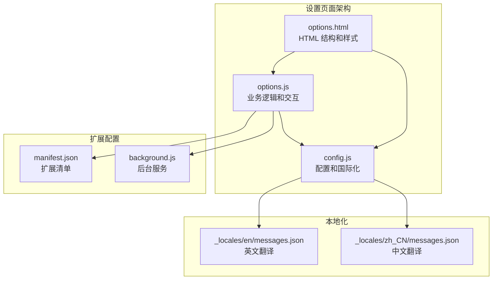
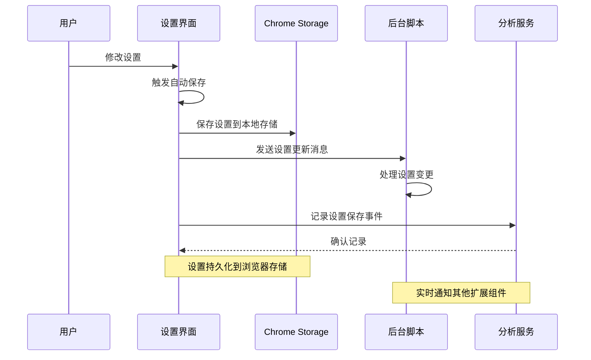
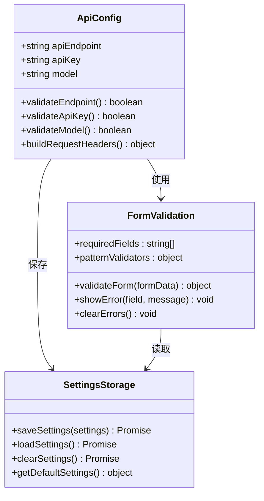
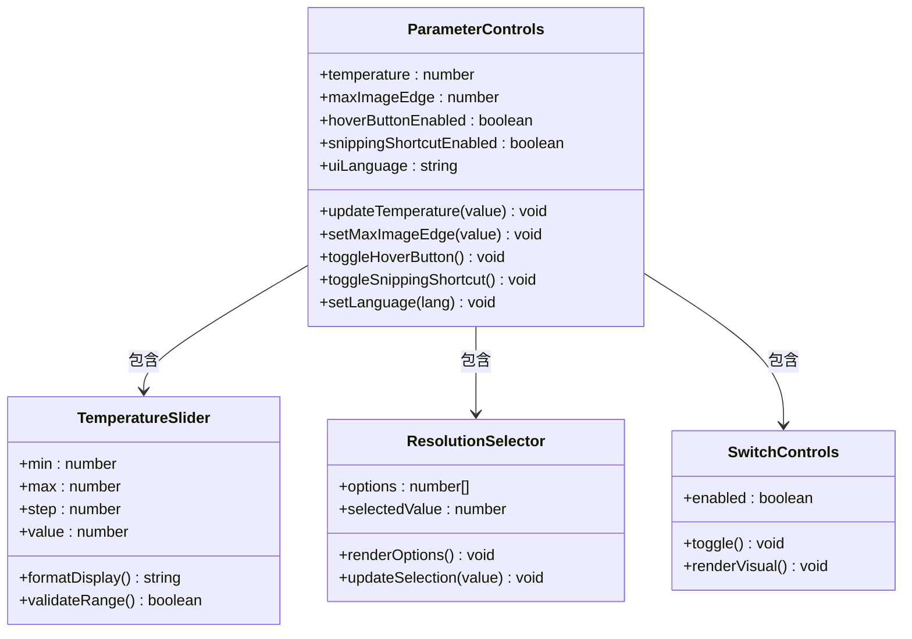
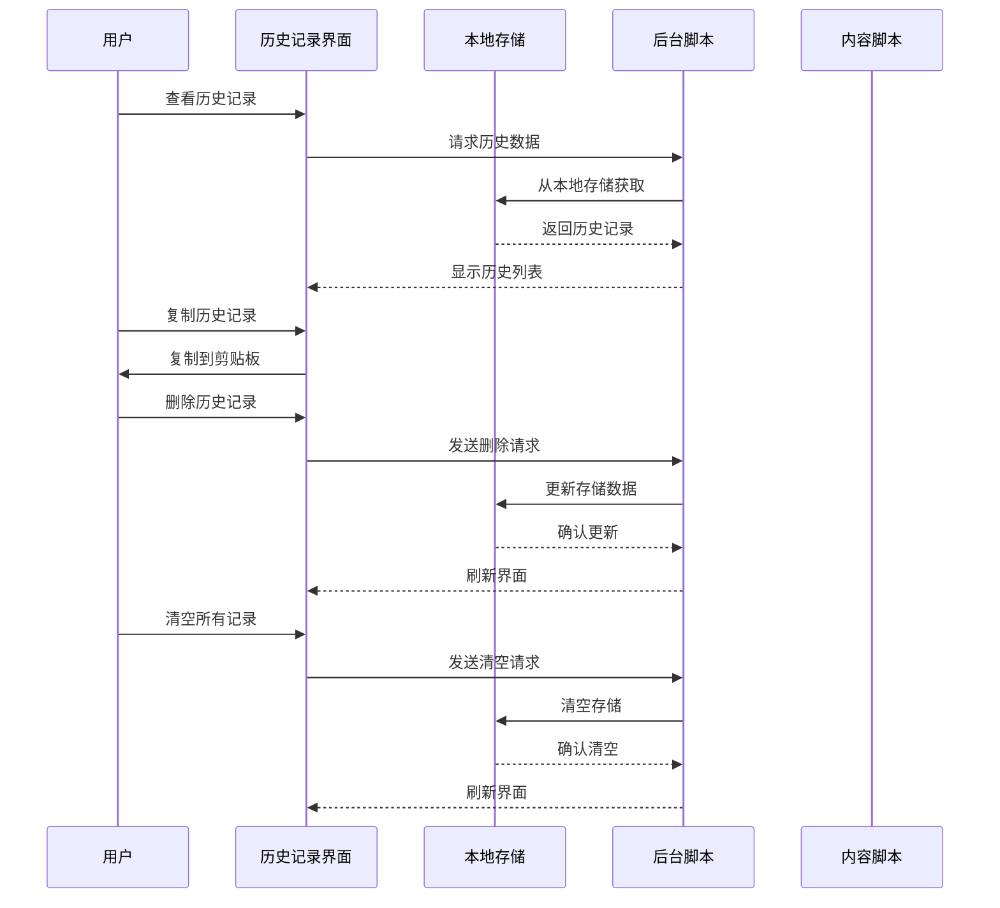
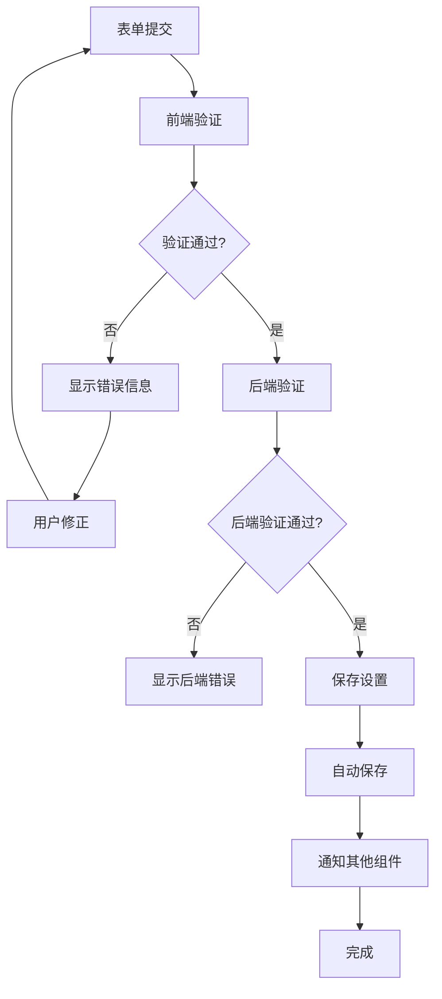
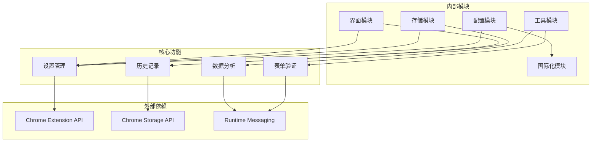

# 设置页面

<cite>
**本文档引用的文件**
- [options.html](file://options.html)
- [options.js](file://options.js)
- [config.js](file://config.js)
- [manifest.json](file://manifest.json)
- [background.js](file://background.js)
- [_locales/en/messages.json](file://_locales/en/messages.json)
- [_locales/zh_CN/messages.json](file://_locales/zh_CN/messages.json)
</cite>

## 目录
1. [简介](#简介)
2. [项目结构](#项目结构)
3. [核心组件](#核心组件)
4. [架构概览](#架构概览)
5. [详细组件分析](#详细组件分析)
6. [依赖关系分析](#依赖关系分析)
7. [性能考虑](#性能考虑)
8. [故障排除指南](#故障排除指南)
9. [结论](#结论)

## 简介

Img2Prompt 设置页面是一个现代化的 Chrome 扩展设置界面，提供了完整的 API 配置、模型选择、参数调节和历史记录管理功能。该页面采用深色主题设计，支持中英文双语界面，并提供了直观的用户交互体验。

## 项目结构

设置页面由三个主要文件组成，每个文件承担不同的职责：

**图表来源**
- [options.html:1-687](file://options.html#L1-L687)
- [options.js:1-551](file://options.js#L1-L551)
- [config.js:1-253](file://config.js#L1-L253)

**章节来源**
- [options.html:1-687](file://options.html#L1-L687)
- [options.js:1-551](file://options.js#L1-L551)
- [config.js:1-253](file://config.js#L1-L253)
- [manifest.json:1-45](file://manifest.json#L1-L45)

## 核心组件

设置页面包含以下主要功能模块：

### 1. 连接配置区域
- **API 端点配置**：支持自定义 API 地址，包含常见的兼容接口提示
- **模型选择**：支持多种模型名称输入，包含示例提示
- **API 密钥管理**：密码输入框，仅保存在本地浏览器中

### 2. 提示词配置区域
- **预设模板系统**：8 种预设场景（通用、摄影、CG、平面设计、UI 设计、游戏资产、电商产品）
- **自定义模板**：支持用户创建和管理自定义提示词模板
- **模板管理**：添加、编辑、删除自定义模板

### 3. 使用体验设置
- **语言切换**：支持中文和英文界面切换
- **悬浮按钮**：控制图片悬停时的快捷入口显示
- **截屏功能**：启用网页框选截图分析功能

### 4. 兼容性设置
- **图片分辨率限制**：通过自定义下拉菜单控制最大图片边长
- **请求格式配置**：支持 OpenAI 和 Anthropic 格式

### 5. 历史记录管理
- **历史记录展示**：显示所有生成的历史记录
- **记录操作**：支持复制、删除单条记录
- **批量清理**：一键清空所有历史记录

**章节来源**
- [options.html:484-687](file://options.html#L484-L687)
- [options.js:182-216](file://options.js#L182-L216)
- [config.js:4-30](file://config.js#L4-L30)

## 架构概览

设置页面采用模块化架构设计，各组件之间通过事件驱动的方式进行通信：

**图表来源**
- [options.js:387-405](file://options.js#L387-L405)
- [options.js:469-483](file://options.js#L469-L483)
- [background.js:134-147](file://background.js#L134-L147)

## 详细组件分析

### API 配置区域

API 配置区域是设置页面的核心功能之一，提供了完整的 API 连接配置能力：

**图表来源**
- [options.html:500-517](file://options.html#L500-L517)
- [options.js:407-422](file://options.js#L407-L422)
- [config.js:5-20](file://config.js#L5-L20)

#### API 密钥输入验证机制

API 密钥验证采用多层防护机制：

1. **前端验证**：实时检查密钥格式和长度
2. **后端验证**：通过实际 API 调用来验证密钥有效性
3. **错误处理**：提供详细的错误信息和解决方案

#### 模型参数调节

模型参数调节支持以下配置：
- **温度值设置**：范围 0-2，默认值 1
- **请求格式选择**：OpenAI 兼容格式或 Anthropic 格式
- **Anthropic 版本控制**：指定 API 版本号

**章节来源**
- [options.html:500-517](file://options.html#L500-L517)
- [options.js:407-422](file://options.js#L407-L422)
- [config.js:5-20](file://config.js#L5-L20)

### 模型选择界面

模型选择界面提供了丰富的预设模板和自定义功能：

**图表来源**
- [options.js:26-57](file://options.js#L26-L57)
- [options.js:119-137](file://options.js#L119-L137)
- [options.js:162-179](file://options.js#L162-L179)

#### 预设模板系统

预设模板系统包含 8 种不同场景的模板：

| 模板类型 | 中文标签 | 英文标签 | 适用场景 |
|---------|---------|---------|---------|
| 通用 | 通用 | General | 通用图像分析 |
| 摄影 | 📸 摄影 | Photo | 摄影技术参数分析 |
| CG | 🎨 插画CG | Illust | 数字艺术作品分析 |
| 平面设计 | 📐 平面设计 | Design | 设计元素识别 |
| UI设计 | 📱 界面 UI | UI Design | 界面组件分析 |
| 游戏资产 | 🧊 游戏资产 | 3D Asset | 3D模型分析 |
| 电商产品 | 👕 电商产品 | Product | 产品摄影分析 |
| 自定义 | ➕ 添加自定义 | Add Custom | 用户自定义模板 |

**章节来源**
- [options.js:26-57](file://options.js#L26-L57)
- [config.js:22-30](file://config.js#L22-L30)

### 参数调节控件

参数调节控件提供了精细的配置选项：

**图表来源**
- [options.js:407-467](file://options.js#L407-L467)
- [options.js:494-550](file://options.js#L494-L550)

#### 温度值设置

温度值控制生成结果的创造性程度：
- **范围**：0.0 到 2.0
- **默认值**：1.0
- **影响**：较低值产生更保守的结果，较高值产生更多样化的创意结果

#### 图像尺寸限制

图像尺寸限制通过下拉菜单控制：
- **选项**：512px, 768px, 1024px, 1280px
- **默认值**：1024px
- **用途**：减少请求大小，避免超时和拒绝

**章节来源**
- [options.js:407-467](file://options.js#L407-L467)
- [options.js:494-550](file://options.js#L494-L550)

### 历史记录管理

历史记录管理系统提供了完整的记录生命周期管理：

**图表来源**
- [options.js:218-248](file://options.js#L218-L248)
- [options.js:302-328](file://options.js#L302-L328)
- [background.js:432-463](file://background.js#L432-L463)

#### 历史记录展示

历史记录以卡片形式展示，包含以下信息：
- **时间戳**：记录生成的时间
- **图像预览**：缩略图显示
- **中英文提示词**：双语对比显示
- **操作按钮**：复制和删除功能

#### 记录管理功能

- **单条删除**：点击删除按钮移除特定记录
- **批量清空**：一键删除所有历史记录
- **数据导出**：支持复制历史记录内容

**章节来源**
- [options.js:218-248](file://options.js#L218-L248)
- [options.js:302-328](file://options.js#L302-L328)
- [background.js:432-463](file://background.js#L432-L463)

### 表单验证机制

设置页面实现了多层次的表单验证机制：

**图表来源**
- [options.js:369-375](file://options.js#L369-L375)
- [options.js:387-405](file://options.js#L387-L405)

#### 错误处理策略

设置页面采用渐进式错误处理：
1. **即时反馈**：用户输入时提供实时验证反馈
2. **详细错误信息**：针对不同错误类型提供具体解决方案
3. **优雅降级**：在网络异常时提供备用方案

**章节来源**
- [options.js:369-375](file://options.js#L369-L375)
- [options.js:387-405](file://options.js#L387-L405)

## 依赖关系分析

设置页面的依赖关系清晰明确，遵循单一职责原则：

**图表来源**
- [options.js:1-10](file://options.js#L1-L10)
- [config.js:4-30](file://config.js#L4-L30)
- [manifest.json:38-41](file://manifest.json#L38-L41)

**章节来源**
- [options.js:1-10](file://options.js#L1-L10)
- [config.js:4-30](file://config.js#L4-L30)
- [manifest.json:38-41](file://manifest.json#L38-L41)

## 性能考虑

设置页面在设计时充分考虑了性能优化：

### 1. 自动保存机制
- **防抖处理**：220ms 防抖延迟，避免频繁写入
- **增量更新**：只保存变更的设置项
- **异步处理**：不阻塞用户界面响应

### 2. 内存管理
- **懒加载**：历史记录按需加载
- **虚拟滚动**：大量历史记录时使用虚拟化
- **事件委托**：减少事件监听器数量

### 3. 网络优化
- **缓存策略**：本地存储缓存常用设置
- **批量操作**：支持批量历史记录操作
- **连接复用**：避免重复建立连接

## 故障排除指南

### 常见问题及解决方案

| 问题类型 | 症状 | 解决方案 |
|---------|------|---------|
| API 连接失败 | 无法连接到 API 服务 | 检查 API 端点和密钥，确认网络连接 |
| 设置保存失败 | 设置更改未生效 | 清除浏览器缓存，重新加载扩展 |
| 历史记录丢失 | 历史记录无法显示 | 检查 Chrome 存储空间，重置扩展设置 |
| 界面显示异常 | 设置页面布局错乱 | 刷新页面，检查浏览器兼容性 |

### 调试方法

1. **开发者工具**：打开 Chrome 开发者工具查看控制台日志
2. **存储检查**：在 Application 面板检查 Chrome Storage 数据
3. **网络监控**：使用 Network 面板监控 API 请求
4. **扩展调试**：使用 chrome://extensions 页面调试扩展

**章节来源**
- [options.js:485-491](file://options.js#L485-L491)
- [background.js:465-476](file://background.js#L465-L476)

## 结论

Img2Prompt 设置页面是一个功能完整、设计精良的 Chrome 扩展设置界面。它成功地将复杂的配置选项封装在直观易用的界面中，同时提供了强大的自定义能力和完善的错误处理机制。

### 主要优势

1. **用户体验优秀**：现代化的设计和流畅的交互体验
2. **功能完整性**：涵盖所有必要的配置选项
3. **可扩展性强**：模块化设计便于功能扩展
4. **可靠性高**：完善的错误处理和数据保护机制

### 改进建议

1. **性能优化**：可以考虑实现虚拟滚动以处理大量历史记录
2. **功能增强**：添加设置导入导出功能
3. **用户体验**：增加设置分组和搜索功能
4. **国际化**：支持更多语言和地区设置

设置页面为用户提供了强大而灵活的配置能力，是 Img2Prompt 扩展功能的重要组成部分。