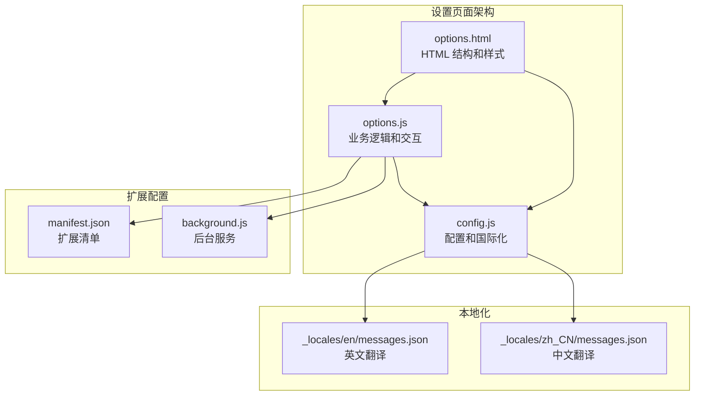
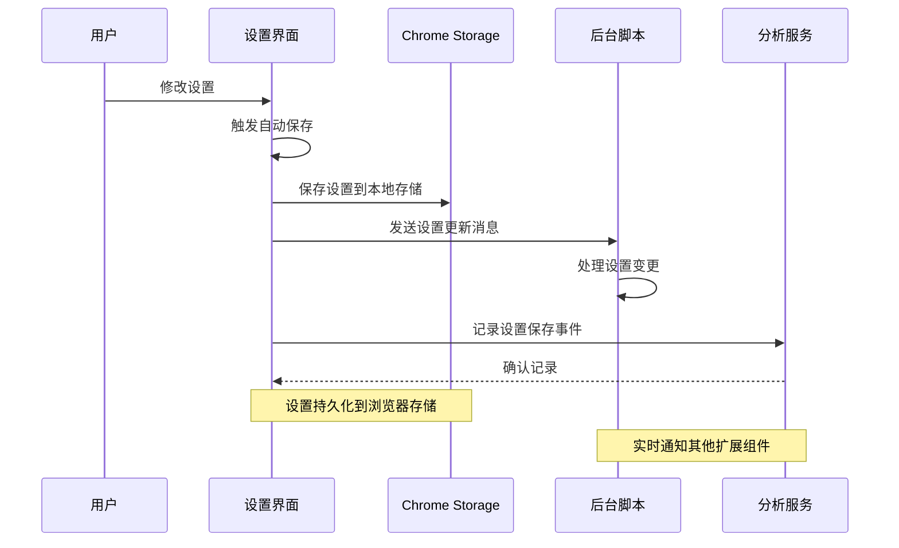
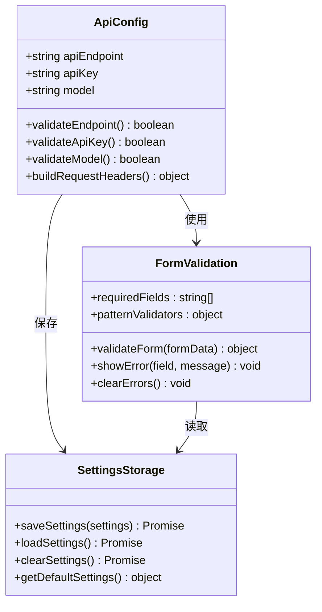
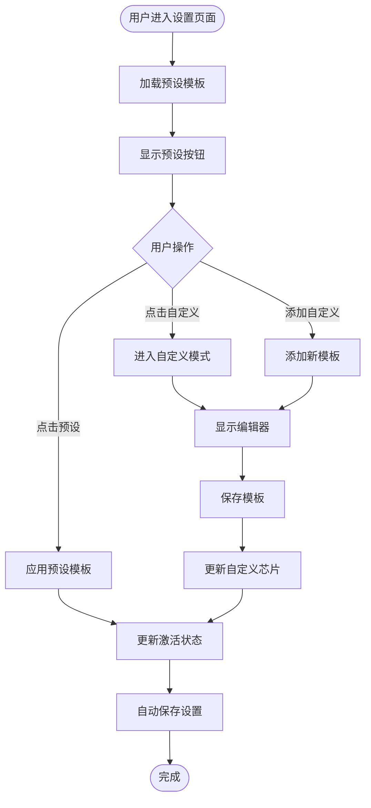
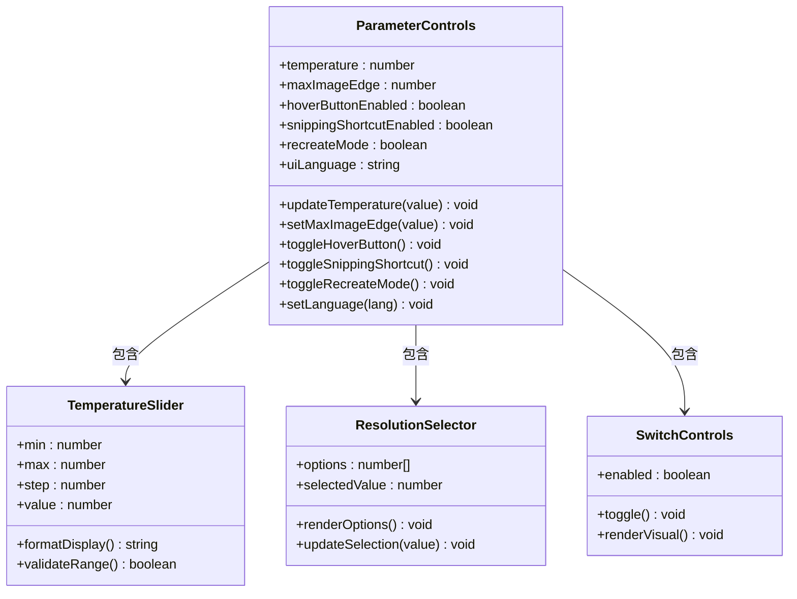
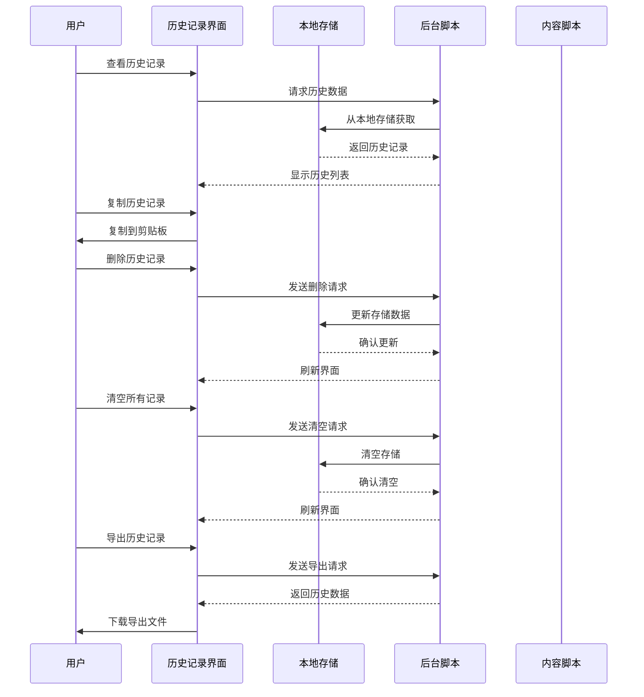
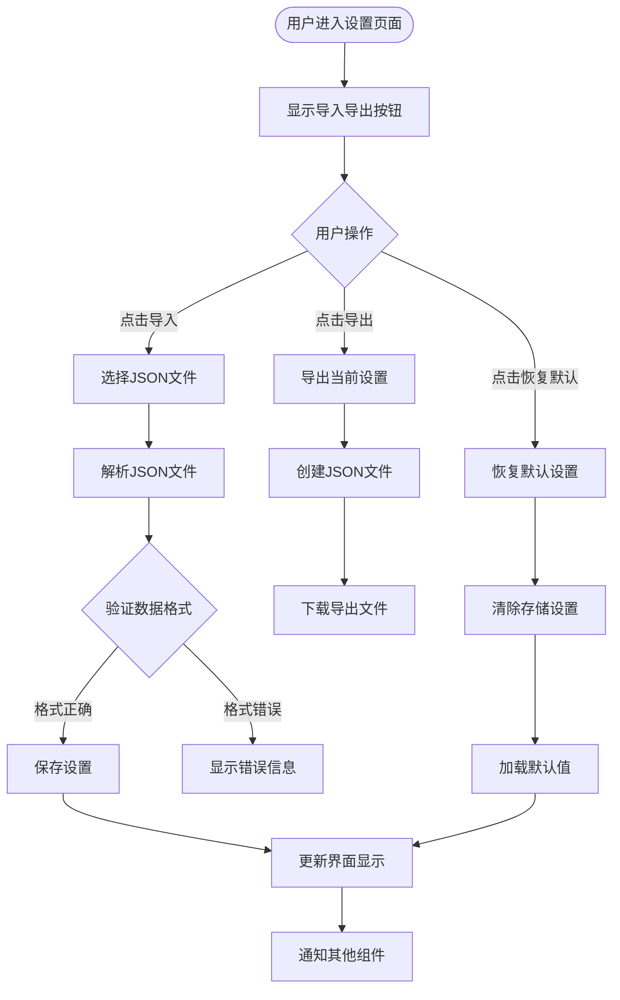
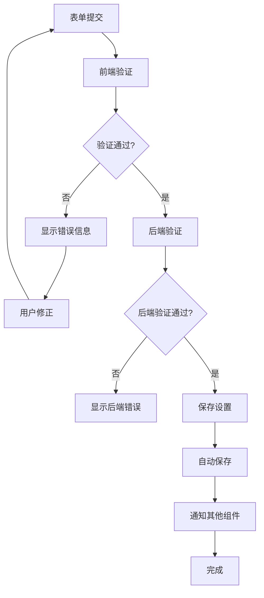
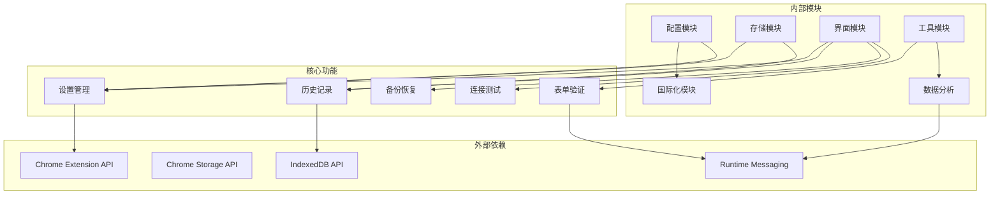

# 设置页面

<cite>
**本文档引用的文件**
- [options.html](file://options.html)
- [options.js](file://options.js)
- [config.js](file://config.js)
- [manifest.json](file://manifest.json)
- [background.js](file://background.js)
- [_locales/en/messages.json](file://_locales/en/messages.json)
- [_locales/zh_CN/messages.json](file://_locales/zh_CN/messages.json)
</cite>

## 更新摘要
**变更内容**
- 新增设置导入/导出功能，支持设置备份和恢复
- 新增 API 密钥可见性切换按钮，提升用户体验
- 新增连接测试功能，实时验证 API 配置有效性
- 扩展预设模板系统，新增动漫、建筑、美食、人像等场景
- 新增历史记录导出功能，支持数据备份
- 完善表单验证和错误处理机制

## 目录
1. [简介](#简介)
2. [项目结构](#项目结构)
3. [核心组件](#核心组件)
4. [架构概览](#架构概览)
5. [详细组件分析](#详细组件分析)
6. [依赖关系分析](#依赖关系分析)
7. [性能考虑](#性能考虑)
8. [故障排除指南](#故障排除指南)
9. [结论](#结论)

## 简介

Img2Prompt 设置页面是一个现代化的 Chrome 扩展设置界面，提供了完整的 API 配置、模型选择、参数调节和历史记录管理功能。该页面采用深色主题设计，支持中英文双语界面，并提供了直观的用户交互体验。最新版本新增了设置备份与恢复、API 密钥可见性切换、连接测试等重要功能。

## 项目结构

设置页面由三个主要文件组成，每个文件承担不同的职责：

**图表来源**
- [options.html:1-769](file://options.html#L1-L769)
- [options.js:1-676](file://options.js#L1-L676)
- [config.js:1-270](file://config.js#L1-L270)

**章节来源**
- [options.html:1-769](file://options.html#L1-L769)
- [options.js:1-676](file://options.js#L1-L676)
- [config.js:1-270](file://config.js#L1-L270)
- [manifest.json:1-45](file://manifest.json#L1-L45)

## 核心组件

设置页面包含以下主要功能模块：

### 1. 连接配置区域
- **API 端点配置**：支持自定义 API 地址，包含常见的兼容接口提示
- **模型选择**：支持多种模型名称输入，包含示例提示
- **API 密钥管理**：密码输入框，支持显示/隐藏切换，仅保存在本地浏览器中
- **连接测试**：一键测试 API 连接有效性，实时反馈连接状态

### 2. 提示词配置区域
- **预设模板系统**：12 种预设场景（通用、摄影、CG、平面设计、UI 设计、游戏资产、电商产品、动漫插画、建筑室内、美食摄影、人像摄影）
- **自定义模板**：支持用户创建和管理自定义提示词模板
- **模板管理**：添加、编辑、删除自定义模板

### 3. 使用体验设置
- **语言切换**：支持中文和英文界面切换
- **悬浮按钮**：控制图片悬停时的快捷入口显示
- **截屏功能**：启用网页框选截图分析功能
- **高还原度模式**：启用详细的分析提示词生成

### 4. 兼容性设置
- **图片分辨率限制**：通过自定义下拉菜单控制最大图片边长
- **请求格式配置**：支持 OpenAI 和 Anthropic 格式

### 5. 历史记录管理
- **历史记录展示**：显示所有生成的历史记录
- **记录操作**：支持复制、删除单条记录
- **批量清理**：一键清空所有历史记录
- **数据导出**：支持导出历史记录为 JSON 文件

### 6. 设置管理
- **设置导入**：从 JSON 文件恢复之前保存的设置
- **设置导出**：导出当前设置为 JSON 文件
- **默认设置恢复**：一键恢复到初始设置状态

**章节来源**
- [options.html:525-580](file://options.html#L525-L580)
- [options.html:590-620](file://options.html#L590-L620)
- [options.html:736-749](file://options.html#L736-L749)
- [options.js:400-447](file://options.js#L400-L447)
- [config.js:23-35](file://config.js#L23-L35)

## 架构概览

设置页面采用模块化架构设计，各组件之间通过事件驱动的方式进行通信：

**图表来源**
- [options.js:502-520](file://options.js#L502-L520)
- [options.js:515-519](file://options.js#L515-L519)
- [background.js:151-164](file://background.js#L151-L164)

## 详细组件分析

### API 配置区域

API 配置区域是设置页面的核心功能之一，提供了完整的 API 连接配置能力：

**图表来源**
- [options.html:546-580](file://options.html#L546-L580)
- [options.js:462-490](file://options.js#L462-L490)
- [config.js:5-21](file://config.js#L5-L21)

#### API 密钥输入验证机制

API 密钥验证采用多层防护机制：

1. **前端验证**：实时检查密钥格式和长度
2. **后端验证**：通过实际 API 调用来验证密钥有效性
3. **错误处理**：提供详细的错误信息和解决方案

#### API 密钥可见性切换

新增的 API 密钥可见性切换功能提升了用户体验：

- **切换按钮**：位于 API 密钥输入框右侧的眼睛图标
- **显示模式**：点击显示明文 API 密钥
- **隐藏模式**：再次点击恢复密码模式
- **状态指示**：通过不同图标区分当前显示状态

#### 连接测试功能

连接测试功能提供了实时的 API 验证能力：

- **测试按钮**：位于 API 密钥输入框右侧
- **自动验证**：测试前自动检查必填字段
- **状态反馈**：通过颜色和文本显示测试结果
- **错误诊断**：提供具体的错误信息和解决方案

**章节来源**
- [options.html:546-580](file://options.html#L546-L580)
- [options.js:449-490](file://options.js#L449-L490)
- [config.js:5-21](file://config.js#L5-L21)

### 模型选择界面

模型选择界面提供了丰富的预设模板和自定义功能：

**图表来源**
- [options.js:26-57](file://options.js#L26-L57)
- [options.js:79-117](file://options.js#L79-L117)
- [options.js:119-179](file://options.js#L119-L179)

#### 预设模板系统

预设模板系统包含 12 种不同场景的模板：

| 模板类型 | 中文标签 | 英文标签 | 适用场景 |
|---------|---------|---------|---------|
| 通用 | 通用 | General | 通用图像分析 |
| 摄影 | 📸 摄影 | Photo | 摄影技术参数分析 |
| CG | 🎨 插画CG | Illust | 数字艺术作品分析 |
| 平面设计 | 📐 平面设计 | Design | 设计元素识别 |
| UI设计 | 📱 界面 UI | UI Design | 界面组件分析 |
| 游戏资产 | 🧊 游戏资产 | 3D Asset | 3D模型分析 |
| 电商产品 | 👕 电商产品 | Product | 产品摄影分析 |
| 动漫插画 | 🎭 动漫插画 | Anime | 动漫角色分析 |
| 建筑室内 | 🏛️ 建筑室内 | Architecture | 建筑设计分析 |
| 美食摄影 | 🍜 美食摄影 | Food | 食物摄影分析 |
| 人像摄影 | 👤 人像摄影 | Portrait | 人物肖像分析 |
| 自定义 | ➕ 添加自定义 | Add Custom | 用户自定义模板 |

**章节来源**
- [options.js:26-57](file://options.js#L26-L57)
- [config.js:23-35](file://config.js#L23-L35)

### 参数调节控件

参数调节控件提供了精细的配置选项：

**图表来源**
- [options.js:522-537](file://options.js#L522-L537)
- [options.js:618-675](file://options.js#L618-L675)

#### 温度值设置

温度值控制生成结果的创造性程度：
- **范围**：0.0 到 2.0
- **默认值**：1.0
- **影响**：较低值产生更保守的结果，较高值产生更多样化的创意结果

#### 图像尺寸限制

图像尺寸限制通过下拉菜单控制：
- **选项**：512px, 768px, 1024px, 1280px
- **默认值**：1024px
- **用途**：减少请求大小，避免超时和拒绝

#### 高还原度模式

高还原度模式提供更精确的图像重建：
- **启用条件**：需要详细的分析提示词
- **功能效果**：生成包含负面提示词和技术参数的精确提示词
- **适用场景**：高质量图像重建需求

**章节来源**
- [options.js:522-537](file://options.js#L522-L537)
- [options.js:618-675](file://options.js#L618-L675)

### 历史记录管理

历史记录管理系统提供了完整的记录生命周期管理：

**图表来源**
- [options.js:219-249](file://options.js#L219-L249)
- [options.js:360-390](file://options.js#L360-L390)
- [background.js:166-185](file://background.js#L166-L185)

#### 历史记录展示

历史记录以卡片形式展示，包含以下信息：
- **时间戳**：记录生成的时间
- **图像预览**：缩略图显示
- **中英文提示词**：双语对比显示
- **操作按钮**：复制和删除功能

#### 记录管理功能

- **单条删除**：点击删除按钮移除特定记录
- **批量清空**：一键删除所有历史记录
- **数据导出**：支持导出历史记录为 JSON 文件
- **数据导入**：支持从 JSON 文件恢复历史记录

**章节来源**
- [options.js:219-249](file://options.js#L219-L249)
- [options.js:360-390](file://options.js#L360-L390)
- [background.js:166-185](file://background.js#L166-L185)

### 设置管理功能

设置管理功能提供了完整的设置备份与恢复能力：

**图表来源**
- [options.js:400-447](file://options.js#L400-L447)
- [options.js:492-500](file://options.js#L492-L500)

#### 设置导入功能

设置导入功能支持从 JSON 文件恢复之前的设置：
- **导入按钮**：位于设置页面顶部右侧
- **文件选择**：支持 .json 格式的设置文件
- **数据验证**：自动验证文件格式和内容完整性
- **错误处理**：提供详细的导入失败原因

#### 设置导出功能

设置导出功能支持备份当前设置：
- **导出按钮**：位于设置页面顶部右侧
- **文件格式**：标准 JSON 格式，包含版本信息
- **数据完整性**：导出完整的设置数据
- **下载机制**：自动触发文件下载

#### 默认设置恢复

一键恢复到初始设置状态：
- **恢复按钮**：位于设置页面底部
- **数据清除**：清除所有用户设置
- **默认加载**：加载扩展内置的默认设置
- **组件通知**：通知其他扩展组件设置已更新

**章节来源**
- [options.js:400-447](file://options.js#L400-L447)
- [options.js:492-500](file://options.js#L492-L500)

### 表单验证机制

设置页面实现了多层次的表单验证机制：

**图表来源**
- [options.js:392-398](file://options.js#L392-L398)
- [options.js:502-520](file://options.js#L502-L520)

#### 错误处理策略

设置页面采用渐进式错误处理：
1. **即时反馈**：用户输入时提供实时验证反馈
2. **详细错误信息**：针对不同错误类型提供具体解决方案
3. **优雅降级**：在网络异常时提供备用方案

**章节来源**
- [options.js:392-398](file://options.js#L392-L398)
- [options.js:502-520](file://options.js#L502-L520)

## 依赖关系分析

设置页面的依赖关系清晰明确，遵循单一职责原则：

**图表来源**
- [options.js:1-10](file://options.js#L1-L10)
- [config.js:4-30](file://config.js#L4-L30)
- [manifest.json:38-41](file://manifest.json#L38-L41)

**章节来源**
- [options.js:1-10](file://options.js#L1-L10)
- [config.js:4-30](file://config.js#L4-L30)
- [manifest.json:38-41](file://manifest.json#L38-L41)

## 性能考虑

设置页面在设计时充分考虑了性能优化：

### 1. 自动保存机制
- **防抖处理**：220ms 防抖延迟，避免频繁写入
- **增量更新**：只保存变更的设置项
- **异步处理**：不阻塞用户界面响应

### 2. 内存管理
- **懒加载**：历史记录按需加载
- **虚拟滚动**：大量历史记录时使用虚拟化
- **事件委托**：减少事件监听器数量

### 3. 网络优化
- **缓存策略**：本地存储缓存常用设置
- **批量操作**：支持批量历史记录操作
- **连接复用**：避免重复建立连接
- **超时控制**：连接测试设置 10 秒超时

## 故障排除指南

### 常见问题及解决方案

| 问题类型 | 症状 | 解决方案 |
|---------|------|---------|
| API 连接失败 | 无法连接到 API 服务 | 检查 API 端点和密钥，确认网络连接，使用连接测试功能 |
| 设置保存失败 | 设置更改未生效 | 清除浏览器缓存，重新加载扩展，检查存储空间 |
| 历史记录丢失 | 历史记录无法显示 | 检查 Chrome 存储空间，重置扩展设置，使用历史记录导出功能 |
| 界面显示异常 | 设置页面布局错乱 | 刷新页面，检查浏览器兼容性，更新扩展版本 |
| 设置导入失败 | JSON 文件无法导入 | 检查文件格式，确保为有效的 JSON 格式，验证数据完整性 |

### 调试方法

1. **开发者工具**：打开 Chrome 开发者工具查看控制台日志
2. **存储检查**：在 Application 面板检查 Chrome Storage 数据
3. **网络监控**：使用 Network 面板监控 API 请求
4. **扩展调试**：使用 chrome://extensions 页面调试扩展

**章节来源**
- [options.js:584-598](file://options.js#L584-L598)
- [background.js:1068-1106](file://background.js#L1068-L1106)

## 结论

Img2Prompt 设置页面是一个功能完整、设计精良的 Chrome 扩展设置界面。最新版本的更新显著增强了用户体验和数据管理能力，新增的设置备份与恢复、API 密钥可见性切换、连接测试等功能使其更加实用和可靠。

### 主要优势

1. **用户体验优秀**：现代化的设计和流畅的交互体验
2. **功能完整性**：涵盖所有必要的配置选项和管理功能
3. **数据安全保障**：提供设置和历史记录的备份与恢复能力
4. **可扩展性强**：模块化设计便于功能扩展
5. **可靠性高**：完善的错误处理和数据保护机制

### 新增功能亮点

1. **设置备份与恢复**：支持设置的导入导出，便于跨设备同步
2. **API 密钥管理增强**：提供可见性切换，提升使用便利性
3. **连接状态可视化**：实时测试连接，及时发现配置问题
4. **历史记录管理完善**：支持导出和批量操作
5. **预设模板丰富化**：新增多种专业场景的预设模板

### 改进建议

1. **性能优化**：可以考虑实现虚拟滚动以处理大量历史记录
2. **功能增强**：添加设置分组和搜索功能
3. **用户体验**：增加设置导入导出的进度提示
4. **国际化**：支持更多语言和地区设置

设置页面为用户提供了强大而灵活的配置能力，是 Img2Prompt 扩展功能的重要组成部分。新增的功能进一步提升了其作为专业图像提示词生成工具的实用性和可靠性。