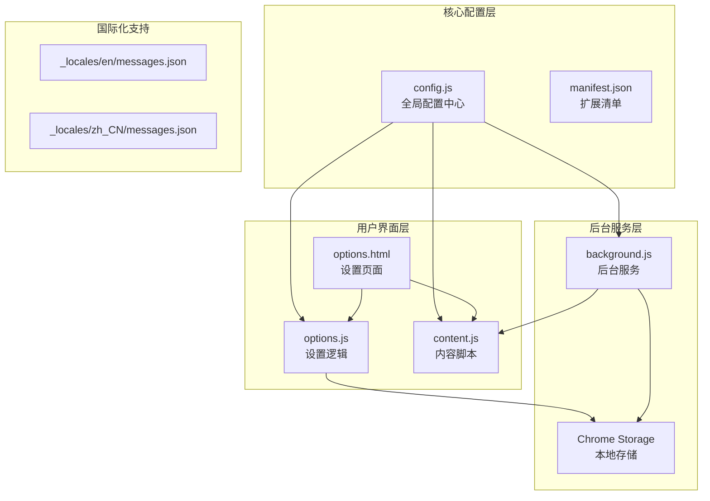
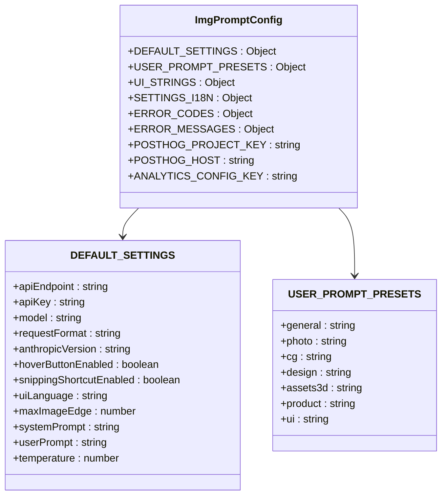
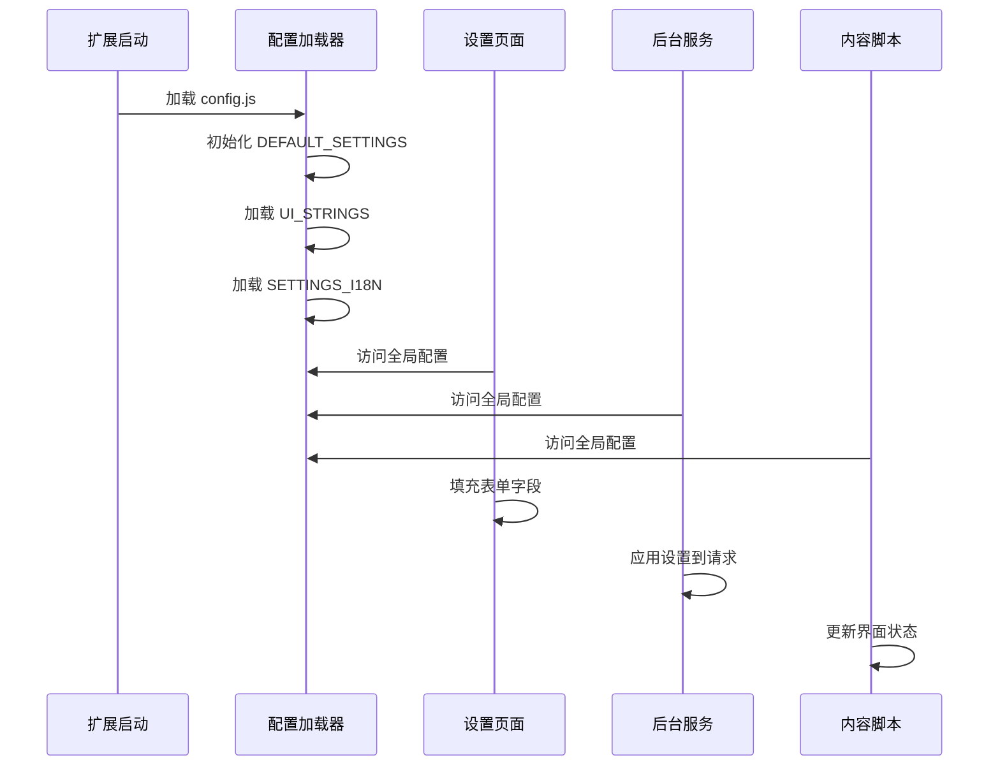
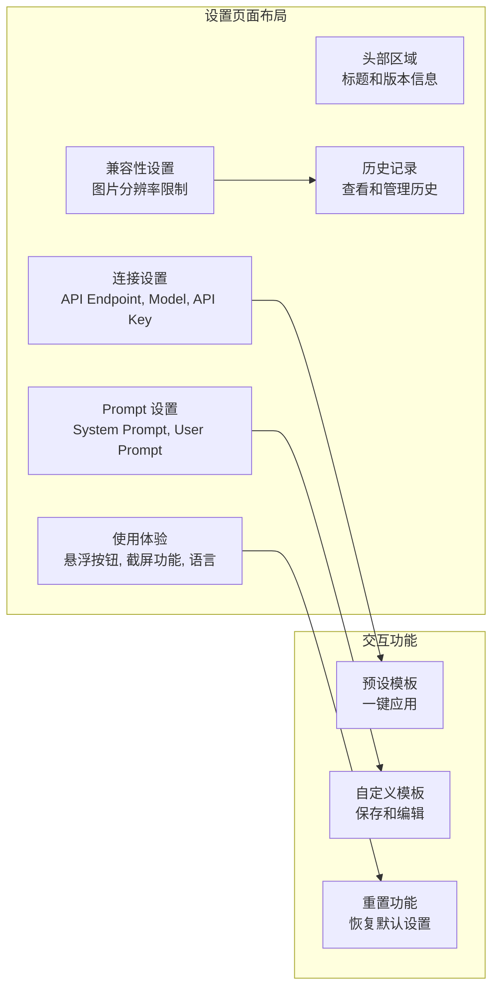
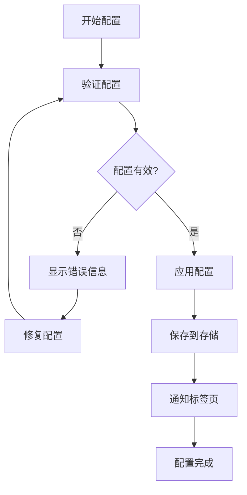

# 基础配置

<cite>
**本文档引用的文件**
- [config.js](file://config.js)
- [options.js](file://options.js)
- [options.html](file://options.html)
- [background.js](file://background.js)
- [content.js](file://content.js)
- [manifest.json](file://manifest.json)
- [_locales/en/messages.json](file://_locales/en/messages.json)
- [_locales/zh_CN/messages.json](file://_locales/zh_CN/messages.json)
</cite>

## 目录
1. [简介](#简介)
2. [项目结构](#项目结构)
3. [核心配置系统](#核心配置系统)
4. [配置项详解](#配置项详解)
5. [用户界面配置](#用户界面配置)
6. [高级配置选项](#高级配置选项)
7. [配置示例](#配置示例)
8. [故障排除指南](#故障排除指南)
9. [最佳实践建议](#最佳实践建议)
10. [总结](#总结)

## 简介

Img2Prompt 是一个 Chrome 扩展程序，能够将图片转换为 AI 模型可以理解的提示词。该扩展通过智能的配置系统，为用户提供灵活且强大的图片分析功能。本文档详细介绍了基础配置系统的各个方面，包括 API 设置、用户体验配置、提示词模板以及故障排除方法。

## 项目结构

Img2Prompt 采用模块化的架构设计，主要文件组织如下：



**图表来源**
- [config.js:1-253](file://config.js#L1-L253)
- [options.html:1-595](file://options.html#L1-L595)
- [manifest.json:1-45](file://manifest.json#L1-L45)

**章节来源**
- [config.js:1-253](file://config.js#L1-L253)
- [manifest.json:1-45](file://manifest.json#L1-L45)

## 核心配置系统

### 配置架构概述

Img2Prompt 的配置系统基于单一的全局配置对象，该对象在所有扩展组件之间共享：



**图表来源**
- [config.js:4-30](file://config.js#L4-L30)

### 配置加载流程

配置系统采用延迟加载机制，确保各个组件能够按需访问配置：



**图表来源**
- [config.js:1-253](file://config.js#L1-L253)
- [options.js:182-213](file://options.js#L182-L213)
- [background.js:322-328](file://background.js#L322-L328)

**章节来源**
- [config.js:1-253](file://config.js#L1-L253)
- [options.js:182-213](file://options.js#L182-L213)
- [background.js:322-328](file://background.js#L322-L328)

## 配置项详解

### API 连接配置

#### apiEndpoint（API 接口地址）

**默认值**: `"https://api.openai.com/v1/chat/completions"`

**取值范围**: 有效的 HTTP/HTTPS URL 地址

**配置说明**: 
- 支持 OpenAI 兼容接口
- 支持 Anthropic Claude 接口
- 必须以 `/v1/chat/completions` 或 `/v1/messages` 结尾

**推荐设置**:
- OpenAI: `https://api.openai.com/v1/chat/completions`
- Anthropic: `https://api.anthropic.com/v1/messages`
- 自定义代理: `https://your-proxy.com/v1/chat/completions`

**章节来源**
- [config.js:6](file://config.js#L6)
- [background.js:517-592](file://background.js#L517-L592)

#### apiKey（API 密钥）

**默认值**: `""`（空字符串）

**取值范围**: 有效的 API 密钥字符串

**配置说明**:
- 仅保存在本地浏览器存储中
- 不会发送到任何服务器
- 支持多种提供商的密钥格式

**安全建议**:
- 使用专用的 API 密钥
- 定期轮换密钥
- 避免在公共场合泄露

**章节来源**
- [config.js:7](file://config.js#L7)
- [options.js:407](file://options.js#L407)

#### model（模型名称）

**默认值**: `"gpt-5-mini"`

**取值范围**: 字符串，支持各种 AI 模型名称

**配置说明**:
- 支持 OpenAI 模型: `gpt-4-turbo`, `gpt-4o`, `gpt-3.5-turbo`
- 支持 Gemini 模型: `gemini-pro`, `gemini-2.0-flash-exp`
- 支持 Claude 模型: `claude-3-5-sonnet`, `claude-3-haiku`

**兼容性考虑**:
- 不同模型支持不同的图像输入格式
- 某些模型可能不支持特定的图片格式

**章节来源**
- [config.js:8](file://config.js#L8)
- [background.js:518-524](file://background.js#L518-L524)

#### requestFormat（请求格式）

**默认值**: `"auto"`

**取值范围**: `"auto"`, `"openai"`, `"anthropic"`

**配置说明**:
- `auto`: 自动检测模型类型
- `openai`: 使用 OpenAI 兼容格式
- `anthropic`: 使用 Anthropic Claude 格式

**自动检测规则**:
- 模型名包含 "claude": 使用 Anthropic 格式
- 其他情况: 使用 OpenAI 格式

**章节来源**
- [config.js:9](file://config.js#L9)
- [background.js:505-515](file://background.js#L505-L515)

#### anthropicVersion（Anthropic 版本）

**默认值**: `"2023-06-01"`

**取值范围**: 有效的 Anthropic API 版本号

**配置说明**:
- 仅在使用 Anthropic 模型时生效
- 影响请求头中的 `anthropic-version` 参数

**章节来源**
- [config.js:10](file://config.js#L10)
- [background.js:610](file://background.js#L610)

### 用户体验配置

#### hoverButtonEnabled（悬浮按钮开关）

**默认值**: `true`

**取值范围**: `true`, `false`

**配置说明**:
- 控制是否在图片悬停时显示快捷按钮
- 影响 content.js 中的悬浮按钮功能
- 关闭后不会影响其他功能

**使用场景**:
- 需要更简洁的界面时
- 在某些网站上可能与现有元素冲突时

**章节来源**
- [config.js:11](file://config.js#L11)
- [content.js:102-111](file://content.js#L102-L111)

#### snippingShortcutEnabled（截屏快捷键开关）

**默认值**: `true`

**取值范围**: `true`, `false`

**配置说明**:
- 控制是否启用截屏快捷键功能
- 快捷键: `Alt + S`（Windows/Linux）或 `Option + S`（Mac）
- 通过 Chrome 扩展快捷键设置修改

**相关设置**:
- 截图工具在 content.js 中实现
- 通过命令监听器触发

**章节来源**
- [config.js:12](file://config.js#L12)
- [background.js:77-92](file://background.js#L77-L92)

#### uiLanguage（界面语言）

**默认值**: `"zh"`

**取值范围**: `"zh"`, `"en"`

**配置说明**:
- 控制设置页面和弹窗的语言
- 影响错误消息和用户界面文本
- 支持简体中文和英文

**国际化支持**:
- UI 文本通过 SETTINGS_I18N 对象管理
- 错误消息通过 ERROR_MESSAGES 对象管理

**章节来源**
- [config.js:13](file://config.js#L13)
- [options.js:421-451](file://options.js#L421-L451)

#### maxImageEdge（最大图片边长）

**默认值**: `1024`

**取值范围**: `512`, `768`, `1024`, `1280`

**配置说明**:
- 控制图片压缩的最大边长
- 影响 API 请求大小和响应时间
- 降低分辨率可减少带宽使用

**性能优化**:
- 较小的值: 更快的处理速度，较低的精度
- 较大的值: 更好的图像质量，较长的处理时间

**章节来源**
- [config.js:14](file://config.js#L14)
- [background.js:239](file://background.js#L239)
- [options.html:556-562](file://options.html#L556-L562)

#### temperature（温度参数）

**默认值**: `1`

**取值范围**: `0` 到 `2`（浮点数）

**配置说明**:
- 控制 AI 生成的创造性程度
- `0`: 最确定性，最保守
- `1`: 默认平衡
- `2`: 最创造性，可能不稳定

**使用建议**:
- 提示词提取: `0.3` - `0.7`
- 创意生成: `0.8` - `1.5`
- 精确分析: `0.1` - `0.5`

**章节来源**
- [config.js:19](file://config.js#L19)
- [background.js:528](file://background.js#L528)

### 提示词配置

#### systemPrompt（系统提示词）

**默认值**: 复杂的 JSON 输出约束提示词

**配置说明**:
- 强制 AI 返回严格的 JSON 格式
- 包含中英文双语提示词生成
- 覆盖主题、构图、风格、光线等多个维度

**JSON 输出要求**:
- 必须包含 `zh` 和 `en` 字段
- 保持自然流畅的中文表达
- 优化英文提示词以适配图像生成模型

**章节来源**
- [config.js:15-16](file://config.js#L15-L16)
- [background.js:532](file://background.js#L532)

#### userPrompt（用户提示词）

**默认值**: 结构化分解任务提示词

**配置说明**:
- 指导 AI 进行结构化分析
- 识别视觉原语、空间布局逻辑
- 提取色彩和谐系统和精确的宽高比

**预设模板**:
- 通用场景: 基础的结构化分析
- 摄影场景: 技术参数提取
- CG 场景: 数字艺术分析
- 设计场景: 视觉沟通系统
- UI 场景: 界面架构分析

**章节来源**
- [config.js:17-18](file://config.js#L17-L18)
- [config.js:22-30](file://config.js#L22-L30)

**章节来源**
- [config.js:15-18](file://config.js#L15-L18)
- [config.js:22-30](file://config.js#L22-L30)

## 用户界面配置

### 设置页面结构

设置页面采用响应式设计，支持桌面和移动设备：



**图表来源**
- [options.html:402-595](file://options.html#L402-L595)

### 国际化支持

系统支持简体中文和英文两种语言：

| 配置项 | 中文 | 英文 |
|--------|------|------|
| 连接设置标题 | 连接设置 | Connection |
| API 接口地址标签 | API 接口地址 | API Endpoint |
| 模型名称标签 | 模型名称 | Model |
| API 密钥标签 | API 密钥 | API Key |
| 提示词设置标题 | 提示词设置 | Prompt |
| System Prompt 标签 | System Prompt | System Prompt |
| User Prompt 标签 | User Prompt | User Prompt |
| 使用体验标题 | 使用体验 | Experience |
| 悬浮按钮标题 | 悬浮 PicPrompt 按钮 | Hover PicPrompt Button |
| 截屏功能标题 | 截屏提取提示词 | Shortcut Snipping |

**章节来源**
- [config.js:115-204](file://config.js#L115-L204)
- [options.html:404-542](file://options.html#L404-L542)

## 高级配置选项

### 错误处理配置

系统内置了完善的错误处理机制：



**图表来源**
- [background.js:465-476](file://background.js#L465-L476)

### 存储机制

配置数据通过 Chrome Storage API 进行持久化存储：

| 存储类型 | 数据用途 | 生命周期 |
|----------|----------|----------|
| local | 用户配置 | 永久存储 |
| session | 临时状态 | 浏览器会话期间 |
| sync | 同步配置 | 跨设备同步 |

**章节来源**
- [options.js:384-402](file://options.js#L384-L402)
- [background.js:322-328](file://background.js#L322-L328)

## 配置示例

### 基础配置示例

以下是一些常见的配置组合示例：

#### OpenAI 兼容配置
```javascript
{
  apiEndpoint: "https://api.openai.com/v1/chat/completions",
  apiKey: "sk-your-openai-key",
  model: "gpt-4o-mini",
  requestFormat: "auto",
  temperature: 0.7
}
```

#### Anthropic Claude 配置
```javascript
{
  apiEndpoint: "https://api.anthropic.com/v1/messages",
  apiKey: "your-anthropic-key",
  model: "claude-3-haiku",
  requestFormat: "anthropic",
  anthropicVersion: "2026-02-21"
}
```

#### Gemini 配置
```javascript
{
  apiEndpoint: "https://generativelanguage.googleapis.com/v1beta/openai/chat/completions",
  apiKey: "your-gemini-key",
  model: "gemini-2.0-flash-exp",
  requestFormat: "openai"
}
```

### 性能优化配置

针对不同使用场景的优化配置：

#### 高速模式
```javascript
{
  maxImageEdge: 512,
  temperature: 0.3,
  requestFormat: "auto"
}
```

#### 高质量模式
```javascript
{
  maxImageEdge: 1280,
  temperature: 1.2,
  requestFormat: "auto"
}
```

## 故障排除指南

### 常见问题及解决方案

#### API 认证失败
**症状**: 显示 "API 密钥无效或已过期"

**解决方案**:
1. 检查 API 密钥格式是否正确
2. 确认密钥具有足够的权限
3. 尝试重新生成新的 API 密钥
4. 验证 API Endpoint 是否正确

#### 图片处理失败
**症状**: 显示 "图片处理失败：无法获取图片的二进制数据"

**解决方案**:
1. 尝试使用不同的图片格式
2. 检查图片链接是否可访问
3. 降低 maxImageEdge 设置
4. 确认图片没有跨域限制

#### 模型响应异常
**症状**: 显示 "模型返回的内容无法解析"

**解决方案**:
1. 检查 systemPrompt 是否正确
2. 确认返回的是纯 JSON 格式
3. 调整 temperature 参数
4. 验证模型支持的输入格式

#### 网络连接问题
**症状**: 显示 "网络连接失败"

**解决方案**:
1. 检查网络连接状态
2. 尝试使用代理服务器
3. 增加 API Timeout 设置
4. 确认防火墙设置允许访问

**章节来源**
- [config.js:206-247](file://config.js#L206-L247)
- [background.js:280-317](file://background.js#L280-L317)

### 调试技巧

#### 启用调试模式
1. 打开 Chrome 开发者工具
2. 在 Console 中输入 `localStorage.debug = true`
3. 重新加载扩展
4. 查看详细的日志信息

#### 检查配置状态
```javascript
// 在控制台中检查当前配置
console.log('当前配置:', chrome.storage.local.get(null));

// 检查特定配置项
console.log('API 密钥:', localStorage.getItem('apiKey'));
console.log('模型设置:', localStorage.getItem('model'));
```

## 最佳实践建议

### 安全配置建议

1. **密钥管理**
   - 使用专用的 API 密钥
   - 定期轮换密钥
   - 避免在代码中硬编码密钥

2. **网络配置**
   - 使用 HTTPS 端点
   - 配置适当的超时时间
   - 考虑使用代理服务器

3. **隐私保护**
   - 了解数据传输范围
   - 定期清理历史记录
   - 谨慎分享配置信息

### 性能优化建议

1. **图片处理**
   - 根据使用场景选择合适的分辨率
   - 避免过高的温度参数
   - 合理设置请求格式

2. **内存管理**
   - 定期清理历史记录
   - 监控存储使用情况
   - 避免同时处理过多图片

3. **网络优化**
   - 使用稳定的网络连接
   - 考虑地理位置因素
   - 避免高峰期使用

### 使用场景建议

#### 专业设计师
- 使用高质量配置 (`maxImageEdge: 1280`)
- 设置合理的温度参数 (`temperature: 0.8`)
- 选择专业的提示词模板

#### 快速原型师
- 使用高速配置 (`maxImageEdge: 512`)
- 设置较低的温度参数 (`temperature: 0.3`)
- 使用通用提示词模板

#### 内容创作者
- 根据内容类型选择合适的模板
- 调整提示词以适应特定风格
- 定期更新配置以获得最佳效果

## 总结

Img2Prompt 的基础配置系统提供了全面而灵活的设置选项，涵盖了从 API 连接到用户体验的各个方面。通过合理配置这些选项，用户可以根据自己的需求和使用场景获得最佳的使用体验。

关键要点包括：
- **安全性**: API 密钥仅本地存储，不发送到任何服务器
- **灵活性**: 支持多种 AI 提供商和模型
- **易用性**: 直观的设置界面和丰富的预设模板
- **可靠性**: 完善的错误处理和故障排除机制

建议用户根据具体使用场景选择合适的配置，并定期评估和调整设置以获得最佳效果。