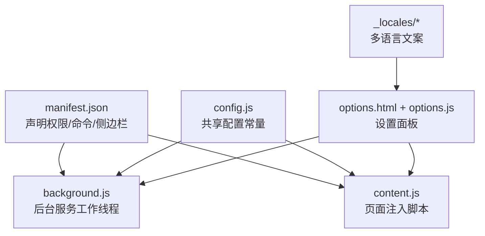
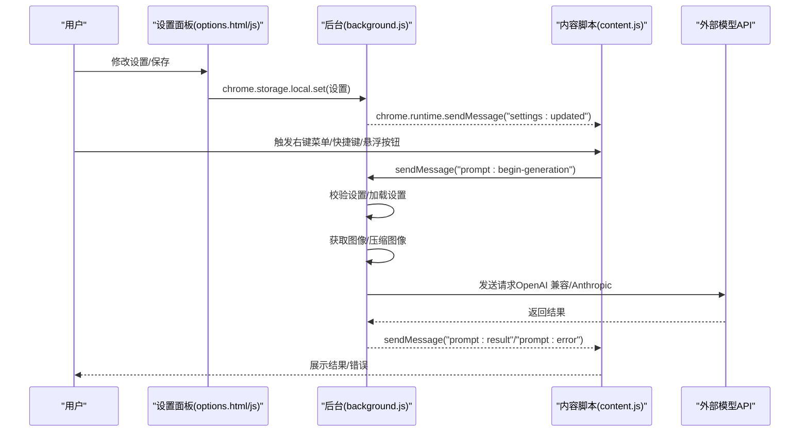
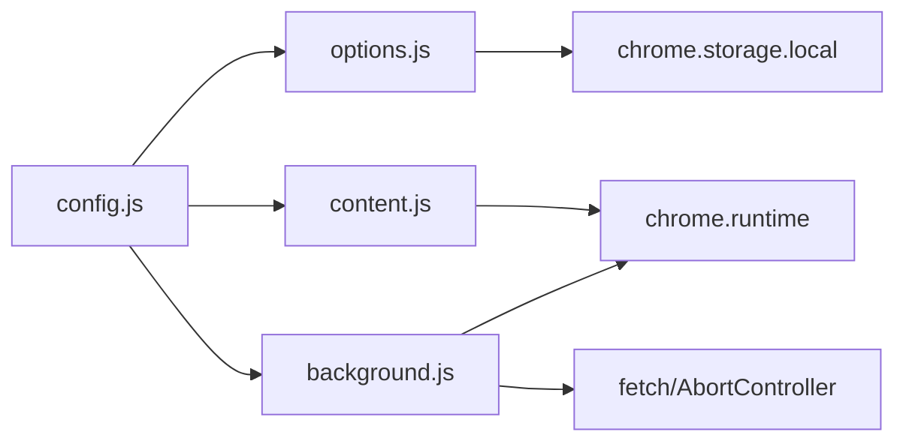

# 配置与定制

<cite>
**本文引用的文件列表**
- [manifest.json](file://manifest.json)
- [config.js](file://config.js)
- [options.html](file://options.html)
- [options.js](file://options.js)
- [background.js](file://background.js)
- [content.js](file://content.js)
- [_locales/en/messages.json](file://_locales/en/messages.json)
- [_locales/zh_CN/messages.json](file://_locales/zh_CN/messages.json)
</cite>

## 目录
1. [简介](#简介)
2. [项目结构](#项目结构)
3. [核心组件](#核心组件)
4. [架构总览](#架构总览)
5. [详细组件分析](#详细组件分析)
6. [依赖关系分析](#依赖关系分析)
7. [性能考量](#性能考量)
8. [故障排查指南](#故障排查指南)
9. [结论](#结论)
10. [附录](#附录)

## 简介
本指南面向 Img2Prompt 扩展的使用者与定制者，系统讲解如何通过配置文件与设置界面完成基础与高级定制，包括：
- 基础配置项：API 端点、模型参数、温度参数等
- 高级定制：自定义提示词模板的创建与管理、UI 界面个性化
- 行为偏好：触发方式（悬浮按钮、截屏提取）、输出格式与语言偏好
- 配置文件结构与验证规则
- 实际配置示例与最佳实践

## 项目结构
该扩展采用 Manifest V3 架构，核心由共享配置、后台脚本、内容脚本与设置页面组成。关键文件职责如下：
- manifest.json：声明扩展元信息、权限、侧边栏、命令与图标
- config.js：共享配置常量（默认设置、提示词预设、UI 文案、错误码与消息）
- options.html + options.js：设置面板页面与逻辑（保存、自动同步、历史记录）
- background.js：后台服务工作线程（监听命令、发起请求、进度与错误处理）
- content.js：注入到页面的内容脚本（悬浮按钮、面板、截屏工具、与后台通信）
- _locales/*：多语言文案资源

图表来源
- [manifest.json:1-45](file://manifest.json#L1-L45)
- [config.js:1-254](file://config.js#L1-L254)
- [options.html:1-585](file://options.html#L1-L585)
- [options.js:1-491](file://options.js#L1-L491)
- [background.js:1-969](file://background.js#L1-L969)
- [content.js:1-1578](file://content.js#L1-L1578)

章节来源
- [manifest.json:1-45](file://manifest.json#L1-L45)
- [config.js:1-254](file://config.js#L1-L254)
- [options.html:1-585](file://options.html#L1-L585)
- [options.js:1-491](file://options.js#L1-L491)
- [background.js:1-969](file://background.js#L1-L969)
- [content.js:1-1578](file://content.js#L1-L1578)

## 核心组件
- 共享配置（config.js）
  - 默认设置：API 端点、模型名、请求格式、Anthropic 版本、UI 开关、语言、最大图像边长、超时、系统提示词、用户提示词、温度
  - 提示词预设：通用、摄影、CG、平面设计、UI、3D 资产、电商产品
  - UI 文案与多语言映射
  - 错误码与错误消息
  - 分析事件配置（PostHog）

- 设置面板（options.html + options.js）
  - 连接设置：API 端点、模型、密钥
  - 提示词设置：内置预设与自定义模板（增删改查）
  - 使用体验：面板语言、悬浮按钮、截屏提取开关
  - 兼容性设置：API 超时、最大图像边长
  - 历史记录：查看、复制、删除、清空

- 后台（background.js）
  - 监听命令（上下文菜单、快捷键）
  - 加载设置、校验设置
  - 发起模型请求（OpenAI 兼容或 Anthropic）
  - 处理进度、错误与取消
  - 保存历史记录、发送分析事件

- 内容脚本（content.js）
  - 悬浮按钮与面板渲染
  - 截屏选取与裁剪
  - 与后台通信、状态更新

章节来源
- [config.js:4-254](file://config.js#L4-L254)
- [options.html:379-585](file://options.html#L379-L585)
- [options.js:1-491](file://options.js#L1-L491)
- [background.js:19-328](file://background.js#L19-L328)
- [content.js:102-163](file://content.js#L102-L163)

## 架构总览
下图展示从设置面板到后台再到模型请求的整体流程，以及内容脚本与后台之间的消息传递。

图表来源
- [options.js:384-402](file://options.js#L384-L402)
- [background.js:94-184](file://background.js#L94-L184)
- [background.js:212-320](file://background.js#L212-L320)
- [content.js:209-247](file://content.js#L209-L247)

## 详细组件分析

### 基础配置项详解
- API 端点与密钥
  - 位置：设置面板“连接设置”区域
  - 存储：chrome.storage.local
  - 用途：向外部模型服务发起请求
  - 注意：必须与所选模型兼容（OpenAI 兼容或 Anthropic）

- 模型参数
  - 名称：模型标识字符串
  - 温度：数值，影响输出随机性
  - 请求格式：auto/anthropic/openai（自动根据模型名或显式指定）

- UI 行为偏好
  - 悬浮按钮：鼠标悬停图片时显示入口
  - 截屏提取：使用快捷键框选截图分析
  - 面板语言：设置面板与 UI 文案语言

- 兼容性参数
  - API 超时：毫秒数，避免长时间等待
  - 最大图像边长：像素，降低请求体积与内存占用

章节来源
- [options.html:394-413](file://options.html#L394-L413)
- [options.html:456-518](file://options.html#L456-L518)
- [options.html:527-552](file://options.html#L527-L552)
- [background.js:505-515](file://background.js#L505-L515)
- [background.js:517-604](file://background.js#L517-L604)
- [background.js:606-690](file://background.js#L606-L690)

### 高级定制：提示词模板
- 内置预设
  - 通用、摄影、CG、平面设计、UI、3D 资产、电商产品
  - 可直接选择，即时应用到用户提示词

- 自定义模板
  - 在“添加自定义”中创建新模板，命名并编辑用户提示词
  - 保存后以“⚙️ 模板名”形式出现在预设区
  - 支持删除与取消编辑
  - 保存至 chrome.storage.local 的 customTemplates

- 与系统提示词的关系
  - 系统提示词固定为统一的结构化 JSON 输出约束
  - 用户提示词决定具体任务与风格
  - 二者共同决定最终模型输入

章节来源
- [config.js:23-31](file://config.js#L23-L31)
- [options.html:422-448](file://options.html#L422-L448)
- [options.js:37-117](file://options.js#L37-L117)
- [options.js:119-160](file://options.js#L119-L160)
- [options.js:182-213](file://options.js#L182-L213)

### UI 界面个性化
- 面板语言
  - 通过 radio 切换 zh/en，即时更新设置面板文案
  - 通知内容脚本更新面板内文案

- 面板外观与交互
  - 固定在页面右上角，支持拖拽、复制、停止生成
  - 根据生成阶段显示不同状态文本与进度

- 悬浮按钮
  - 可启用/禁用，悬停图片时显示入口
  - 支持关闭按钮，避免干扰

章节来源
- [options.html:456-518](file://options.html#L456-L518)
- [options.js:422-452](file://options.js#L422-L452)
- [content.js:622-725](file://content.js#L622-L725)

### 行为偏好与触发方式
- 触发方式
  - 右键菜单：针对图片上下文
  - 快捷键：默认 Alt/S（可在扩展快捷键页面修改）
  - 悬浮按钮：悬停图片时显示入口

- 输出格式
  - 统一期望返回结构化 JSON（包含 zh/en 字段）
  - 若模型返回非 JSON，将尝试清理并解析；否则报错

- 语言偏好
  - 面板语言：设置面板显示语言
  - 提示词语言：面板内可切换 zh/en 显示对应提示词

章节来源
- [manifest.json:13-21](file://manifest.json#L13-L21)
- [background.js:59-92](file://background.js#L59-L92)
- [content.js:249-326](file://content.js#L249-L326)
- [background.js:719-750](file://background.js#L719-L750)

### 配置文件结构与验证规则
- 默认设置键集合
  - apiEndpoint、apiKey、model、requestFormat、anthropicVersion、hoverButtonEnabled、snippingShortcutEnabled、uiLanguage、maxImageEdge、apiTimeout、systemPrompt、userPrompt、temperature

- 验证规则
  - 必填校验：API 端点、API Key、模型名
  - 模型类型识别：根据模型名前缀自动选择请求格式（Claude -> Anthropic）
  - 图像处理：确保可读取 base64 数据（Anthropic）
  - 结果解析：期望 JSON，缺失字段时报错

- 存储与同步
  - 设置写入：chrome.storage.local.set
  - 自动保存：表单变更后延迟保存
  - 设置更新广播：通知所有标签页刷新 UI

章节来源
- [config.js:5-21](file://config.js#L5-L21)
- [background.js:465-476](file://background.js#L465-L476)
- [background.js:505-515](file://background.js#L505-L515)
- [background.js:606-690](file://background.js#L606-L690)
- [background.js:719-750](file://background.js#L719-L750)
- [options.js:384-402](file://options.js#L384-L402)
- [options.js:182-213](file://options.js#L182-L213)

### 实际配置示例与最佳实践
- 示例一：使用 OpenAI 兼容接口
  - 设置 apiEndpoint 为 /v1/chat/completions
  - 设置 model 为 gpt-5-mini 或 gemini-2.5-pro
  - 设置 apiKey 为你的密钥
  - 保持 requestFormat 为 auto（或显式 openai）
  - 适当提高 apiTimeout（如 120000ms）以应对大模型

- 示例二：使用 Claude（Anthropic）
  - 设置 apiEndpoint 为 /v1/messages（或 /v1/chat/completions 将被转换）
  - 设置 model 为 claude-*
  - 设置 apiKey 为 x-api-key
  - 保持 requestFormat 为 auto（或显式 anthropic）
  - 降低 maxImageEdge（如 768）以满足接口限制

- 示例三：自定义提示词模板
  - 在“添加自定义”中命名模板，编写用户提示词
  - 保存后即可在预设区快速切换
  - 建议每次只聚焦单一任务，便于复用

- 最佳实践
  - 优先使用与模型匹配的端点与头部
  - 保持 systemPrompt 不变，仅调整 userPrompt
  - 遇到 400/429/5xx 错误时，先降低分辨率与超时，再检查密钥与配额
  - 定期清理历史记录，避免占用存储空间

章节来源
- [options.html:394-413](file://options.html#L394-L413)
- [options.html:527-552](file://options.html#L527-L552)
- [background.js:517-604](file://background.js#L517-L604)
- [background.js:606-690](file://background.js#L606-L690)
- [options.js:119-160](file://options.js#L119-L160)

## 依赖关系分析
- 模块耦合
  - config.js 作为共享常量源，被 options.js、background.js、content.js 引用
  - options.js 依赖 chrome.storage.local 与 chrome.runtime
  - background.js 依赖 chrome.runtime、fetch、AbortController
  - content.js 依赖 DOM 事件与 chrome.runtime

- 关键依赖链
  - 设置面板 -> chrome.storage.local -> 后台加载设置 -> 内容脚本接收更新
  - 用户触发 -> 内容脚本 -> 后台 -> 模型 -> 后台 -> 内容脚本 -> 展示

图表来源
- [config.js:1-254](file://config.js#L1-L254)
- [options.js:1-491](file://options.js#L1-L491)
- [background.js:1-969](file://background.js#L1-L969)
- [content.js:1-1578](file://content.js#L1-L1578)

章节来源
- [config.js:1-254](file://config.js#L1-L254)
- [options.js:1-491](file://options.js#L1-L491)
- [background.js:1-969](file://background.js#L1-L969)
- [content.js:1-1578](file://content.js#L1-L1578)

## 性能考量
- 图像压缩
  - 后台统一执行图像获取与压缩，限制最大边长，减少请求体大小
- 超时控制
  - 后台同时使用 AbortController 与超时控制，避免长时间阻塞
- 自动保存节流
  - 设置面板对频繁输入进行延迟保存，减少存储压力
- 历史记录上限
  - 限制最多 50 条历史记录，避免无限增长

章节来源
- [background.js:799-800](file://background.js#L799-L800)
- [background.js:552-572](file://background.js#L552-L572)
- [options.js:384-402](file://options.js#L384-L402)
- [background.js:412-430](file://background.js#L412-L430)

## 故障排查指南
- 常见错误与定位
  - 认证失败（401）：检查 API Key 是否正确
  - 访问受限（403）：检查权限与配额
  - 调用超限（429）：降低频率或提升配额
  - 服务器错误（5xx）：稍后重试或更换模型
  - 网络错误：检查网络连通性
  - 图像获取失败：确认图片可访问或降低分辨率
  - 解析失败：确保 systemPrompt 输出纯 JSON，或使用内置预设

- 用户提示与错误码
  - 后台维护错误码与用户友好消息映射，按语言显示
  - 支持取消生成，释放资源

章节来源
- [background.js:574-594](file://background.js#L574-L594)
- [background.js:659-678](file://background.js#L659-L678)
- [background.js:207-248](file://background.js#L207-L248)
- [background.js:280-317](file://background.js#L280-L317)

## 结论
通过合理配置 API 端点、模型与提示词模板，并结合 UI 个性化与行为偏好，用户可以在不同模型与场景下获得稳定、高效的提示词生成体验。建议优先使用与模型匹配的端点与头部，配合合理的图像压缩与超时设置，以获得最佳效果。

## 附录
- 多语言支持
  - 扩展名称与描述由 _locales/* 提供
  - 设置面板文案由 config.js 中 SETTINGS_I18N 与 UI_STRINGS 提供

章节来源
- [_locales/en/messages.json:1-11](file://_locales/en/messages.json#L1-L11)
- [_locales/zh_CN/messages.json:1-11](file://_locales/zh_CN/messages.json#L1-L11)
- [config.js:116-205](file://config.js#L116-L205)
- [config.js:33-114](file://config.js#L33-L114)