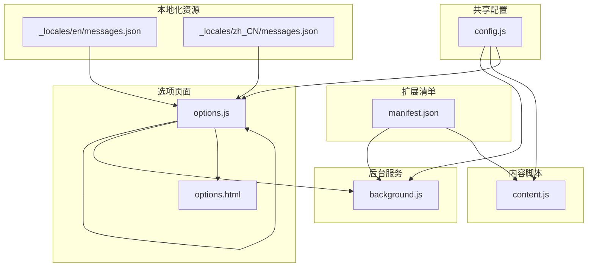
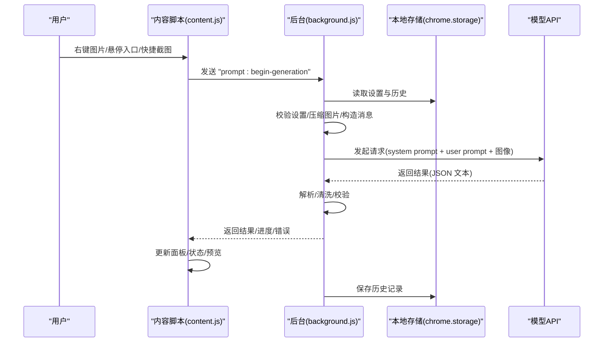
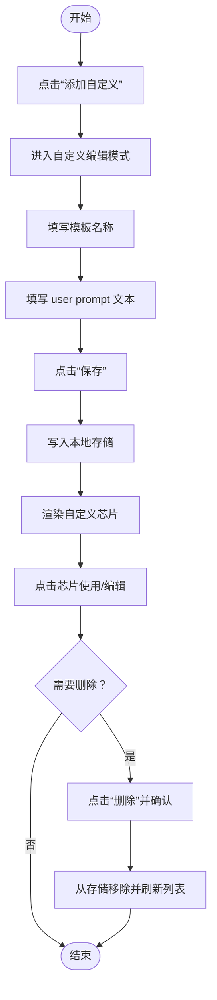
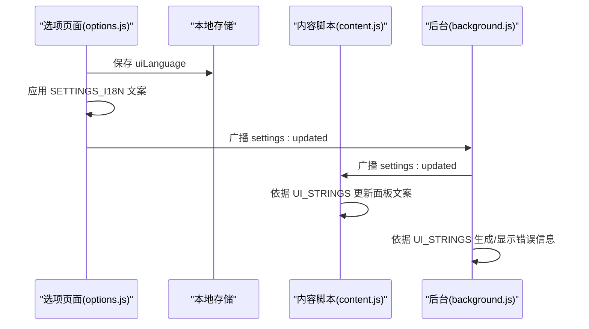
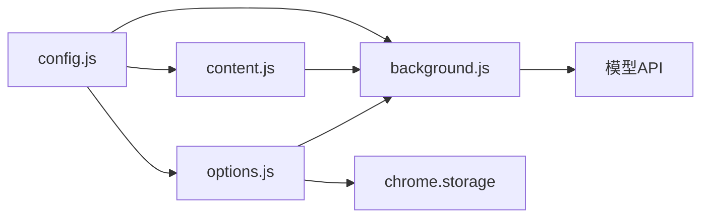

# 高级定制

<cite>
**本文引用的文件**
- [manifest.json](file://manifest.json)
- [config.js](file://config.js)
- [background.js](file://background.js)
- [options.js](file://options.js)
- [content.js](file://content.js)
- [options.html](file://options.html)
- [_locales/en/messages.json](file://_locales/en/messages.json)
- [_locales/zh_CN/messages.json](file://_locales/zh_CN/messages.json)
</cite>

## 目录
1. [简介](#简介)
2. [项目结构](#项目结构)
3. [核心组件](#核心组件)
4. [架构总览](#架构总览)
5. [详细组件分析](#详细组件分析)
6. [依赖关系分析](#依赖关系分析)
7. [性能考量](#性能考量)
8. [故障排查指南](#故障排查指南)
9. [结论](#结论)
10. [附录](#附录)

## 简介
本指南聚焦 Img2Prompt 的“高级定制”能力，围绕以下主题展开：
- USER_PROMPT_PRESETS 预设场景的使用与自定义方法，覆盖 general、photo、cg、design、assets3d、product、ui 等模板及其适用场景与配置要点
- 自定义提示词模板的创建、命名、保存与删除流程
- UI_STRINGS 与 SETTINGS_I18N 的国际化配置机制及界面文本调整方法
- 面向高级用户的定制技巧与最佳实践，帮助按工作流优化使用体验

## 项目结构
该扩展采用 Manifest V3 架构，核心由共享配置、后台服务、内容脚本与选项页面组成，并通过本地存储实现设置持久化与跨模块通信。

图表来源
- [manifest.json:1-45](file://manifest.json#L1-L45)
- [config.js:1-253](file://config.js#L1-L253)
- [background.js:1-120](file://background.js#L1-L120)
- [content.js:1-120](file://content.js#L1-L120)
- [options.js:1-60](file://options.js#L1-L60)
- [options.html:1-60](file://options.html#L1-L60)
- [_locales/en/messages.json:1-11](file://_locales/en/messages.json#L1-L11)
- [_locales/zh_CN/messages.json:1-11](file://_locales/zh_CN/messages.json#L1-L11)

章节来源
- [manifest.json:1-45](file://manifest.json#L1-L45)
- [config.js:1-253](file://config.js#L1-L253)
- [background.js:1-120](file://background.js#L1-L120)
- [content.js:1-120](file://content.js#L1-L120)
- [options.js:1-60](file://options.js#L1-L60)
- [options.html:1-60](file://options.html#L1-L60)
- [_locales/en/messages.json:1-11](file://_locales/en/messages.json#L1-L11)
- [_locales/zh_CN/messages.json:1-11](file://_locales/zh_CN/messages.json#L1-L11)

## 核心组件
- 共享配置中心：集中定义默认设置、预设提示词、UI 文案与错误码，供后台与内容脚本共享
- 后台服务：负责上下文菜单、快捷截图、设置更新广播、历史记录管理、与模型 API 的请求与错误分类
- 内容脚本：负责悬浮入口、主面板渲染、状态展示、进度与错误提示、语言切换与面板内文案更新
- 选项页面：提供连接设置、提示词预设与自定义模板、体验设置、兼容性设置、历史记录查看与清理、语言切换

章节来源
- [config.js:4-253](file://config.js#L4-L253)
- [background.js:19-184](file://background.js#L19-L184)
- [content.js:102-247](file://content.js#L102-L247)
- [options.js:8-489](file://options.js#L8-L489)

## 架构总览
下图展示了从用户触发到生成提示词的关键流程，以及各模块间的交互关系。

图表来源
- [content.js:249-326](file://content.js#L249-L326)
- [background.js:212-320](file://background.js#L212-L320)
- [background.js:478-592](file://background.js#L478-L592)
- [background.js:412-463](file://background.js#L412-L463)

章节来源
- [content.js:249-326](file://content.js#L249-L326)
- [background.js:212-320](file://background.js#L212-L320)
- [background.js:478-592](file://background.js#L478-L592)
- [background.js:412-463](file://background.js#L412-L463)

## 详细组件分析

### USER_PROMPT_PRESETS 预设场景详解与使用
- 预设集合位置：共享配置中定义了多类场景的 user prompt 模板，便于快速选择
- 场景与要点
  - general：通用结构化解析，适合大多数图像理解任务
  - photo：强调摄影技术参数（光质、色温、对比度、镜头特性、景深等）
  - cg：关注数字制作与渲染管线（光照、材质、风格影响等）
  - design：面向平面设计的信息架构与视觉系统（排版、网格、负空间、设计运动等）
  - assets3d：3D 资产拓扑与材质逻辑（PBR 映射、网格密度、表面瑕疵等）
  - product：电商产品拍摄与英雄图（灯光布置、材质质感、品牌细节、环境心理定位）
  - ui：界面架构与设计系统（组件库特征、导航模式、交互暗示、设计令牌、界面风格）
- 使用方式
  - 在选项页面的“提示词”区域点击对应预设按钮，即可自动填充 user prompt
  - 若需微调，可在文本域直接编辑，随后自动保存

章节来源
- [config.js:22-30](file://config.js#L22-L30)
- [options.html:445-454](file://options.html#L445-L454)
- [options.js:42-57](file://options.js#L42-L57)

### 自定义提示词模板：创建、命名、保存与删除
- 创建与命名
  - 点击“添加自定义”按钮进入自定义模式
  - 填写模板名称与 user prompt 文本
  - 点击“保存”，模板以自动生成的 ID 存储于本地存储
- 查看与编辑
  - 保存后会在预设区出现带“⚙️”前缀的自定义芯片，点击即可加载
  - 可再次进入编辑模式修改标题或内容
- 删除
  - 在编辑模式下点击“删除”按钮，确认后从本地存储移除
  - 预设区对应的芯片会被移除，同时表单回退到通用预设
- 数据持久化
  - 所有设置与自定义模板统一保存在本地存储，变更后自动广播给内容脚本以即时生效

图表来源
- [options.js:79-137](file://options.js#L79-L137)
- [options.js:139-149](file://options.js#L139-L149)
- [options.js:162-179](file://options.js#L162-L179)
- [options.js:182-213](file://options.js#L182-L213)

章节来源
- [options.js:79-179](file://options.js#L79-L179)
- [options.js:182-213](file://options.js#L182-L213)

### UI_STRINGS 与 SETTINGS_I18N 国际化机制
- UI_STRINGS：内容脚本与后台服务用于面板状态、按钮文案、错误提示等 UI 文本的本地化字典
- SETTINGS_I18N：选项页面的静态文案与占位符，配合语言切换实现设置面板的双语显示
- 运行机制
  - 选项页面加载时根据 uiLanguage 应用 SETTINGS_I18N 中的文案
  - 内容脚本与后台服务根据当前语言从 UI_STRINGS 读取对应文本
  - 设置变更后通过广播通知其他模块同步更新
- 调整方法
  - 在选项页面的语言切换控件中选择 zh 或 en
  - 对应的 data-i18n 属性会自动替换为 SETTINGS_I18N 中的翻译
  - 主面板内的动态状态文本也会基于 UI_STRINGS 进行翻译

图表来源
- [options.js:421-451](file://options.js#L421-L451)
- [options.js:384-402](file://options.js#L384-L402)
- [content.js:113-141](file://content.js#L113-L141)
- [content.js:165-207](file://content.js#L165-L207)
- [background.js:134-147](file://background.js#L134-L147)

章节来源
- [options.js:421-451](file://options.js#L421-L451)
- [options.js:384-402](file://options.js#L384-L402)
- [content.js:113-207](file://content.js#L113-L207)
- [background.js:134-147](file://background.js#L134-L147)

### 高级定制技巧与最佳实践
- 预设优先，模板补充
  - 优先选用贴近场景的预设作为基础，再针对具体项目微调 user prompt
  - 将高频使用的定制模板命名为易识别的标题，便于快速复用
- 语言与界面一致性
  - 统一设置面板语言与主面板语言，避免混用造成阅读负担
  - 当需要与团队协作时，建议固定语言并共享自定义模板
- 历史记录管理
  - 定期清理历史记录，减少本地存储占用
  - 复杂项目可导出提示词后归档，再在扩展中复用
- 性能与兼容性
  - 遇到 400 错误时，适当降低图片分辨率限制
  - 不同模型对图片输入格式敏感，必要时切换请求格式或模型
- 快捷键与悬浮入口
  - 启用悬浮入口与截图快捷键，提升批量处理效率
  - 在复杂页面中合理关闭悬浮入口，避免干扰

章节来源
- [options.html:518-542](file://options.html#L518-L542)
- [background.js:517-592](file://background.js#L517-L592)
- [background.js:412-463](file://background.js#L412-L463)

## 依赖关系分析
- 模块耦合
  - config.js 为共享配置中心，被 background.js、content.js、options.js 引用
  - options.js 与 background.js 通过消息通道与本地存储进行双向交互
  - content.js 与 background.js 通过运行时消息进行状态与结果传递
- 关键依赖链
  - 选项页面 -> 本地存储 -> 内容脚本/后台服务
  - 内容脚本 -> 后台服务 -> 模型 API -> 后台服务 -> 内容脚本
- 潜在风险
  - 本地存储异常可能影响设置与历史记录读写
  - 语言切换未正确广播可能导致面板文案不同步

图表来源
- [config.js:1-20](file://config.js#L1-L20)
- [background.js:1-12](file://background.js#L1-L12)
- [content.js:1-5](file://content.js#L1-L5)
- [options.js:1-6](file://options.js#L1-L6)

章节来源
- [config.js:1-20](file://config.js#L1-L20)
- [background.js:1-12](file://background.js#L1-L12)
- [content.js:1-5](file://content.js#L1-L5)
- [options.js:1-6](file://options.js#L1-L6)

## 性能考量
- 图像压缩与请求体积
  - 默认最大边长为 1024，可根据网络与模型能力调整
  - 低分辨率有助于减少请求体大小，降低超时与 400 错误概率
- 并发与取消
  - 支持取消生成，避免重复请求占用资源
- 本地存储读写
  - 自动保存采用节流策略，减少频繁写入
  - 历史记录数量上限为 50，避免无限增长

章节来源
- [background.js:775-800](file://background.js#L775-L800)
- [options.js:384-402](file://options.js#L384-L402)
- [background.js:412-463](file://background.js#L412-L463)

## 故障排查指南
- 常见错误与定位
  - 认证失败/权限不足：检查 API 密钥与权限
  - 调用次数超限：降低频率或升级配额
  - 服务器错误/超时：降低分辨率或更换模型
  - 模型返回非 JSON：调整 system prompt 确保输出纯 JSON
  - 缺少 zh/en 字段：确保 system prompt 正确生成双语字段
- 用户可见提示
  - 后台与内容脚本均基于 UI_STRINGS 提供用户友好提示
  - 错误码与错误消息在 ERROR_CODES 与 ERROR_MESSAGES 中定义
- 处理建议
  - 优先核对连接设置与模型配置
  - 使用历史记录回放定位问题
  - 切换语言与分辨率进行对比测试

章节来源
- [background.js:465-476](file://background.js#L465-L476)
- [background.js:562-582](file://background.js#L562-L582)
- [background.js:695-726](file://background.js#L695-L726)
- [config.js:206-247](file://config.js#L206-L247)

## 结论
通过 USER_PROMPT_PRESETS 的场景化模板、自定义模板的灵活扩展、UI_STRINGS 与 SETTINGS_I18N 的双语支持，以及后台与内容脚本的协同，Img2Prompt 提供了强大的高级定制能力。结合最佳实践与故障排查方法，用户可以按自身工作流高效地生成与复用高质量提示词，并在多语言环境下保持一致的使用体验。

## 附录
- 术语
  - 预设：内置的 user prompt 模板
  - 自定义模板：用户创建并保存的 user prompt 模板
  - 双语：中文与英文两种界面语言
- 相关文件路径
  - [config.js](file://config.js)
  - [background.js](file://background.js)
  - [content.js](file://content.js)
  - [options.js](file://options.js)
  - [options.html](file://options.html)
  - [_locales/en/messages.json](file://_locales/en/messages.json)
  - [_locales/zh_CN/messages.json](file://_locales/zh_CN/messages.json)