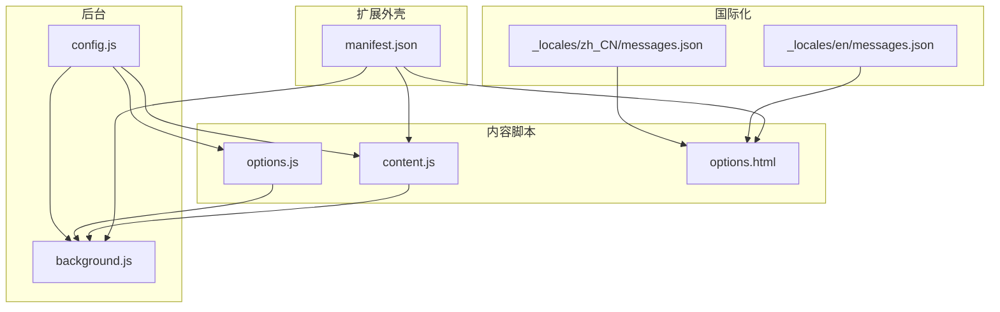
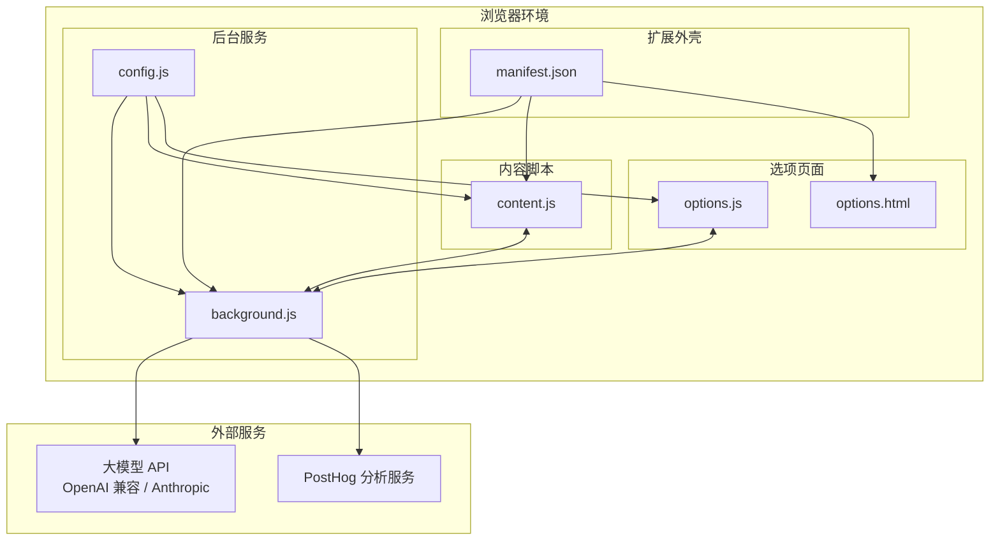
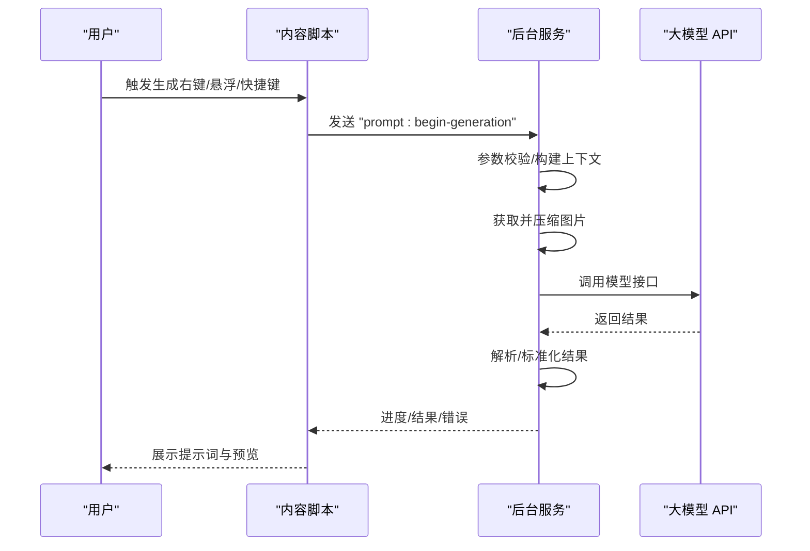
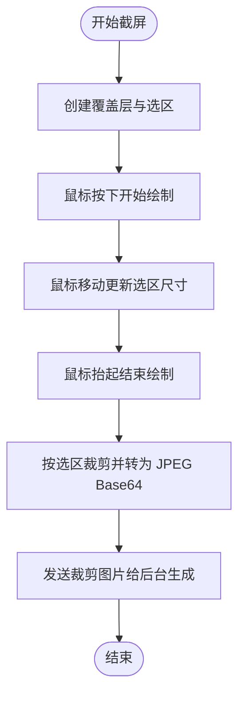
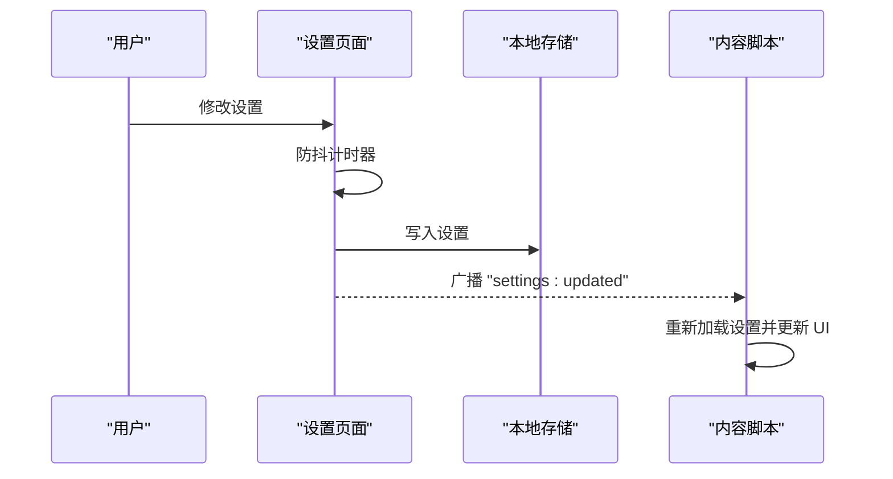
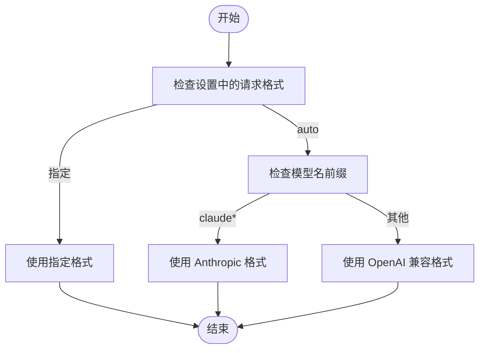
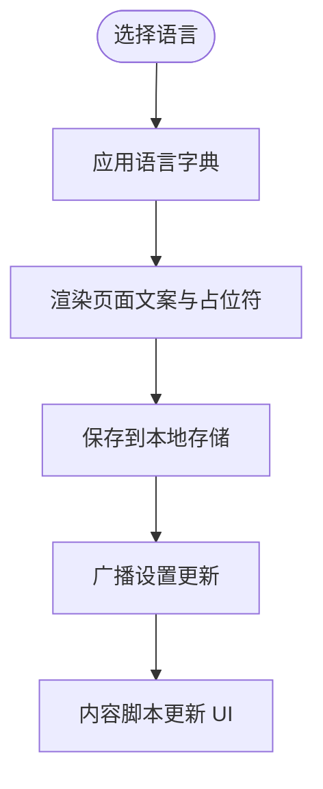
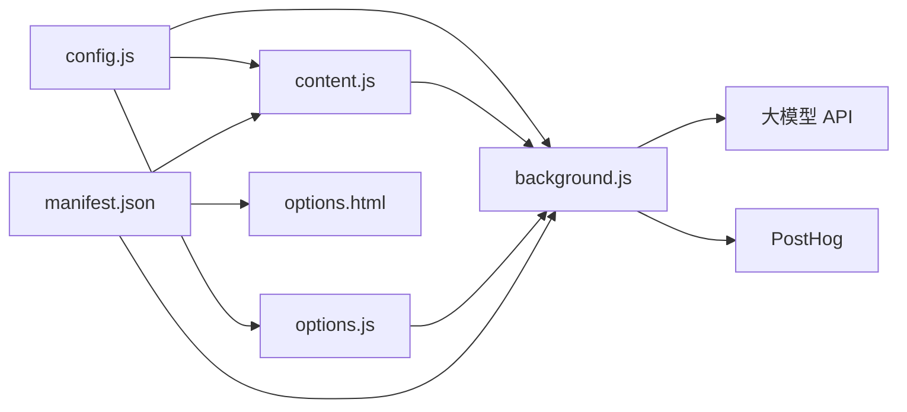

# 项目概述

<cite>
**本文档引用的文件**
- [manifest.json](file://manifest.json)
- [background.js](file://background.js)
- [content.js](file://content.js)
- [options.js](file://options.js)
- [config.js](file://config.js)
- [options.html](file://options.html)
- [_locales/en/messages.json](file://_locales/en/messages.json)
- [_locales/zh_CN/messages.json](file://_locales/zh_CN/messages.json)
</cite>

## 目录
1. [简介](#简介)
2. [项目结构](#项目结构)
3. [核心组件](#核心组件)
4. [架构总览](#架构总览)
5. [详细组件分析](#详细组件分析)
6. [依赖关系分析](#依赖关系分析)
7. [性能考虑](#性能考虑)
8. [故障排除指南](#故障排除指南)
9. [结论](#结论)
10. [附录](#附录)

## 简介
ImgPrompt 是一款基于 Chrome Extension Manifest V3 的图片转提示词（Image-to-Prompt）工具，旨在帮助用户快速从网页图片中提取高质量的图像生成提示词。该扩展通过与多种大模型接口（如 OpenAI 兼容接口、Anthropic Claude）集成，实现对图片内容的结构化分析与多语言提示词输出。它支持右键菜单触发、悬浮按钮入口、快捷键截屏等多种使用方式，并提供本地历史记录管理与多语言界面支持。

本项目的核心价值在于：
- 提升创意工作者与设计师的工作效率：一键从图片中提取结构化提示词，减少手工撰写成本。
- 降低门槛：无需复杂配置即可接入主流模型，提供多场景预设提示词模板。
- 增强可定制性：支持自定义 System Prompt 与 User Prompt，适配不同风格与需求。
- 注重隐私与性能：本地存储敏感信息，图片压缩与超时控制保障流畅体验。

## 项目结构
项目采用 Chrome Extension Manifest V3 标准结构，包含后台服务脚本、内容脚本、选项页面与共享配置等模块。核心文件职责如下：
- manifest.json：声明扩展元数据、权限、图标、侧边栏路径与快捷键等。
- background.js：后台服务脚本，负责上下文菜单、命令监听、消息路由、与模型接口通信、进度与错误处理、历史记录持久化与分析事件上报。
- content.js：内容脚本，负责在页面内渲染浮动面板、处理用户交互、与后台通信、展示生成结果、支持截屏分析与悬浮按钮。
- options.js + options.html：设置页面与逻辑，提供连接设置、提示词模板、使用体验与兼容性设置、历史记录查看与操作。
- config.js：共享配置，包含默认设置、提示词模板、UI 文案、错误码与消息、分析事件配置等。
- _locales/*：国际化消息资源，支持英文与简体中文。

**图表来源**
- [manifest.json:1-45](file://manifest.json#L1-L45)
- [background.js:1-120](file://background.js#L1-L120)
- [content.js:1-120](file://content.js#L1-L120)
- [options.js:1-60](file://options.js#L1-L60)
- [options.html:1-60](file://options.html#L1-L60)
- [config.js:1-40](file://config.js#L1-L40)
- [_locales/en/messages.json:1-11](file://_locales/en/messages.json#L1-L11)
- [_locales/zh_CN/messages.json:1-11](file://_locales/zh_CN/messages.json#L1-L11)

**章节来源**
- [manifest.json:1-45](file://manifest.json#L1-L45)
- [background.js:1-120](file://background.js#L1-L120)
- [content.js:1-120](file://content.js#L1-L120)
- [options.js:1-60](file://options.js#L1-L60)
- [options.html:1-60](file://options.html#L1-L60)
- [config.js:1-40](file://config.js#L1-L40)

## 核心组件
- 配置中心（config.js）
  - 默认设置：API 地址、模型名、请求格式、Anthropic 版本、悬停按钮开关、截屏快捷键开关、UI 语言、最大图片边长、超时时间、系统提示词、用户提示词、温度等。
  - 提示词模板：通用、摄影、CG、平面设计、UI、3D 资产、电商产品等场景预设。
  - UI 文案：中英双语状态文本与表单文案。
  - 错误码与错误消息：统一分类网络、图片获取、模型认证、速率限制、超时、JSON 解析、字段缺失、取消、未知等错误类型。
  - 分析事件配置：PostHog 项目密钥与主机、分析开关键名。
- 后台服务（background.js）
  - 生命周期与初始化：安装/更新事件、上下文菜单创建、侧边栏行为设置、默认设置写入、客户端 ID 生成。
  - 消息处理：接收来自内容脚本的消息，启动生成流程、进度通知、结果回传、错误处理、历史记录查询/删除/清空、设置变更广播。
  - 生成流程：参数校验、图片获取与压缩、模型请求（OpenAI 兼容或 Anthropic）、结果解析与标准化、进度与事件上报、历史记录保存。
  - 分析事件：安全上报，支持开关控制与异常兜底。
  - 历史记录：本地存储，最多 50 条，支持增删清空。
- 内容脚本（content.js）
  - 用户交互：悬浮按钮、右键菜单、快捷键截屏、拖拽移动面板、复制提示词、停止生成。
  - 面板渲染：Shadow DOM 渲染，支持拖动、预览、进度条、状态文本、语言切换、复制按钮。
  - 进度与结果：接收后台进度与结果，更新面板状态，展示提示词与来源图片。
  - 设置同步：监听本地存储变化，动态更新面板语言与行为。
- 设置页面（options.js + options.html）
  - 表单：连接设置（端点、模型、密钥）、提示词模板（内置预设与自定义）、使用体验（悬停按钮、截屏快捷键、面板语言）、兼容性（超时、分辨率）。
  - 历史记录：列表展示、复制、删除、清空；支持回放至主面板。
  - 自动保存：防抖保存，即时通知其他部分刷新。
  - 国际化：根据 UI 语言动态渲染文案。
- 国际化资源（_locales/*）
  - 英文与中文扩展名称与描述，配合 manifest 中的 __MSG__ 占位符使用。

**章节来源**
- [config.js:1-254](file://config.js#L1-L254)
- [background.js:1-200](file://background.js#L1-L200)
- [content.js:1-200](file://content.js#L1-L200)
- [options.js:1-120](file://options.js#L1-L120)
- [options.html:1-120](file://options.html#L1-L120)
- [_locales/en/messages.json:1-11](file://_locales/en/messages.json#L1-L11)
- [_locales/zh_CN/messages.json:1-11](file://_locales/zh_CN/messages.json#L1-L11)

## 架构总览
ImgPrompt 采用“后台服务脚本 + 内容脚本 + 选项页面”的三段式架构，结合共享配置与本地存储，形成完整的图片提示词生成闭环。

**图表来源**
- [manifest.json:1-45](file://manifest.json#L1-L45)
- [background.js:1-120](file://background.js#L1-L120)
- [content.js:1-120](file://content.js#L1-L120)
- [options.js:1-60](file://options.js#L1-L60)
- [options.html:1-60](file://options.html#L1-L60)
- [config.js:1-40](file://config.js#L1-L40)

## 详细组件分析

### 组件一：后台服务（background.js）
- 角色与职责
  - 生命周期管理：安装/更新事件、上下文菜单创建、侧边栏行为设置、默认设置初始化。
  - 消息路由：处理来自内容脚本的生成请求、进度、结果、错误、取消、设置更新、历史记录操作等。
  - 生成引擎：参数校验、图片获取与压缩、模型请求（OpenAI 兼容或 Anthropic）、结果解析与标准化、进度与事件上报、历史记录保存。
  - 分析事件：安全上报，支持开关控制与异常兜底。
  - 历史记录：本地存储，最多 50 条，支持增删清空。
- 关键流程（生成流程）

**图表来源**
- [background.js:212-320](file://background.js#L212-L320)
- [content.js:249-326](file://content.js#L249-L326)

**章节来源**
- [background.js:1-320](file://background.js#L1-L320)

### 组件二：内容脚本（content.js）
- 角色与职责
  - 用户交互：悬浮按钮、右键菜单、快捷键截屏、拖拽移动面板、复制提示词、停止生成。
  - 面板渲染：Shadow DOM 渲染，支持拖动、预览、进度条、状态文本、语言切换、复制按钮。
  - 进度与结果：接收后台进度与结果，更新面板状态，展示提示词与来源图片。
  - 设置同步：监听本地存储变化，动态更新面板语言与行为。
- 关键流程（截屏分析）

**图表来源**
- [content.js:489-594](file://content.js#L489-L594)

**章节来源**
- [content.js:1-594](file://content.js#L1-L594)

### 组件三：设置页面（options.js + options.html）
- 角色与职责
  - 表单：连接设置（端点、模型、密钥）、提示词模板（内置预设与自定义）、使用体验（悬停按钮、截屏快捷键、面板语言）、兼容性（超时、分辨率）。
  - 历史记录：列表展示、复制、删除、清空；支持回放至主面板。
  - 自动保存：防抖保存，即时通知其他部分刷新。
  - 国际化：根据 UI 语言动态渲染文案。
- 关键流程（自动保存与设置广播）

**图表来源**
- [options.js:384-402](file://options.js#L384-L402)
- [content.js:113-141](file://content.js#L113-L141)

**章节来源**
- [options.js:1-491](file://options.js#L1-L491)
- [options.html:1-585](file://options.html#L1-L585)

### 组件四：配置中心（config.js）
- 角色与职责
  - 默认设置：API 地址、模型名、请求格式、Anthropic 版本、悬停按钮开关、截屏快捷键开关、UI 语言、最大图片边长、超时时间、系统提示词、用户提示词、温度等。
  - 提示词模板：通用、摄影、CG、平面设计、UI、3D 资产、电商产品等场景预设。
  - UI 文案：中英双语状态文本与表单文案。
  - 错误码与错误消息：统一分类网络、图片获取、模型认证、速率限制、超时、JSON 解析、字段缺失、取消、未知等错误类型。
  - 分析事件配置：PostHog 项目密钥与主机、分析开关键名。
- 关键流程（请求格式判定）

**图表来源**
- [background.js:505-515](file://background.js#L505-L515)

**章节来源**
- [config.js:1-254](file://config.js#L1-L254)

### 组件五：国际化与本地化（_locales/*）
- 角色与职责
  - 英文与中文扩展名称与描述，配合 manifest 中的 __MSG__ 占位符使用。
  - 选项页面文案与状态文本由配置中心的 UI 文案字典驱动。
- 关键流程（语言切换）

**图表来源**
- [options.js:422-452](file://options.js#L422-L452)
- [content.js:165-207](file://content.js#L165-L207)

**章节来源**
- [_locales/en/messages.json:1-11](file://_locales/en/messages.json#L1-L11)
- [_locales/zh_CN/messages.json:1-11](file://_locales/zh_CN/messages.json#L1-L11)

## 依赖关系分析
- 文件级依赖
  - background.js 依赖 config.js（全局配置常量与字典）。
  - content.js 依赖 config.js（UI 文案与默认设置）。
  - options.js 依赖 config.js（默认设置、提示词模板、设置文案、分析配置）。
  - options.html 依赖 options.js 与 config.js（渲染与交互）。
  - manifest.json 声明背景脚本、内容脚本、侧边栏路径、权限与快捷键。
- 组件间耦合
  - 内容脚本与后台服务通过消息通道紧密耦合，用于生成流程的双向通信。
  - 设置页面与内容脚本通过本地存储与消息广播实现解耦的实时同步。
  - 配置中心作为单一事实源，避免重复配置分散。
- 外部依赖
  - 大模型 API（OpenAI 兼容或 Anthropic）。
  - PostHog 分析服务（可选）。
  - 浏览器 API：chrome.runtime、chrome.storage、chrome.contextMenus、chrome.commands、chrome.sidePanel、chrome.tabs、chrome.runtime.sendMessage 等。

**图表来源**
- [config.js:1-40](file://config.js#L1-L40)
- [background.js:1-120](file://background.js#L1-L120)
- [content.js:1-120](file://content.js#L1-L120)
- [options.js:1-60](file://options.js#L1-L60)
- [manifest.json:1-45](file://manifest.json#L1-L45)

**章节来源**
- [config.js:1-254](file://config.js#L1-L254)
- [background.js:1-120](file://background.js#L1-L120)
- [content.js:1-120](file://content.js#L1-L120)
- [options.js:1-60](file://options.js#L1-L60)
- [manifest.json:1-45](file://manifest.json#L1-L45)

## 性能考虑
- 图片处理
  - 最大边长限制与压缩：通过最大边长与质量参数控制请求体积，降低超时与失败概率。
  - 异步与超时：模型请求与图片压缩均支持 AbortController，避免长时间阻塞。
- 生成流程
  - 进度分阶段上报：准备、获取图片、调用模型、整理提示词、完成，提升感知性能。
  - 取消机制：支持中途取消，释放资源并上报取消事件。
- 存储与历史
  - 本地存储：敏感信息与设置仅保存在本地，历史记录最多 50 条，避免膨胀。
- UI 体验
  - 防抖保存：设置修改后延迟保存，减少频繁写入。
  - Shadow DOM：隔离样式与事件，避免与页面冲突。
- 网络与分析
  - 分析事件可开关，失败不阻断主流程。
  - 超时时间可配置，默认 60 秒，可根据模型响应速度调整。

[本节为通用性能建议，无需特定文件来源]

## 故障排除指南
- 常见错误与排查
  - 认证失败（401）：检查 API Key 是否正确、是否过期或权限不足。
  - 速率限制（429）：降低调用频率或升级配额。
  - 服务器错误（5xx）：稍后重试或更换模型/端点。
  - 请求超时（408/默认超时）：提高超时时间或降低图片分辨率。
  - 图片获取失败：确认图片链接有效、网络可达；尝试换图或压缩分辨率。
  - JSON 解析失败：确保系统提示词输出严格 JSON，避免 Markdown 包裹。
  - 字段缺失：系统提示词需返回 zh 与 en 字段。
  - 取消生成：点击停止按钮或刷新页面后重新生成。
- 定位手段
  - 查看内容面板状态与错误提示。
  - 在设置页面查看历史记录，必要时复制到剪贴板。
  - 检查设置中的超时与分辨率配置。
  - 开启分析事件（若启用）以辅助问题追踪。
- 相关实现参考
  - 错误码与消息映射：参见配置中心的错误码与错误消息字典。
  - 生成流程中的错误分类与用户提示：参见后台服务的错误处理与用户消息拼装。

**章节来源**
- [config.js:207-248](file://config.js#L207-L248)
- [background.js:280-317](file://background.js#L280-L317)
- [content.js:452-487](file://content.js#L452-L487)

## 结论
ImgPrompt 通过简洁而强大的架构，将图片分析与提示词生成无缝整合到浏览器环境中。其基于 Manifest V3 的设计确保了现代浏览器的安全性与性能；共享配置中心保证了跨模块的一致性；内容脚本与后台服务的清晰分工提升了可维护性。对于初学者，丰富的预设提示词与直观的设置界面降低了上手成本；对于有经验的开发者，灵活的配置项与可扩展的错误处理机制提供了足够的定制空间。未来可在以下方向持续演进：
- 支持更多模型与接口格式，增强生态兼容性。
- 优化图片处理算法与缓存策略，进一步提升生成速度与稳定性。
- 增加更多场景化的提示词模板与可视化编辑器。
- 提供更细粒度的分析事件与诊断工具，便于问题定位与性能优化。

[本节为总结性内容，无需特定文件来源]

## 附录

### 技术栈概览
- 前端与扩展框架
  - Manifest V3：声明权限、后台脚本、内容脚本、侧边栏与快捷键。
  - Shadow DOM：隔离样式与事件，提升兼容性。
  - 浏览器 API：runtime、storage、contextMenus、commands、sidePanel、tabs 等。
- 后端与集成
  - OpenAI 兼容接口：标准 chat/completions 请求格式。
  - Anthropic Claude：messages 接口与特定请求体格式。
  - PostHog：可选分析事件上报。
- 工具与资源
  - 国际化：_locales/* 与配置中心 UI 文案字典。
  - 配置中心：集中管理默认设置、模板、文案与错误码。

**章节来源**
- [manifest.json:1-45](file://manifest.json#L1-L45)
- [background.js:1-120](file://background.js#L1-L120)
- [content.js:1-120](file://content.js#L1-L120)
- [options.js:1-60](file://options.js#L1-L60)
- [config.js:1-254](file://config.js#L1-L254)

### 主要功能特性
- 图片分析与提示词生成：支持右键菜单、悬浮按钮、快捷键截屏三种入口。
- 多语言界面：中英双语 UI 文案与设置面板语言切换。
- 提示词模板：内置多场景预设与自定义模板管理。
- 使用体验：悬停按钮、截屏快捷键、拖拽移动面板、复制提示词。
- 兼容性设置：超时时间与最大图片边长调节。
- 历史记录：本地存储、复制、删除、清空与回放。

**章节来源**
- [content.js:1-200](file://content.js#L1-L200)
- [options.js:1-200](file://options.js#L1-L200)
- [config.js:1-120](file://config.js#L1-L120)

### 与其他工具的差异化优势
- 一体化工作流：从图片到提示词的端到端体验，无需额外工具切换。
- 低门槛接入：默认配置与多场景模板，开箱即用。
- 高度可定制：支持自定义 System Prompt 与 User Prompt，适配不同风格。
- 隐私优先：敏感信息本地存储，不上传至云端。
- 现代架构：基于 Manifest V3，具备更好的安全性与性能表现。

[本节为概念性对比，无需特定文件来源]

### 版本信息与发展历程
- 当前版本：1.0.0（来自 manifest.json 的 version 字段）。
- 发展历程与未来规划
  - v1.0.0：基础功能上线，支持 OpenAI 兼容与 Anthropic Claude，提供多场景模板与历史记录。
  - 后续可能方向：支持更多模型、优化图片处理、增强分析事件、扩展提示词模板与可视化编辑器。
- 版本展示：设置页面顶部显示扩展版本号，便于用户核对。

**章节来源**
- [manifest.json:43-43](file://manifest.json#L43-L43)
- [options.js:197-202](file://options.js#L197-L202)